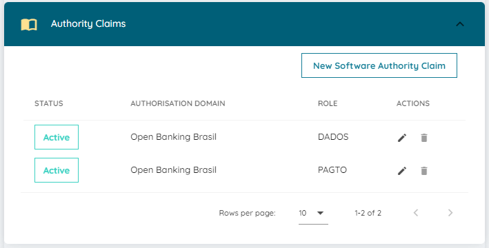

# Realizando DCR

O certificador funcional de pagamento exige a utilização de um client registrado
no AS que tenha sido gerado através do Software Statement Assertion do diretório
de participantes de sandbox.

Apesar do certificador de segurança realizar o processo de DCR, ele não utiliza o
redirect_uri do certificador funcional, o que exige a realização do registro de
outra maneira.

É possível realizar o DCR através do comando cURL, para isso é necessário:

* Certificado e chave privada de transporte (BRCAC) do Software Statament
  emitido pelo diretório de participantes de sandbox
* Endereço MTLS do Authorization Server da instalação do Opus Open Banking
* Nome do alias utilizado na configuração da execução dos testes funcionais
* Acesso ao diretório de participantes de sandbox
* Software Statement cadastrado com o papel PAGTO e DADOS
* Endereço software_jwks_uri do Software Statement

Como o Software Statement Assertion possui uma validade de 5 minutos, sugerimos
começar o processo pelos demais itens, em especial preparando o comando cURL a
ser executado.

## Iniciando

Crie um diretório de trabalho para gerar todos os arquivos necessários durante o
processo do DCR.

Copie os arquivos do certificado de transporte (BRCAC) do Software Statement para
o diretório de trabalho.

Renomeie os para facilitar a utilização dos exemplos deste guia, utilize os nomes
`brcac.cer` e `brcac.key` para o certificado e a chave privada respectivamente.

Tenha a URL de configuração do Authorization Server da instalação.
Exemplo: `https://obb.qa.oob.opus-software.com.br/.well-known/openid-configuration`

## Obtendo a URL de DCR

Abra a URL de configuração do Authorization Server da instalação em um browser.
Procure no JSON retornado a propriedade `registration_endpoint`, o valor dessa
propriedade é a URL do endpoint de DCR da instalação.
Exemplo: `https://mtls-obb.qa.oob.opus-software.com.br/auth/reg`

A URL de DCR será usada no comando cURL.

## Arquivo DCR

Crie o arquivo `dcr.json` com o conteúdo abaixo:

```text
{
    "grant_types": [
        "authorization_code",
        "implicit",
        "refresh_token",
        "client_credentials"
    ],
    "jwks_uri": "<jwks-software-statement-url>",
    "token_endpoint_auth_method": "private_key_jwt",
    "response_types": [
        "code id_token"
    ],
    "redirect_uris": [
        "https://web.conformance.directory.openbankingbrasil.org.br/test/a/<alias>/callback",
        "https://web.conformance.directory.openbankingbrasil.org.br/test/a/<alias>/callback?dummy1=lorem&dummy2=ipsum"
    ],
    "software_statement": "<ssa-jwt>"
}
```

Substitua os `<alias>` pelo valor que está sendo usando no certificador funcional.

## Software Statement

Acesse o [diretório de participantes de sandbox](https://web.sandbox.directory.openbankingbrasil.org.br/)
com um usuário com privilégio de alteração de `software statements.

Iremos utilizar o mesmo software statement utilizado na certificação de DCR, todos
os passos a seguir são referentes à ele.

Clique no link do nome do Software Statement e garanta que os papeis de PAGTO e
DADOS estão presentes dentro da sessão de Authority Claims. Caso algum papel não
esteja disponível para adição, será necessário adicionar a role através da sessão
`Authority Domain Role Claims` da organização.



Clique no ícone de edição do Software Statement e garanta que as URLs de `redirect uri`
do arquivo dcr.json estão presentes no campo REDIRECT URI.

Como exemplo para o alias `exemplo`, as URLs que devem estar presentes são:

`https://web.conformance.directory.openbankingbrasil.org.br/test/a/exemplo/callback`
`https://web.conformance.directory.openbankingbrasil.org.br/test/a/exemplo/callback?dummy1=lorem&dummy2=ipsum`


Clique novamente no link do nome do Software Statement e abra a sessão
`Software Statement Assertion`, um SSA será gerado pelo diretório de participantes:


Clique em `Copy to clipboard` para copiar o JWT do SSA e substitua o valor da
propriedade `software_statement` do arquivo dcr.json pelo copiado.

Novamente na sessão do `Software Statement Assertion`, copie o valor do atributo
`software_jwks_uri` e substitua o valor da propriedade `jwks_uri` do arquivo
`dcr.json` pelo copiado.

Não esqueça de salvar o arquivo `dcr.json`!

## Execute o DCR

Abra um terminal no diretório de trabalho e execute o comando cUrl abaixo,
utilizando a URL de configuração OpenId do Authorization Server da instalação.

```bash
curl -k --cipher 'DEFAULT:!DH' --cert brcac.cer --key brcac.key -d @dcr.json -H "content-type: application/json" -H "accept: application/json" -o dcr-result.json <as-dcr-url>
```

Abra o arquivo `dcr-result.json` e procure pelo atributo `client_id` dentro do
JSON, a presença dele indica o sucesso na operação.
