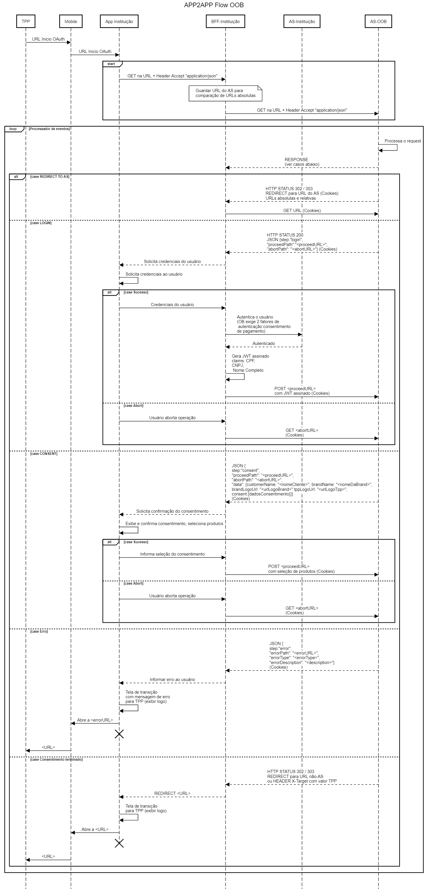

# Fluxo App2App para Geração de Consentimento

Alguns pontos importantes deste fluxo:

- Para mais detalhes, ver a documentação oficial para Instituição Receptora ou Iniciadora de Pagamentos (TPPs)
- A documentação oficial do manual de TPPs foi seguida para elaboração deste fluxo, especificamente o diagrama de sequência para redirect. O fluxo App2App do O2B se insere entre os passos “Redirect to Authorisation Server” e “Redirect to TPP + authorisation code” no diagrama do manual de TPPs. 
- Ele é uma adaptação do fluxo Web que existe no authorization server, e por isso as respostas dos requests voltam como REDIRECT (HTTP 302). Portanto, o App precisará receber esse redirect e em seguida fazer uma chamada para receber o payload JSON com os dados daquele passo.
- Ele é implementado como uma sequência de passos (steps) e caminhos (paths) que podem ser tomados em cada passo. Portanto, para cada passo, o App deverá receber o redirect, solicitar (GET) o payload JSON daquele passo, exibir os dados necessários e tomar as ações junto ao usuário para então seguir um dos caminhos através de um POST para a URL daquele path
- Todos os requests feitos pelo App ao Authorization Server O2B devem incluir os cookies.

Seguindo os passos do fluxo:

1.	O App da iniciadora de pagamentos (TPP) faz um redirect para uma URL que estará registrada no diretório. Essa URL estará registrada no sistema operacional do dispositivo Mobile do usuário para ser aberta pelo App (deep link)
Exemplo de URL: https://auth.amazingbank.com.br/auth?client_id=clientIdFromAmazingBank&scope=openid&request=eyJhbGciO... tDerEl32E8plGnsuA
2.	Ao ser aberto pelo sistema operacional e receber a URL, o App precisará interpretar a URL, detectar que é um redirect de Open Banking e iniciar o fluxo de criação de consentimento, chamando o authorization server com a mesma URL que foi recebida
Documentação para processamento de deep links no iOS e Android
3.	Ao receber esta requisição o AS O2B entenderá que está sendo iniciado um novo fluxo de criação de consentimento, e irá responder com um REDIRECT para uma URL relativa /interaction/{id} e um conjunto de Cookies. Este {id} é um hash utilizado pelo AS em conjunto com os cookies para acompanhar o estado deste fluxo de geração de consentimento que está iniciando
4.	Ao receber a resposta de REDIRECT para URL relativa, o App deve fazer um GET com content type JSON para a mesma URL que veio no redirect, incluindo o {id}  e os Cookies. O AS responderá com o payload JSON informando o passo atual e os caminhos que podem ser tomados a partir deste passo. Neste caso, o step será “login”, indicando que o App precisa fazer o login do usuário, podendo dar prosseguimento positivo caso o login esteja ok ou abortar o fluxo caso contrário
5.	O App exibe a tela de login para o usuário faz o processo de autenticação normalmente, da forma que ele já faz atualmente
6.	Caso o login aconteça com sucesso, o App deve chamar o AS com um POST para a URL /interaction/{id}/login incluindo cookies e o JWT gerado pelo RH SSO. Esta etapa é necessária para garantir que o AS O2B receba prova da autenticação do usuário. Neste JWT precisamos das claims de CPF e nome
7.	O AS O2B valida a assinatura do JWT de autenticação, e envia mais um REDIRECT para o App
8.	Ao receber o REDIRECT, o App faz novamente um GET para a URL com o {id} e os cookies
9.	Nesta etapa (step consentimento), o App recebe o payload com os dados do consentimento para exibir os detalhes de pagamento pro cliente (payload de exemplo em anexo)
10.	O App exibe os dados de pagamento para o usuário. Como temos uma única conta, não é necessário exibir seleção de conta origem
11.	O app faz um post para o path de sucesso POST interaction/{id}/ok com os cookies
12.	O AS O2B retorna a URL de redirect para o TPP, já com o authorization code. Diferente dos outros redirects, esta URL será absoluta
13.	O App exibe a tela de redirecionamento e redireciona o sistema operacional para a URL de redirect para o TPP
