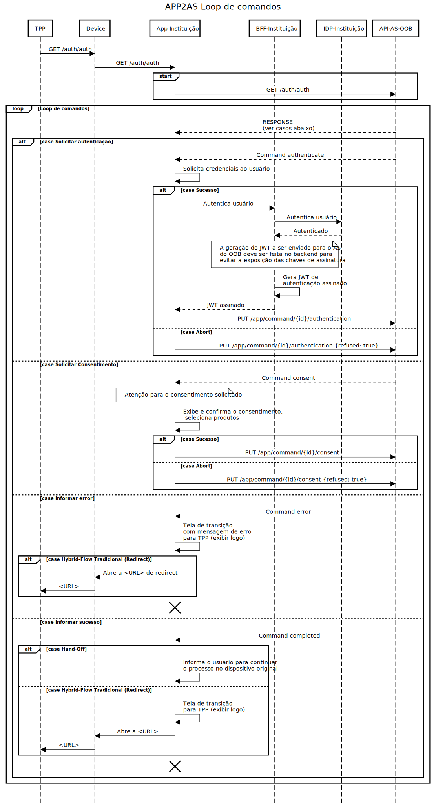

# Integração via aplicativo para Geração de Consentimento

A integração por aplicativo para a geração do consentimento é a melhor
experiência de uso para o cliente da instituição, permitindo a inclusão das
funcionalidades de Open Banking dentro do aplicativo da instituição já familiar
ao cliente final.

A Geração do Consentimento é um momento crítico, inserido no meio do fluxo de
OIDC e exigindo integrações não tradicionais, em especial o início da Geração do
Consentimento que é justamente o início do fluxo de redirects do hybrid flow OIDC.

## Open API Specification

As definições da API Rest estão definidas em Open API Specification 3.0 [aqui](oas-app2as.yaml).

## Deep Link e Universal Link

O aplicativo da instituição precisa interceptar as chamadas dos TPPs ao
Authorization Server quando essas ocorrem no celular do usuário, permitindo
dessa forma realizar a geração do consentimento no aplicativo.

O aplicativo também pode ser acionado durante fluxo hybrid flow com Hand-off,
onde o usuário está utilizando o TPP no desktop e a instituição só possui
autenticação através do seu aplicativo. Nesse cenário o Authorization Server
(AS) do Opus Open Banking (OOB) exibirá um QR-code com uma URL que também deve
ser interceptada pelo aplicativo. Utilizar uma URL que está registrada no
aplicativo permite o usuário realizar a leitura através de qualquer aplicativo
capaz de ler QR-code além do próprio aplicativo da instituição.

Desta forma, temos dois padrões de URLs que precisam ser interceptados pelo
aplicativo da instituição como vemos na tabela abaixo:

| Origem                       | URL                                                    |
| ---------------------------- | ------------------------------------------------------ |
| Mesmo dispositivo            | `https://<EV-FQDN-open-banking>/auth/auth`             |
| Outro dispositivo (Hand-Off) | `https://<EV-FQDN-open-banking>/auth/app/command/{id}` |

### O que fazer ao interceptar uma URL?

Uma vez que a aplicação está interceptando as URLs e sendo acionada durante uma
solicitação de consentimento, o próximo passo é realizar todo tratamento da
geração do consentimento de fato.

De posse de uma URL interceptada, o primeiro passo é realizar o request `GET`
de fato na URL acionada, incluindo todos os parâmetros de query-string que
possam existir, adicionado o header `Content-Type` com o valor
`application/json`, esse header informa o AS que a chamada está sendo realizada
pelo aplicativo e não pelo navegador.

O AS sabendo que a chamada foi realizada pelo aplicativo através do header
`Content-Type` passará a funcionar como uma API Rest, respondendo os requests
sempre no formato JSON. A adição do header é obrigatória em todas as chamadas
entre o aplicativo da instituição e o AS do OOB.

A resposta do `GET` inicial é o primeiro de uma série de comandos que o
aplicativo deve executar durante um loop de eventos como veremos na próxima sessão.

## Loop de comandos

O aplicativo da instituição será guiado pelo AS do OOB, realizando algumas
tarefas em nome do AS e devolvendo o resultado das tarefas, essas tarefas são
chamadas de `command`s no OAS. Toda chamada do aplicativo contra o AS tem um
novo `command` como retorno, inclusive a chamada inicial originada na
interceptação dos deep links / universal links.

É responsabilidade do aplicativo executar cada `command` até que o AS retorne
um `command` com estado final, esse loop é o chamamos de loop de comandos.

Importante ressaltar que o tratamento do retorno de todas as chamadas possíveis
contra o AS deve ser único, uma vez que o schema do retorno das APIs é o mesmo
e a próxima ação que o aplicativo deve executar é retornada no tipo do comando
da resposta ao invés de uma sequência pré-determinada de ações.

Atualmente o AS possui os seguintes `command`:

| Command      | Ação                                                                                                    | Finaliza o loop |
| ------------ | ------------------------------------------------------------------------------------------------------- | --------------- |
| authenticate | Aplicativo deve solicitar autenticação ao usuário                                                       | Não             |
| consent      | Aplicativo deve exibir solicitação do TPP e solicitar o consentimento e escolhas de produtos ao usuário | Não             |
| error        | Aplicativo deve exibir mensagem de erro e iniciar fluxo de retorno ao TPP                               | Sim             |
| completed    | Aplicativo deve exibir mensagem de sucesso e iniciar fluxo de retorno ao TPP                            | Sim             |

Os comandos acima que finalizam o loop são como o nome diz comandos que não
exigem novas chamadas ao AS e concluem a conversa entre o aplicativo e o AS,
concluindo desta forma o loop de comandos.

### Comando `authenticate`

O comando `authenticate` é o comando enviado pelo AS ao aplicativo para esse
solicitar a autenticação do usuário. É importante garantir os requisitos de
segurança do Open Banking Brasil definidos no atributo ACR do comando.

O ACR pode ser `urn:brasil:openbanking:loa2` ou `urn:brasil:openbanking:loa3`,
de forma reduzida o LoA2 (Level Of Assurance 2) exige que o usuário utilize no
mínimo um fator de autenticação e o LoA3 exige no mínimo dois fatores distintos
conforme a [especificação de segurança](https://openbanking-brasil.github.io/specs-seguranca/open-banking-brasil-financial-api-1_ID2.html#name-requesting-the-urnbrasilope)
do Open Banking Brasil.

O aplicativo deve então garantir a autenticação do usuário segundo o ACR
solicitado e enviar o resultado do comando ao AS OOB.

Caso o usuário tenha se autenticado corretamente, a instituição deve emitir um
token JWT assinado com as claims `cpf`, `cnpj` e `name` e enviar ao AS através
da API `PUT /app/command/{id}/authenticate`, onde o `id` é o `commandId` do
comando executado. 

O comando de autenticação retorna uma propriedade `jti`, o envio da claim `jti`
no JWT é usado para evitar a ocorrência de replay-attacks. O envio da claim
`iat` também é exigida para evitar garantir o horário da emissão do token dentro
de uma janela de tolerância dentro do AS OOB.

Importante ressaltar que o token JWT não deve ser assinado no aplicativo,
evitando a exposição da chave privada de assinatura. A chave pública utilizada
na assinatura deve estar exposta através de URL contendo o JWKS. O endereço do
JWKS é configurável na instalação do OOB através da configuração
`customer/federationJwksUrl` do [AS](../../deploy/oob-authorization-server/readme.md).

Um exemplo do conteúdo do JSON a ser utilizado no token JWT:

```JSON
{
    "iat": 1618664738,
    "jti": "e8f172c9-6f83-4d36-9dbb-e3ce7ca8a39b",
    "cpf": "32180490089",
    "cnpj": "77202036000182",
    "name": "João Maria José"
}
```

### Comando `consent`

O comando `consent` é o comando que solicita a exibição da intenção do
consentimento solicitado pelo TPP à instituição. As informações do consentimento
são retornadas juntamente com o comando, além das informações do próprio TPP, da
marca da instituição (para instalações com suporte a multimarca) e, para
consentimentos de compartilhamento de dados, informações descritivas das
permissões e tipos de recursos solicitados.

O papel do aplicativo nesse ponto é exibir a solicitação do TPP ao usuário e
coletar o consentimento do mesmo além da escolha dos recursos selecionáveis.

Consentimentos de compartilhamento de dados podem tratar diversos tipos de
recursos simultaneamente, e vários desses tipos podem ser recursos
selecionáveis. Os recursos selecionáveis devem ser exibidos para o usuário
escolher o compartilhamento ou não de cada produto.

Consentimentos de iniciação de pagamento tratam exclusivamente do recurso
"payment", esse tipo de recurso foi criado internamente no OOB para permitir
diversos produtos como origem financeira nos pagamentos, desvinculado a
exclusividade do uso de contas correntes/poupança. Os recursos de "payment"
possuem duas propriedades extras para trafegar o saldo e a moeda do saldo
permitindo o aplicativo exibir o mesmo para facilitar o usuário na escolha da
origem financeira para o pagamento em questão.

É importante seguir o [Guia de Experiência](https://openbanking-brasil.github.io/areadesenvolvedor/#guia-de-experiencia-de-compartilhamento-de-dados-e-iniciacao-de-pagamento)
do Usuário do Open Banking Brasil nessa etapa.

Os recursos selecionados e por consequencia o aceite do consentimento devem ser
enviados ao AS através da API `PUT /app/command/{id}/consent`.

### Comando `error`

O comando `error` é o comando que indica a ocorrência de algum erro durante o
fluxo de autenticação OIDC. O erro é descrito no comando, podendo ser erros
conhecidos do processo do Open Banking ou erros inesperados conforme vemos na
tabela a seguir.

| Código do Erro | Descrição                                                                                         |
| -------------- | ------------------------------------------------------------------------------------------------- |
| CPF_MISMATCH   | CPF do usuário autenticado diverge do enviado pelo TPP na intenção do consentimento               |
| CNPJ_MISMATCH  | CNPJ do usuário autenticado diverge do enviado pelo TPP na intenção do consentimento              |
| GENERIC_ERROR  | Erro genérico do AS, o campo `message` possui a descrição do erro que deve ser exibida ao usuário |

O comando `error` é um comando que conclui a geração do consentimento. Nos casos
de handoff o aplicativo deve apenas exibir a mensagem de erro ao usuário e
encerrar o processo da geração do consentimento. A página no dispositivo que
iniciou o processo de consentimento irá retornar automaticamente para o TPP
informando o motivo do erro do consentimento.

Já o caso de hybrid flow tradicional, a aplicação, além de exibir a mensagem de
erro, também deve solicitar que o sistema operacional do dispositivo abra a URL
de retorno enviada no comando, garantindo que o TPP seja informado do motivo do
erro e retome fluxo conforme o esperado pelo Guia de Experiência do Open Banking.

A propriedade `isHandOff` indica se o fluxo é um hybrid flow com handoff e a
propriedade `redirectTo` contém a URL que deve ser aberta no sistema operacional
do dispositivo para retorno ao TPP.

### Comando `completed`

O comando `completed` é o comando que indica a conclusão com sucesso do fluxo de
geração do consentimento.

O tratamento é o mesmo do comando `error` porém a mensagem a ser exibida ao
usuário é do sucesso do consentimento. O tratamento de retorno ao TPP deve
ser seguido como descrito no `error`.

## Diagrama de sequência

O diagrama de sequência a seguir ilustra de forma resumida o funcionamento entre
o aplicativo da instituição e o AS conforme descrito anteriormente.



## Mock para integração

WIP
