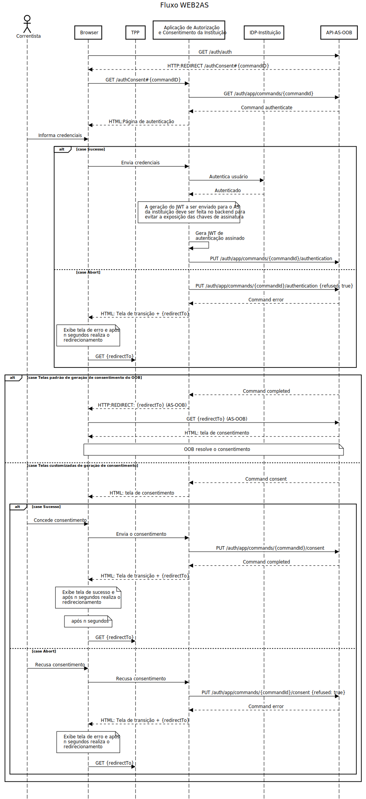

# Integração via aplicativo web para Geração de Consentimento

Caso a instituição não possua aplicativo mobile próprio uma alternativa
é a de realizar a autenticação através de sua própria página de login. Uma
vez realizado o login, a instituição pode optar por utilizar as
telas de geração de consentimento padrão do Opus Open Banking ou então suas
próprias telas customizadas.

## Open API Specification

As definições da API Rest estão definidas em Open API Specification 3.0 [aqui](oas-app2as.yaml).

## Iniciando o fluxo de login web customizado

O início do fluxo ocorre a partir da chamada do primeiro `GET` à URL de
autenticação junto ao AS (`https://<EV-FQDN-open-banking>/auth/auth`).

O AS possui uma configuração que define o template da URL de autenticação
customizada definida pela instituição, desta forma o identificador inicial
do fluxo de autenticação que será tratado pela página de login pode ser
mesclado na URL da forma que a instituição desejar.

A mescla permite a instituição receber o identificador através da `query string`,
`fragment` ou `url`, como exibido na tabela abaixo:

| Formato      | URL Exemplo                                                         |
| ------------ | ------------------------------------------------------------------- |
| Query string | `https://ev.instituicao.com.br?codigo=<IDENTIFICADOR>` |
| Fragment     | `https://ev.instituicao.com.br#<IDENTIFICADOR>`        |
| URL          | `https://ev.instituicao.com.br/<IDENTIFICADOR>`        |

 O exemplo fornecido na documentação trafega o identificador através do fragment
 da URL e deve ser o formato utilizado se possível, ele também remove o
 identificador do histórico de navegação, evitando qualquer confusão por parte
 do cliente em tentar utilizar uma URL antiga de consentimento.

Tal configuração pode ser conferida com detalhes e exemplo na página que descreve
as [configurações do AS](../deploy/oob-authorization-server/readme.md).

Se essa configuração estiver definida o AS entenderá que se trata de um fluxo
de autenticação web customizado e retornará então para a aplicação de
autorização da instituição um endereço para redirecionamento contendo a
identificação do `command` de autenticação criado para início do fluxo.

A comunicação entre o aplicativo web da instituição e o AS acontecerá através
de `command`s dentro de um loop de eventos. A definição deste loop de eventos
pode ser conferida [neste link](../loop-comandos.md).

## Utilizando o fluxo de geração de consentimento customizado

A instituição pode escolher entre utilizar as telas de geração de consentimento
padrão fornecidas junto do Opus Open Banking, ou ainda optar por utilizar suas
próprias telas de geração de consentimento.

Há uma configuração no AS que permite definir qual será a escolha da instituição.
O nome e exemplo podem ser conferidos na página de
[configurações do AS](../deploy/oob-authorization-server/readme.md).

Caso a instituição opte por utilizar suas próprias telas de geração de consentimento
a parte do fluxo relativa à escolha dos recursos e aprovação/recusa do
consentimento ficará por conta da própria instituição, que deverá se comunicar via
API com o AS para informar os recursos selecionados, bem como a aprovação/recusa
do consentimento em questão.

## Diagrama de sequência

O diagrama de sequência a seguir ilustra o funcionamento entre o aplicativo web da
instituição e o AS, englobando a etapa de autenticação seguida do fluxo de geração
de consentimento, tanto para a configuração de uso das telas padrão como uso das
telas customizadas.

## Changelog

### 2022-01-11 - v1.0.0

- Versão inicial do arquivo.
