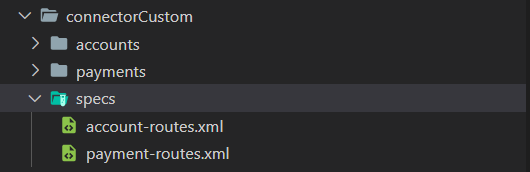
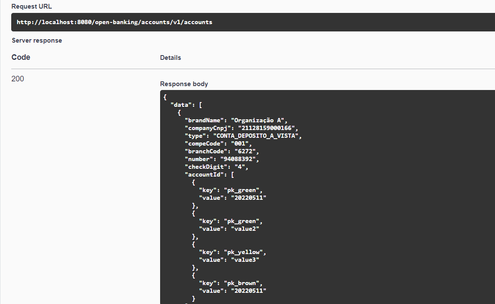

# Documentation for Using the Connector Tester

This documentation aims to guide the use of the connector tester tool and provide an example of setting up an environment for its execution.

Index:

- [Documentation for Using the Connector Tester](#documentation-for-using-the-connector-tester)
  - [Introduction](#introduction)
  - [File Structure](#file-structure)
  - [How to Obtain the Tool's Image](#how-to-obtain-the-tools-image)
  - [How to Run the Tool](#how-to-run-the-tool)
  - [How to Extend the Tool's Image](#how-to-extend-the-tools-image)
  - [Changelog](#changelog)

## Introduction

This tool is designed to facilitate the construction of Camel connectors, which must integrate with backend systems, allowing the connectors to be executed in isolation from the security contexts required by Open Banking.

The application has REST endpoints that represent the integration points of all OOB modules, and it is possible to include the routes (the same Camel XML files that will be used in the production environment, see the following [link](../../integration-connector/readme.md)) and test them via Swagger. The endpoints do not have business logic; they only call the connectors exactly as the OOB modules do. The endpoints receive a JSON in the format expected by the connector, according to its specification. Thus, all input information for the connector (consent, headers, etc.) must be present in the Swagger call.

The tool is provided as a Docker image, which must be extended with request and response mapping templates and the route file(s) responsible for directing calls to the institution's backend systems.

## File Structure

This tool supports `payments` and `financial-data`. The examples provided for `financial-data` refer to the *Accounts* sub-group routes, and other cases are analogous to the selected ones. The complete list of routes implemented for the financial-data service can be found [here](../../integra%C3%A7%C3%A3o-plugin/financial-data/readme.md).

The image below shows the structure of
[accounts](attachments/connector_tester_environment/connectorCustom/accounts), where the folders of each endpoint that can be used for testing are located.

 

 In [payments](attachments/connector_tester_environment/connectorCustom/payments) are all the files that can be used to perform payment endpoint tests, as shown in the image below.

 

 In [specs](attachments/connector_tester_environment/connectorCustom/specs) are the Camel route files, as shown in the image below.

 

## How to Obtain the Tool's Image

The tool is available in Opus's ECR and can be obtained as follows:

```shell
docker pull 618430153747.dkr.ecr.sa-east-1.amazonaws.com/opus-open-banking-release/oob-connector-tester:latest
```


## How to Run the Tool

The tool's image can be run without being extended using the following command:

```shell
docker run -it -p 8080:8080 618430153747.dkr.ecr.sa-east-1.amazonaws.com/opus-open-banking-release/oob-connector-tester:latest
```


When the image is running, the tool's Swagger can be accessed at the following URL: <http://localhost:8080/swagger>


## How to Extend the Tool's Image

In the following [link](attachments/connector_tester_environment), an example environment for the tool is provided. In this example, we use Mockoon as the backend system in the test, using Camel integrations making API Rest calls. The following structure was created to run a Docker Compose, which should extend the original connector tester image and insert some template files and the route file to be used for directing calls.


The [Dockerfile](attachments/connector_tester_environment/connectorCustom/Dockerfile) contains the commands to copy the necessary files for running the image.


Before running the environment, it is necessary to load the mock API using the [Mockoon](https://mockoon.com/) tool and use the file [mockoon_api.json](./attachments/connector_tester_environment/mockoon_api.json) to import it.


You should also change the value within the [environment variables file](./attachments/connector_tester_environment/connectorCustom/env_variables.env) of Docker Compose, informing the Mockoon API URL according to the Docker host's IP.

To run the environment, you need to access the directory containing the docker-compose.yaml file and execute the following commands:

```shell
docker-compose build
docker-compose up
```


Access the following address to load the tool's Swagger: <http://localhost:8080/swagger>

For this example, we will execute the endpoint to list accounts:


**IMPORTANT:** In endpoints that contain identifiers in the route (e.g., the `accountId` parameter in the accounts routes), the values included in the URL path will be *ignored*, and therefore can be used with static values. The values that will actually be sent to the connectors are those present in the payload of the calls.

Inside the `accountsGetAccounts` folder, there is a file named [request-example.json](./attachments/connector_tester_environment/connectorCustom/accounts/accountsGetAccounts/request-example.json) with the request for this call; the content of the file must be sent in the payload of the Swagger call, and the response to the executed call will be:



```json
{
  "data": [
    {
      "brandName": "Organização A",
      "companyCnpj": "21128159000166",
      "type": "CONTA_DEPOSITO_A_VISTA",
      "compeCode": "001",
      "branchCode": "6272",
      "number": "94088392",
      "checkDigit": "4",
      "accountId": [
        {
          "key": "pk_green",
          "value": "20220511"
        },
        {
          "key": "pk_green",
          "value": "value2"
        },
        {
          "key": "pk_yellow",
          "value": "value3"
        },
        {
          "key": "pk_brown",
          "value": "20220511"
        }
      ]
    },
    {
      "brandName": "Organização A",
      "companyCnpj": "21128159000166",
      "type": "CONTA_DEPOSITO_A_VISTA",
      "compeCode": "001",
      "branchCode": "6272",
      "number": "94088392",
      "checkDigit": "4",
      "accountId": [
        {
          "key": "pk_yellow"
        },
        {
          "key": "pk_yellow",
          "value": "4"
        },
        {
          "key": "pk_yellow",
          "value": "5"
        }
      ]
    },
    {
      "brandName": "Organização A",
      "companyCnpj": "21128159000166",
      "type": "CONTA_DEPOSITO_A_VISTA",
      "compeCode": "001",
      "branchCode": "6272",
      "number": "94088392",
      "checkDigit": "4",
      "accountId": [
        {
          "key": "pk_green"
        },
        {
          "key": "pk_brown",
          "value": "value3"
        },
        {
          "key": "pk_brown",
          "value": "value2"
        },
        {
          "key": "pk_yellow",
          "value": "2"
        },
        {
          "key": "pk_brown",
          "value": "2"
        }
      ]
    }
  ],
  "meta": {
    "totalRecords": 1,
    "totalPages": 1,
    "requestDateTime": "2021-05-21T03:00:00Z"
  }
}
```

## Changelog

### 2022-06-15 - v1.4.0

- Updated connector-tester readme with accounts information
- Adjusted path for payment files in connector-tester
- Added accounts route in connector-tester and changed file paths in the connector-tester Dockerfile

### 2022-03-16 - v1.3.0

- New routes for ted-tef payment added

### 2022-03-04 - v1.2.0

- New routes for scheduling functionality added

### 2021-12-23 - v1.1.0

- Expanded example of using the tool, implementing all existing routes
- Updated documentation images

### 2021-11-05 - v1.0.1

- Fixed bug that concatenated Camel XML route paths with consent endpoints called in Swagger
- Corrected URL to download the tool's image

### 2021-10-07 - v1.0.0

- Initial version of the documentation
