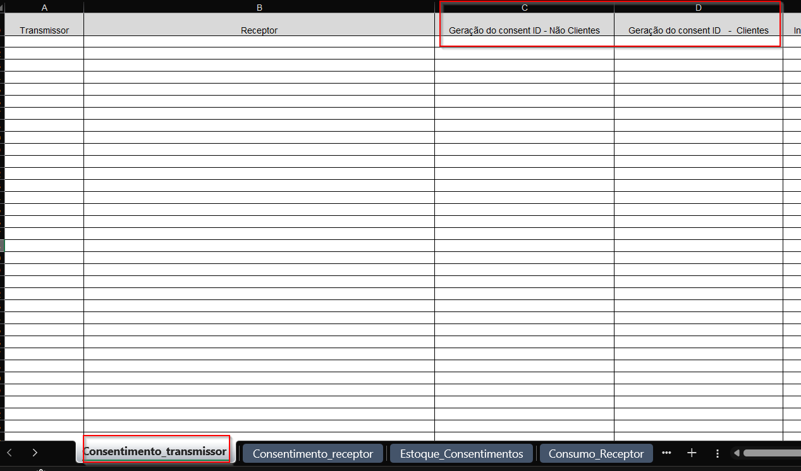
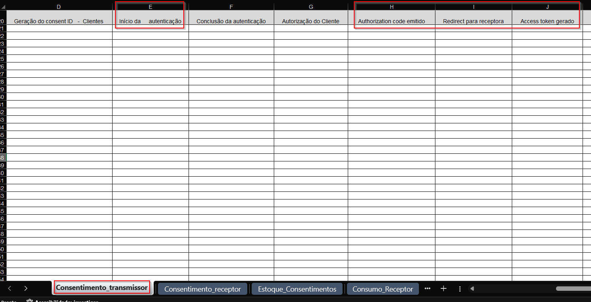
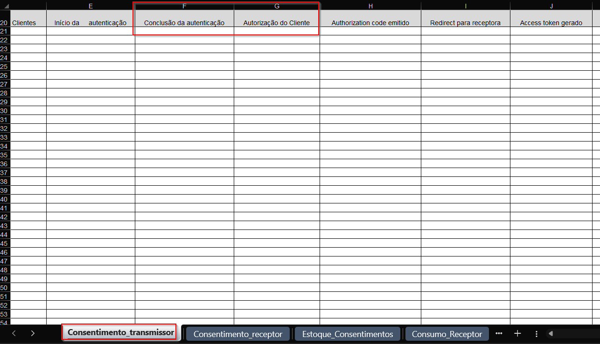
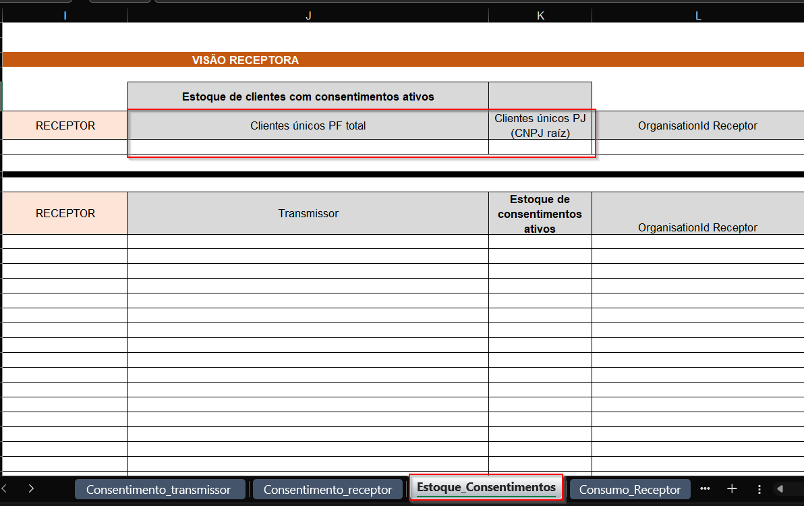
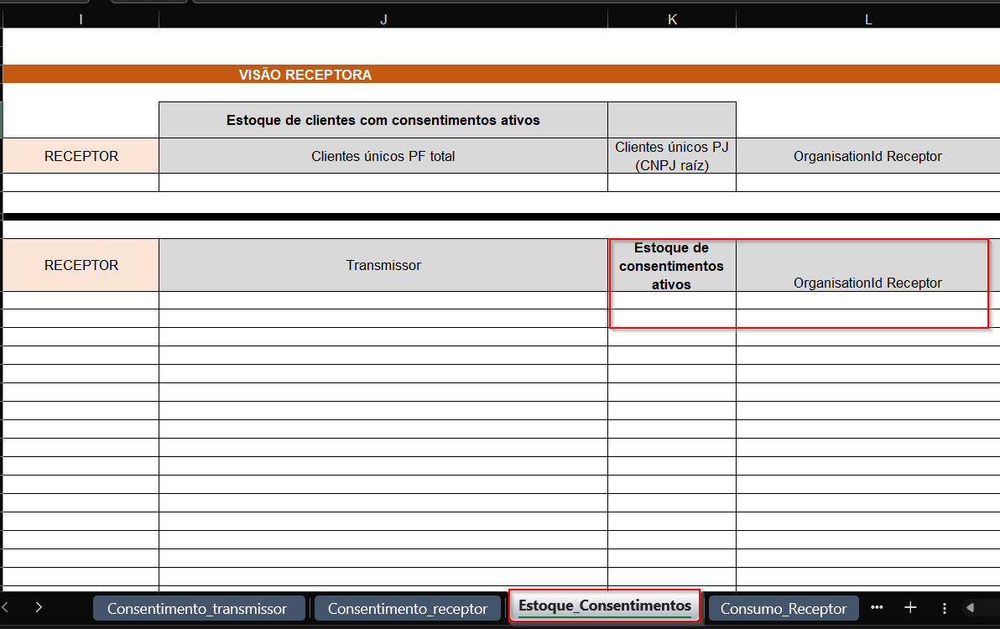
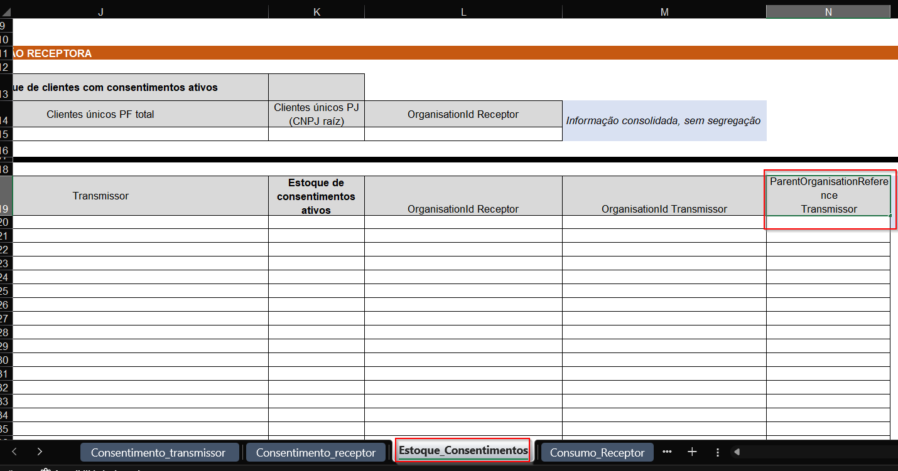

# SQL Scripts - Consent Information

- [SQL Scripts - Consent Information](#sql-scripts---consent-information)
  - [Introduction](#introduction)
  - [Scripts - Transmitting Consent](#scripts---transmitting-consent)
    - [Transmitting Consent - Consent Information](#transmitting-consent---consent-information)
    - [Transmitting Consent - Authorization Server Information](#transmitting-consent---authorization-server-information)
    - [Transmitting Consent - Client Authorization](#transmitting-consent---client-authorization)    
  - [Scripts - Consent Inventory](#scripts---consent-inventory)
    - [Consent Inventory - Consolidated Information](#consent-inventory---consolidated-information)
    - [Consent Inventory - Information by Recipient](#consent-inventory---information-by-recipient)

## Introduction

Opus is providing some SQL scripts that will assist customers in collecting data related to consents generated and stored in the Opus Open Banking **OOB** ecosystem.

The information that can be obtained with them includes:

- Transmitting Consent
- Consent Inventory

**NOTE:** It is up to our customers to run the scripts and format the information in the manner and for the period required by Open Banking Brazil **OBB**.

The fill-in template can be found [at this link](attachments/fase_2_interoperabilidade_modelo.xlsx).

## Scripts - Transmitting Consent

The SQL scripts provided in this section should be operated in the **OOB-Consent database**.

### Transmitting Consent - Consent Information

The SQL scripts provided in this section should be operated in the **OOB-Consent database**.

First, the *get_conglomerate_name* function must be created by executing the following [script](../commons/attachments/function_get_conglomerate_name.sql).

Then, the *CONSENT_USAGE_REPORT* function must be created by executing the following [script](attachments/consent_function_extract_usage_report.sql).

To obtain the data, you must call the function using the following command:

```sql
SELECT * FROM CONSENT_USAGE_REPORT('<initial_date>','<final_date>', <offset?>, <size?>);
```

The parameters must be filled in the format yyyy-MM-dd, for example:

```sql
SELECT * FROM CONSENT_USAGE_REPORT('2022-10-02','2022-10-08');
```

The `<offset?>` and `<size?>` parameters are optional, used for pagination, and indicate how many rows should be skipped and captured, respectively.

The obtained data should be filled in the "Consentimento_transmissor" tab, columns C or D ("Geração do consent ID - Não Clientes" or "Geração do consent ID   -  Clientes").



### Transmitting Consent - Authorization Server Information

The SQL scripts provided in this section should be operated in the **OOB-Authorization-Server database**.

First, the *get_conglomerate_name* function must be created by executing the following [script](../commons/attachments/function_get_conglomerate_name.sql).

Then, the *decode_base64url* function must be created by executing the following [script](attachments/as_function_decode_base64url.sql).

At last, the *extract_report_data* function must be created by executing the following [script](attachments/as_function_extract_report_data.sql).

To obtain the data, you must call the function using the following command:

```sql
SELECT * FROM extract_report_data('<initial_date>','<final_date>');
```

The parameters must be filled in the format yyyy-MM-dd, for example:

```sql
SELECT * FROM extract_report_data('2022-10-02','2022-10-08');
```

The obtained data should be filled in the "Consentimento_transmissor" tab, columns E, H, I, and J ("Início da autenticação", "Authorization code emitido", "Redirect para receptora" e "Access token gerado").



### Transmitting Consent - Client Authorization

First, the *consent_authorization_client* function must be created by executing the following [script](attachments/consent_function_authorization_client.sql).

To obtain the data, you must call the function using the following command:

```sql
SELECT * FROM consent_authorization_client('<initial_date>','<final_date>');
```

The parameters must be filled in the format yyyy-MM-dd, for example:

```sql
SELECT * FROM consent_authorization_client('2022-01-02','2022-10-08');
```

The obtained data should be filled in the "Consentimento_transmissor" tab, columns F and G ("Conclusão da autenticação" e "Autorização do Cliente").



## Scripts - Consent Inventory

### Consent Inventory - Consents with Generated Access Token

The SQL scripts provided in this section should be operated in the **OOB-Authorization-Server database**.

First, the *as_function_access_token_generated* function must be created by executing the following [script](attachments/as_function_access_token_generated.sql).

To obtain the data, you must call the function using the following command:

```sql
SELECT * FROM as_function_access_token_generated('<final_date>');
```

The parameters must be filled in the format yyyy-MM-dd, for example:

```sql
SELECT * FROM as_function_access_token_generated('2022-10-08');
```

The result of this query should be used in the following functions.

### Consent Inventory - Consolidated Information

The SQL scripts provided in this section should be operated in the **OOB-Consent database**.

First, the *consent_consolidated_stock* function must be created by executing the following [script](attachments/consent_function_consolidated_stock.sql).

To obtain the data, you must call the function using the following command:

```sql
SELECT * FROM consent_consolidated_stock('<final_date>', '<as_function_result>');
```

The *final_date* parameter must be filled in the yyyy-MM-dd format, and the *as_function_result* with the result of the previous function execution. For example:

```sql
SELECT * FROM consent_consolidated_stock('2022-10-08', array ['f769dfb4-e537-4458-9408-42b24ef1edc8','c33da603-f7a6-42af-9eba-d10ca59c463b']);
```

The obtained data should be filled in the "Estoque_Consentimentos" tab, Transmitting View, columns J and K ("Clientes únicos PF total" e "Clientes únicos PJ (CNPJ raíz)").



### Consent Inventory - Information by Recipient

The SQL scripts provided in this section should be operated in the **OOB-Consent database**.

First, the *consent_receptor_stock_v2* function must be created by executing the following [script](attachments/consent_function_receptor_stock_v2.sql).

To obtain the data, you must call the function using the following command:

```sql
SELECT * FROM consent_receptor_stock_v2('<final_date>', '<optional_id_brand>');
```

The *final_date* parameter must be filled in the yyyy-MM-dd format.
The *optional_id_brand* parameter can be optionally filled with the brand of the client.

The obtained data should be filled in the "Estoque_Consentimentos" tab, Transmitting View, columns K and L ("Estoque de consentimentos ativos" e "OrganisationId Receptor").



### ParentOrg Initiator

To obtain the main organization identifier, you must run the [getParentOrganization](../parent-org-reference-script/getParentOrganization.js) script, providing the IDs of the organizations returned by the *consent_function_extract_usage_report* and *consent_function_receptor_stock* queries.

You will need to install the version of [Node.js](https://nodejs.org/en/download) corresponding to your Operating System.

With Node.js installed, run the following command from the root of this project:

```bash
node ferramentas-auxiliares/parent-org-reference-script/getParentOrganization.js [Initiator Org IDs]
```

The IDs of the recipient organizations should be separated by spaces, as in the example below:

```bash
$ node ferramentas-auxiliares/parent-org-reference-script/getParentOrganization.js f83bee4f-26df-53d7-8335-a8a6edd7e340 fd0ea3e7-aeca-55f9-a0a2-ec56980059fb fd0ea3e7-aeca-55f9-a0a2-ec56980059fc
----------------------------------------------
Org ID: f83bee4f-26df-53d7-8335-a8a6edd7e340
Parent Organization: 90400888000142
----------------------------------------------
Org ID: fd0ea3e7-aeca-55f9-a0a2-ec56980059fb
Parent Organization: N/A
----------------------------------------------
Org ID fd0ea3e7-aeca-55f9-a0a2-ec56980059fc Not found
----------------------------------------------
```

If the recipient does not have a Parent Organization, the script's return will be *N/A*. If it does not exist, the return will be *Not found*.

The obtained data should be filled in the "Estoque_Consentimentos" tab, Transmitting View, column N ("ParentOrganisationReference Transmissor").



## Execution of Reports with Data Consolidation by Organization

If the organization has two or more brands, for queries that need to be performed on the **OOB-Authorization-Server** and **OOB-Consent** service databases, it is necessary to use scripts with the prefix "organization_". In addition to the original parameters (start date and/or end date), a connection string must be provided to enable communication with the databases of the other brands.

For this purpose, the "dblink" component must be installed in the main databases using the following command:

```sql
CREATE EXTENSION IF NOT EXISTS "dblink";
```

The connection string should be formatted as follows:

host={db_target_host} dbname={db_target_dbname} user={db_target_user} password={db_target_password}
