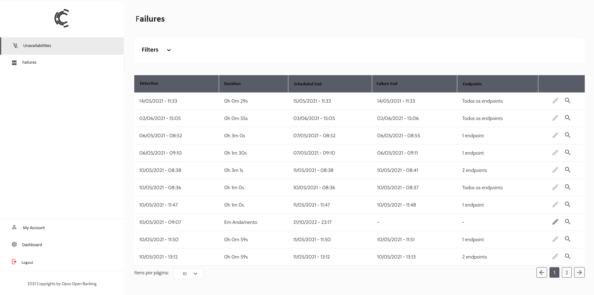
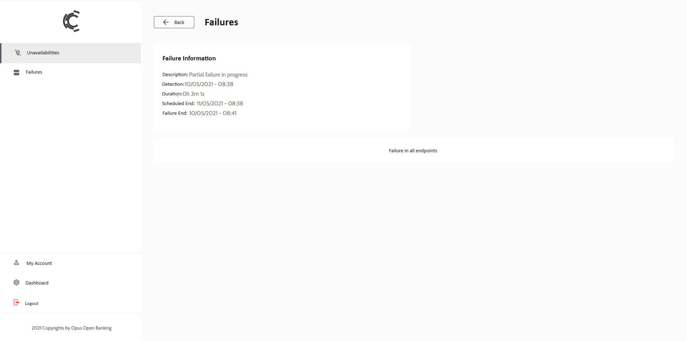
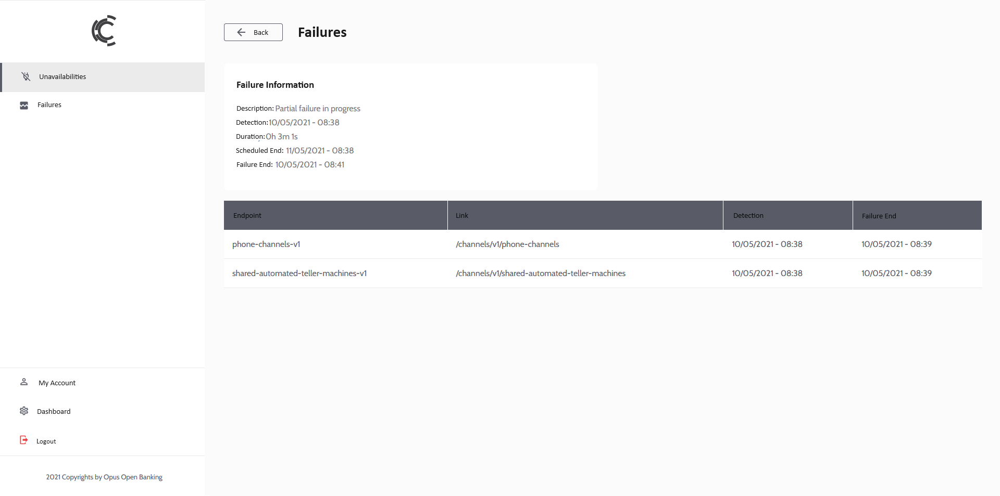
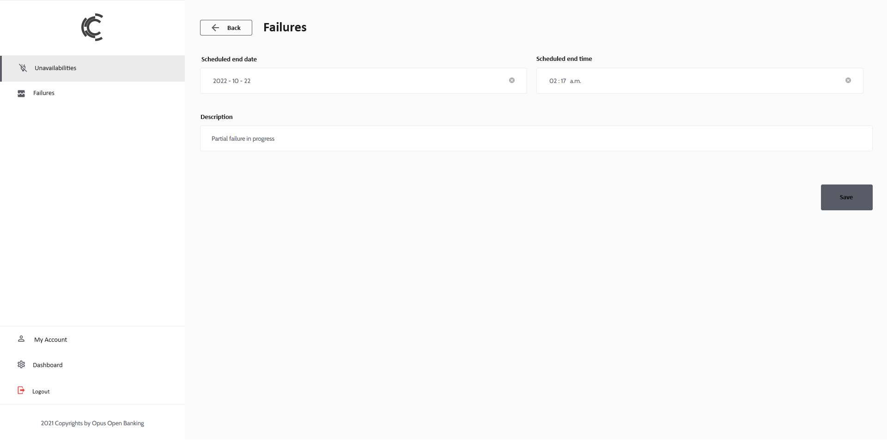
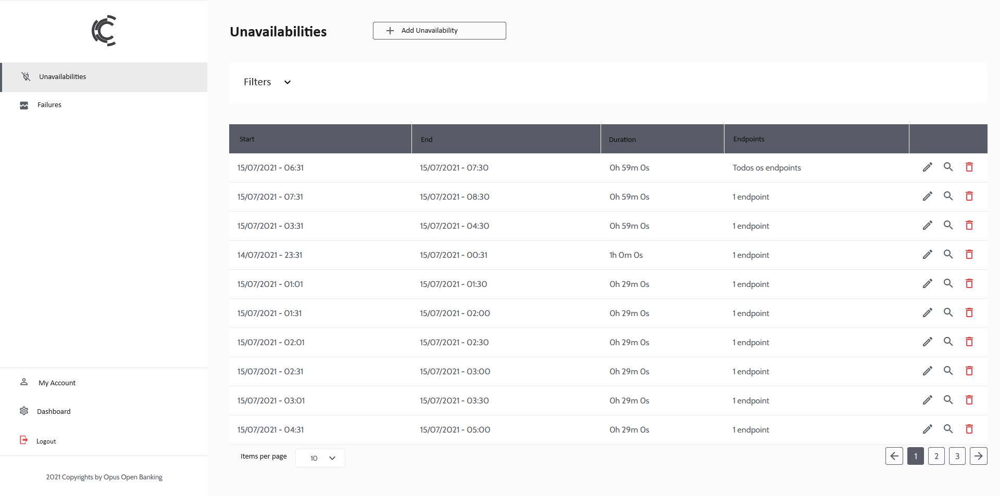
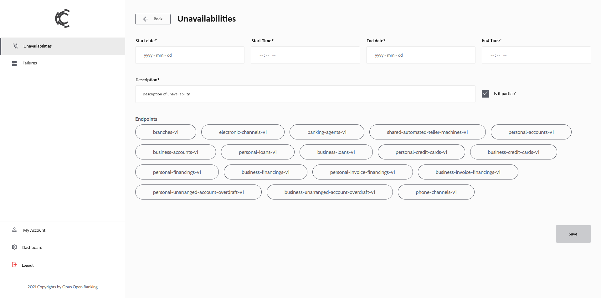
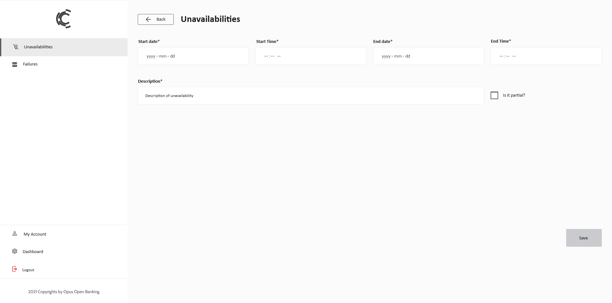

# Failures and Unavailabilities
This section describes the use of the Failures and Unavailabilities screens of the Opus Open Banking Backoffice Portal (OOB or O2B). These screens display and register the information exposed on the Open Banking endpoints for Common APIs (Status and unavailabilities) and Admin APIs (metrics).

## Failures
The O2B Status service monitors the availability of Open Banking endpoints based on the collection of error status requests at the API Gateway and healthcheck calls. If any endpoint or service exhibits a high error rate, it will automatically be classified as in failure and will be displayed on the Failures screen. A Failure can be **Total**, affecting all endpoints, or **Partial**, affecting a specific set of endpoints.

### Listing

All detected failures will be displayed, whether active or concluded, and can be filtered by detection date and failure end date. All Failures can be viewed, but only ongoing Failures can be edited.

### Viewing

Fields:
- **Description:** a brief description of the cause of the failure. This field is automatically generated with the text "Failure in progress" but can be edited while the Failure is ongoing.
- **Detection:** Date and Time of failure detection (Start time)
- **Duration:** Time elapsed since the detection date and time
- **Scheduled End:** Expected end time of the Failure. It is generated empty and can be filled in during editing
- **Failure End:** Date and Time of failure end detection. This field is automatically filled by the Status Service when it detects that the Failure is no longer present

In case all endpoints are in Failure, it is indicated as Total Failure:

If only a set of endpoints is in Failure, the list of endpoints in failure is presented:

### Editing

Only ongoing Failures can be edited. A Failure remains ongoing as long as the Status Service continues to detect an error, being automatically concluded otherwise. The fields that can be edited serve to inform other participants of Open Banking Brazil and the Regulator of the expected date and time for service restoration and a description of the Failure.

Editable fields:
- **Scheduled End Date:** Expected date for the Failure to end
- **Scheduled End Time:** Expected time for the Failure to end
- **Description:** Description of the ongoing Failure

## Unavailabilities

Unavailabilities are time windows during which the service is scheduled to be down or responding partially. They serve as a mechanism to inform other participants of Open Banking Brazil and the Regulator that the endpoints will be unavailable at a scheduled date and time. For example, this allows scheduling a maintenance window in the system.

### Listing

Screen where it is possible to view all registered unavailabilities, whether past or future. It is also possible to add, edit, or delete unavailabilities.

### Inclusion

Fields:
- **Start Date:** Date when the unavailability window will begin
- **Start Time:** Time when the unavailability window will begin
- **End Date:** Date when the unavailability window will end
- **End Time:** Time when the unavailability window will end
- **Description:** A brief description of the reason for the unavailability

Additionally, an unavailability can be Total, affecting all endpoints, or Partial, affecting only a set of them. The "Is Partial?" checkbox is used to indicate Total or Partial Unavailability.

In the case of Partial Unavailability, it is necessary to select the list of endpoints that will be unavailable:

In the case of Total Unavailability, it is not necessary to select endpoints:

