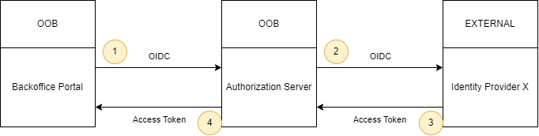

# Federation for Internal Institution Users

This section aims to describe the operation and configuration of the
federation mechanism for authenticating the institution's internal users
to access the OOB Back Office Portal.

The federation mechanism was implemented so that institutions can integrate their own *Identity Providers* (IDP) with the OOB Authorization Server.

Thus, the Back Office Portal initiates the authentication process with
the Authorization Server, which in turn authenticates with the external IDP.
With the user's identification in hand, the Authorization Server generates and returns
a valid access token to the Back Office Portal, which is used to communicate
with relevant APIs.



Therefore, for the correct functioning of the federation, it is necessary to perform
some configurations and pay attention to some points, namely:

1. Configuration of the communication between the OOB Back Office Portal and the
   OOB Authorization Server.
2. Configuration of the communication between the OOB Authorization Server and the external IDP.
3. Correct configuration of the external IDP, so that it generates tokens in the format
   expected by the OOB Authorization Server.

## Back Office Portal Configuration

It is necessary to correctly configure some environment variables in the Back Office
Portal for communication with the Authorization Server to occur correctly. These variables are: `authDiscoveryDocumentUrl`, `authIssuer`, `authClientId`, `authClientSecretName`, and `authClientSecretKey`.

Details and an example configuration for these variables can be found on the
[Back Office Portal deployment configuration page](../../deploy/oob-portal-backoffice/readme.md).

## Authorization Server Configuration

There are two sets of variables that need to be defined. The Authorization
Server needs the client configuration that will receive authentication requests from the Back Office Portal, and it also needs the client configuration that will make authentication requests to the external IDP.

### Back Office Portal Client Configuration

It should be configured as a static client. The detailed documentation of this
configuration can be found [here](../../deploy/oob-authorization-server/readme.md#clients).

For some variables, the value is at the discretion of the installation,
but for others, specific values must be defined. In the example below, when the value is `TBD`, it means it depends on the installation; otherwise, the variable value should be filled in as per the template.

Template for configuring the static client of the Back Office Portal:

\```yaml
  clients:
    - clientSecretName: "TBD"
      clientSecretKey: "TBD"
      clientId: "TBD"
      redirectUris: "https://instituicao-portal-backoffice.com.br/home"
      postLogoutRedirectUris: "https://instituicao-portal-backoffice.com.br/"
      responseTypes: "code"
      grantTypes: "authorization_code,refresh_token"
      tokenEndpointAuthMethod: "client_secret_post"
      allowedScopes: "openid,profile,oob_consents:read,oob_consents:write,
      oob_opendata:read,oob_opendata:write,oob_outages:read,oob_outages:write"
\```

***Notes:*** 

- The `redirectUris` variable must be adjusted to the base URL of the
Back Office Portal of the respective installation, adding the `/home` route at
the end.
- The `postLogoutRedirectUris` variable must be adjusted to the base URL of the
Back Office Portal of the respective installation.

### External IDP Client Configuration

To complete the Authorization Server configuration, it is necessary to define the
variables related to the external IDP access client, as well as define the variable
containing the Back Office Portal address of the installation to avoid CORS issues in communication. The variables that need to be defined are: `INTERNAL_USERS_FEDERATION_DISCOVERY_ENDPOINT`, `INTERNAL_USERS_FEDERATION_ALLOWED_CLIENT_IDS`, `INTERNAL_USERS_FEDERATION_CLIENT_ID`, `INTERNAL_USERS_FEDERATION_SECRET`, and
`PORTAL_BACKOFFICE_URL`.

Details and an example configuration for these variables can be found on the
[Authorization Server deployment configuration page](../../deploy/oob-authorization-server/readme.md#additionalvars).

## Expected Configuration for the External IDP

Lastly, the external IDP configuration must follow some standards
to communicate with the Authorization Server.

- The *discovery* endpoint must be the same address defined in the
  `INTERNAL_USERS_FEDERATION_DISCOVERY_ENDPOINT` variable of the Authorization Server.
- The *client ID* of the client configured in the external IDP must be the same as the one defined
  in the `INTERNAL_USERS_FEDERATION_CLIENT_ID` variable of the Authorization Server.
- The *client secret* of the client configured in the external IDP must be the same
  defined in the `INTERNAL_USERS_FEDERATION_SECRET` variable of the Authorization
  Server.
- The *token endpoint auth method* must be `client_secret_post`.
- The supported *grant type* must be `authorization_code`.
- The supported *response type* must be `code`.
- The list of valid redirect URLs for the IDP client must include the following addresses:
  - `https://oob-authorization-server.com.br/auth-nonfapi/interaction/callback`.
   Address of the institution's Authorization Server in the *nonfapi* path, on the
   `/interaction/callback` route.
  - `https://external-idp.com.br/*`. Address of the external IDP itself,
   allowing all routes (`/*`). This configuration is necessary for the
   redirects that occur during the *logout* flow.

### Scopes

Finally, the end users registered in the external IDP must have the scopes
defined according to the desired access levels.

**Scenario 1:**  A back office user **who can create and view** outages
should generate a token containing the scopes `oob_outages:read` and
`oob_outages:write`. A valid token example for such a user, generated by
the external IDP could be:

```json
{
  "exp": 1651105223,
  "iat": 1651104923,
  "jti": "452e540f-0f58-407f-864c-e9ee09cc897a",
  "iss": "https://external-idp.com.br/auth/example",
  "sub": "f2cec0ee-1d63-45b3-bc7c-03266250a2d5",
  "typ": "Bearer",
  "azp": "internal_users_federation",
  "session_state": "76dc5872-ce3d-42e8-ae88-2f779c486dce",
  "acr": "1",
  "scope": "openid oob_outages:write email oob_outages:read profile",
  "email_verified": false,
  "name": "Usuário1 Admin",
  "preferred_username": "user1",
  "given_name": "Usuário1",
  "family_name": "Admin",
  "email": "user1@example.com"
}
```

**Scenario 2:** A back office user who can **only view outages**
should generate a token containing the `oob_outages:read` scope (but not the
write scope). A valid token example for such a user, generated by the external IDP could be:

```json
{
  "exp": 1651105244,
  "iat": 1651104944,
  "jti": "f8fb977f-b02d-4c49-b1ee-e642e27b07bd",
  "iss": "https://external-idp.com.br/auth/example",
  "sub": "329c7438-a6ef-426d-8a8b-05b6b26ce69b",
  "typ": "Bearer",
  "azp": "internal_users_federation",
  "session_state": "0cb5e1fb-6c19-4d3b-89b3-acadc0902768",
  "acr": "1",
  "scope": "openid email oob_outages:read profile",
  "email_verified": false,
  "name": "Usuário2 Comum",
  "preferred_username": "user2",
  "given_name": "Usuário2",
  "family_name": "Comum",
  "email": "user2@example.com"
}
```
