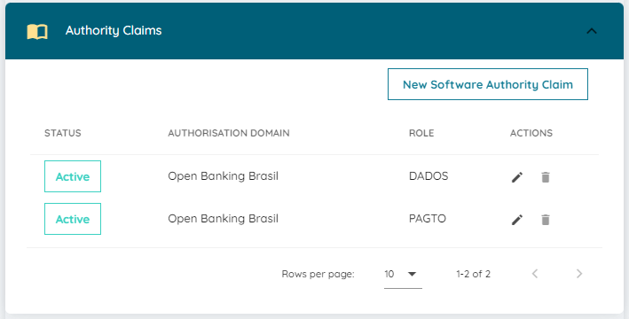
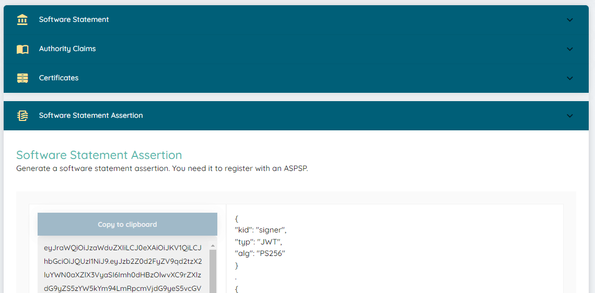

# Performing DCR

The payment functional certifier requires the use of a registered client
at the AS that has been generated through the Software Statement Assertion from the
sandbox participants' directory.

Although the security certifier performs the DCR process, it does not use the
redirect_uri of the functional certifier, which requires registration to be done
in another way.

It is possible to perform DCR through the cURL command, for this you need:

* Transport certificate and private key (BRCAC) from the Software Statement
  issued by the sandbox participants' directory
* MTLS address of the Authorization Server from the Opus Open Banking installation
* Alias name used in the configuration of the functional tests execution
* Access to the sandbox participants' directory
* Software Statement registered with the roles PAGTO (which means "PAYMENT" in Portuguese) and DADOS (which means "DATA")
* software_jwks_uri address from the Software Statement

Since the Software Statement Assertion has a validity of 5 minutes, we suggest
starting the process with the other items, especially preparing the cURL command
to be executed.

## Starting

Create a working directory to generate all the necessary files during the
DCR process.

Copy the transport certificate (BRCAC) files from the Software Statement to the
working directory.

Rename them to facilitate the use of the examples in this guide, use the names
`brcac.cer` and `brcac.key` for the certificate and private key respectively.

Have the configuration URL of the Authorization Server from the installation.
Example: `https://obb.qa.oob.opus-software.com.br/.well-known/openid-configuration`

## Obtaining the DCR URL

Open the configuration URL of the Authorization Server from the installation in a browser.
Look in the returned JSON for the `registration_endpoint` property, the value of this
property is the DCR endpoint URL of the installation.
Example: `https://mtls-obb.qa.oob.opus-software.com.br/auth/reg`

The DCR URL will be used in the cURL command.

## DCR File

Create the `dcr.json` file with the content below:

```text
{
    "grant_types": [
        "authorization_code",
        "implicit",
        "refresh_token",
        "client_credentials"
    ],
    "jwks_uri": "<jwks-software-statement-url>",
    "token_endpoint_auth_method": "private_key_jwt",
    "response_types": [
        "code id_token"
    ],
    "redirect_uris": [
        "https://web.conformance.directory.openbankingbrasil.org.br/test/a/<alias>/callback",
        "https://web.conformance.directory.openbankingbrasil.org.br/test/a/<alias>/callback?dummy1=lorem&dummy2=ipsum"
    ],
    "software_statement": "<ssa-jwt>"
}
Replace the `<alias>` with the value being used in the functional certifier.

## Software Statement

Access the [sandbox participants' directory](https://web.sandbox.directory.openbankingbrasil.org.br/)
with a user who has the privilege to change `software statements`.

We will use the same software statement used in the DCR certification, all
the steps below refer to it.

Click on the Software Statement name link and ensure that the PAGTO and
DADOS roles are present within the Authority Claims section. If any role is
not available for addition, it will be necessary to add the role through the
organization's `Authority Domain Role Claims` session.



Click the edit icon of the Software Statement and ensure that the `redirect uri`
URLs from the `dcr.json` file are present in the REDIRECT URI field.

As an example for the alias `exemplo`, the URLs that should be present are:

`https://web.conformance.directory.openbankingbrasil.org.br/test/a/exemplo/callback`
`https://web.conformance.directory.openbankingbrasil.org.br/test/a/exemplo/callback?dummy1=lorem&dummy2=ipsum`


Click again on the Software Statement name link and open the
`Software Statement Assertion` session, an SSA will be generated by the participants' directory:



Click `Copy to clipboard` to copy the SSA JWT and replace the value of the
`software_statement` property in the `dcr.json` file with the copied value.

Again in the `Software Statement Assertion` session, copy the value of the
`software_jwks_uri` attribute and replace the value of the `jwks_uri` property
in the `dcr.json` file with the copied value.

Don't forget to save the `dcr.json` file!

## Execute DCR

Open a terminal in the working directory and execute the following CURL command,
using the OpenId configuration URL of the Authorization Server from the installation.

```bash
curl -k --cipher 'DEFAULT:!DH' --cert brcac.cer --key brcac.key -d @dcr.json -H "content-type: application/json" -H "accept: application/json" -o dcr-result.json <as-dcr-url>

Open the dcr-result.json file and look for the client_id attribute in the JSON, its presence indicates a successful operation.
