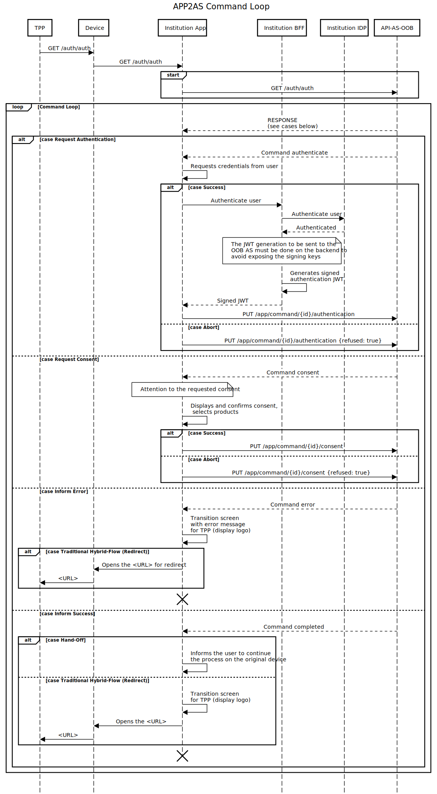

# Mobile Application Integration for Consent Generation

The integration through a mobile application for consent generation provides the best user experience for the institution's customer, allowing the inclusion of Open Banking functionalities within the institution's mobile application already familiar to the end customer.

Consent Generation is a critical moment, embedded in the middle of the OIDC flow and requiring non-traditional integrations, especially the start of Consent Generation which is precisely the beginning of the hybrid flow OIDC redirects.

## Open API Specification

The Rest API definitions are specified in Open API Specification 3.0 [here](../oas-webapp2as.yaml).

## Deep Link and Universal Link

The institution's application needs to intercept calls from TPPs to the Authorization Server when these occur on the user's mobile device, thus enabling the consent generation in the application.

The application can also be triggered during the hybrid flow with Hand-off, where the user is using the TPP on the desktop, and the institution only has authentication through its application. In this scenario, the Opus Open Banking (OOB) Authorization Server (AS) will display a QR code with a URL that also needs to be intercepted by the application. Using a URL that the application can intercept allows the user to read the QR code through any application, including the institution's own application.

Therefore, there are two URL patterns that need to be intercepted by the institution's application as shown in the table below:

| Origin                        | URL                                                    |
| ----------------------------- | ------------------------------------------------------ |
| Same device                   | `https://<EV-FQDN-open-banking>/auth/auth`             |
| Another device (Hand-Off)     | `https://<EV-FQDN-open-banking>/auth/handoff/{id}`     |

### What to do when intercepting a URL?

Once the application is intercepting the URLs and being triggered during a consent request, the next step is to handle the actual consent generation.

With an intercepted URL in hand, the first step is to perform the actual `GET` request to the triggered URL, including any query string parameters that may exist, adding the `Accept` header with the value `application/json`. This header informs the AS that the call is being made by the application and not by the browser.

The AS, knowing that the call was made by the application through the `Accept` header, will function as a Rest API, responding to requests always in JSON format. Adding the header is mandatory for all calls between the institution's application and the OOB AS.

The initial `GET` response is the first of a series of commands that the application must execute during an event loop coming from the AS. The definition of this event loop can be found [at this link](../loop-comandos.md).

## Sequence Diagram

The following sequence diagram briefly illustrates the interaction between the institution's mobile application and the AS as described in the command loop.

## Mock for Integration

The mock to assist in the development of the integration is available in the [Mockoon](https://mockoon.com/) tool and defined in this [JSON file](./mockoon.json).

Several scenarios are mocked and triggered through the respective initial URLs:

| Scenario                                                                   | URL to start process                                |
| -------------------------------------------------------------------------- | --------------------------------------------------- |
| Hybrid-flow / Payment                                                      | <http://localhost:3301/auth/auth?id=standard>       |
| Hybrid-flow hand-off / Payment                                             | <http://localhost:3301/auth/app/commands/handoff>   |
| Hybrid-flow / CPF_MISMATCH in authentication                               | <http://localhost:3301/auth/auth?id=cpf>            |
| Hybrid-flow / EXPIRED_CONSENT in initial link                              | <http://localhost:3301/auth/auth?id=expired>        |
| Hybrid-flow / RESOURCE_MUST_CONTAIN_ID in confirmation                     | <http://localhost:3301/auth/auth?id=resource>       |
| Hybrid-flow / RESOURCE_MUST_CONTAIN_ID_SELECTABLE_PRODUCTS in confirmation | <http://localhost:3301/auth/auth?id=resource>       |
| Hybrid-flow / DISCOVERY_ERROR in authentication                            | <http://localhost:3301/auth/auth?id=discovery>      |
| Hybrid-flow / DISCOVERY_TIMEOUT in authentication                          | <http://localhost:3301/auth/auth?id=discovery-timeout> |
| Hybrid-flow / INVALID_STATUS_CONFIRMATION in confirmation                  | <http://localhost:3301/auth/auth?id=resource>       |
| Hybrid-flow / GENERIC_ERROR in initial link                                | <http://localhost:3301/auth/auth?id=generic>        |

To run the mock, simply import the JSON into the Mockoon tool and start the server of the "OOB Authorization Server Apps API" environment.

## Changelog

### 2023-07-27 - v2.1.10

- Added definition for INVALID_STATUS_CONFIRMATION error.

### 2023-05-15 - v2.1.9

- Added definition for DISCOVERY_TIMEOUT error.

### 2022-11-09 - v2.1.8

- Added definition for RESOURCE_MUST_CONTAIN_ID_SELECTABLE_PRODUCTS error.

### 2022-09-05 - v2.1.7

- Added definition for DISCOVERY_ERROR.

### 2022-08-25 - v2.1.6

- Added new mock scenarios.

### 2022-01-11 - v2.1.5

- Isolated the command loop definition into a separate page.

### 2021-12-13 - v2.1.4

- Changed the path for sending user authentication requests.

### 2021-11-30 - v2.1.3

- Added redirectTo property information for error cases.

### 2021-10-15 - v2.1.2

- Added the structure of the JWT received in the authenticate command to [oas-webapp2as.yaml](../oas-webapp2as.yaml).

### 2021-10-01 - v2.1.1

- Mock of the new interface
- Added TPP information (name and logo) in all commands
- Removed TPP information from ConsentCommand
