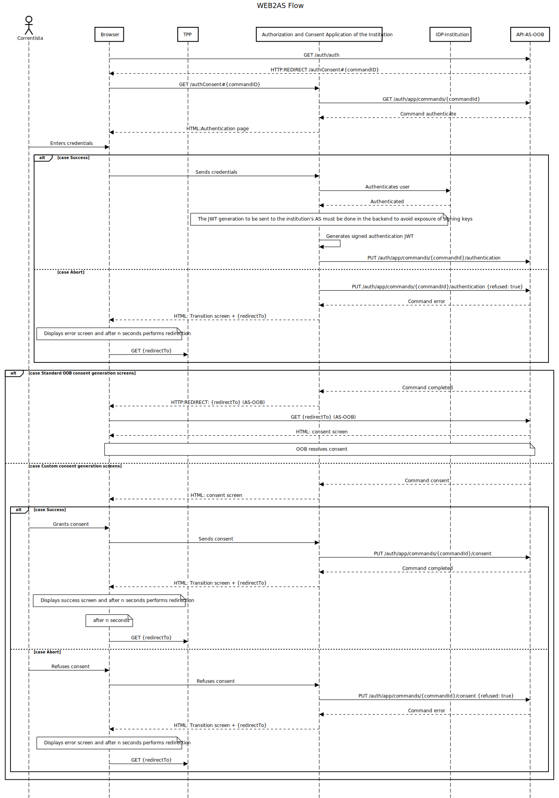

# Integration via Web Application for Consent Generation

If the institution needs, it can authenticate its account holders through
its own login page. Once the login is completed, the institution can
choose to use the standard consent generation screens from Opus Open
Banking or its own customized screens.

## Open API Specification

The definitions of the Rest API are defined in Open API Specification 3.0 [here](../oas-webapp2as.yaml).

## Starting the Custom Web Login Flow

The flow starts with the initial `GET` request to the authentication URL with the AS (`https://<EV-FQDN-open-banking>/auth/auth`).

After receiving this `GET`, the AS then redirects the user's browser to the
URL of the system responsible for the institution's authentication. This URL is
configurable within the AS.

This configuration defines the template of the institution's custom authentication
URL, so the initial identifier of the authentication flow to be handled by the login page can be
merged into the URL as the institution wishes.

The merge allows the institution to receive the identifier through the `query string`,
`fragment`, or `url`, as shown in the table below:

| Format       | Example URL                                             |
| ------------ | ------------------------------------------------------- |
| Query string | `https://ev.institution.com.br?code=<IDENTIFIER>`       |
| Fragment     | `https://ev.institution.com.br#<IDENTIFIER>`            |
| URL          | `https://ev.institution.com.br/<IDENTIFIER>`            |

The example provided in the documentation uses the **Fragment** format, which is the most
recommended among the existing options, as it also removes the identifier
from the navigation history, avoiding any confusion by the client (for
example, when trying to use an old consent URL).

This configuration (`TBD`) can be checked in detail with an example on the page describing the [AS configurations](../deploy/oob-authorization-server/readme.md).

If this configuration is set, the AS will understand that it is a custom web
authentication flow and will then return to the institution's authorization application
an address for redirection containing the identification of the authentication `command` created to start the flow.

The communication between the institution's web application and the AS will happen through
`commands` within an event loop. The definition of this event loop
can be checked [at this link](../loop-comandos.md).

## Using the Custom Consent Generation Flow

The institution can choose between using the standard consent generation
screens provided with Opus Open Banking, or opting to use its
own consent generation screens.

There is a configuration in the AS that allows defining the institution's choice.
The name (`TBD`) and an example can be checked on the [AS configurations](../deploy/oob-authorization-server/readme.md) page.

If the institution opts to use its own consent generation screens,
the part of the flow related to the selection of resources and the approval/refusal of
consent, as well as the final screen responsible for transitioning the
consent generation back to the TPP, will be handled by the institution itself, which must communicate via API with the AS to inform the selected resources and the approval/refusal of the respective consent.

## Sequence Diagram

The following sequence diagram illustrates the operation between the institution's web application and the AS, encompassing the authentication stage followed by the consent generation flow, both for the configuration using standard screens and using custom screens.

## Changelog

### 2022-01-11 - v1.0.0

- Initial version of the document.
