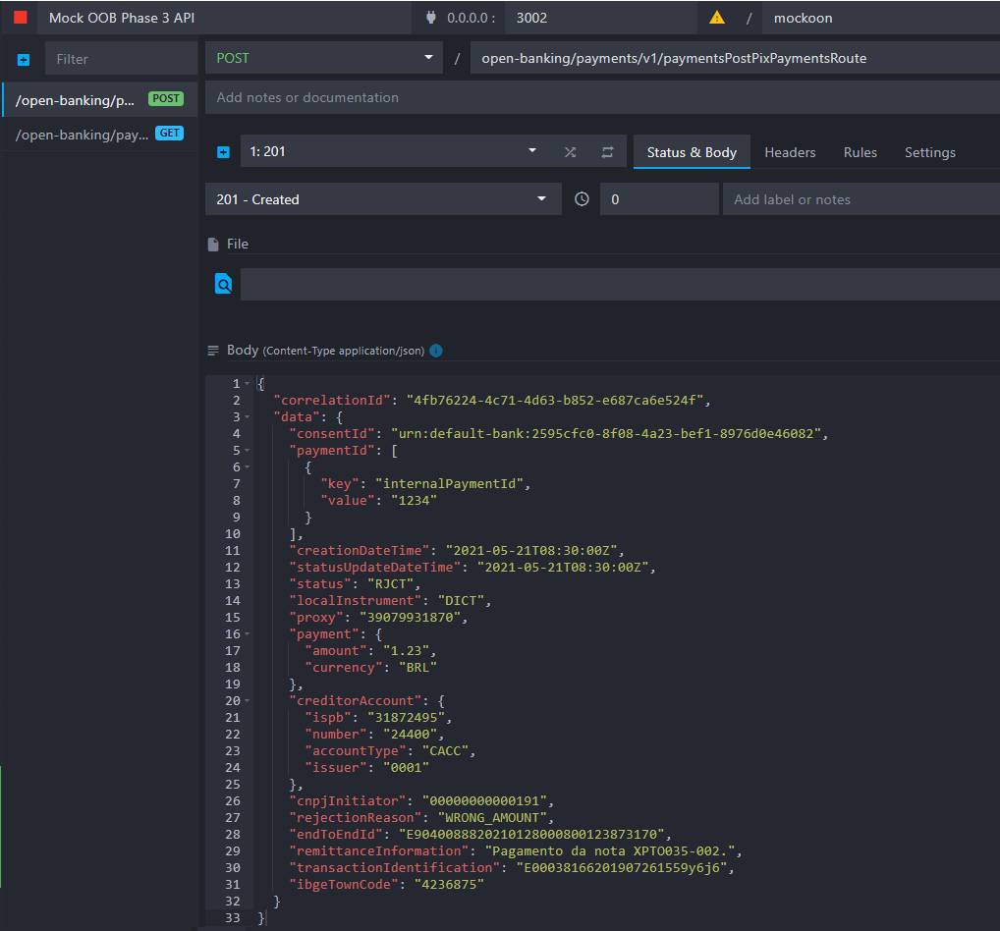
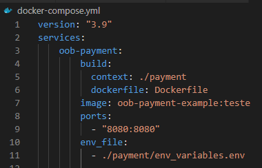
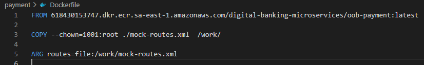
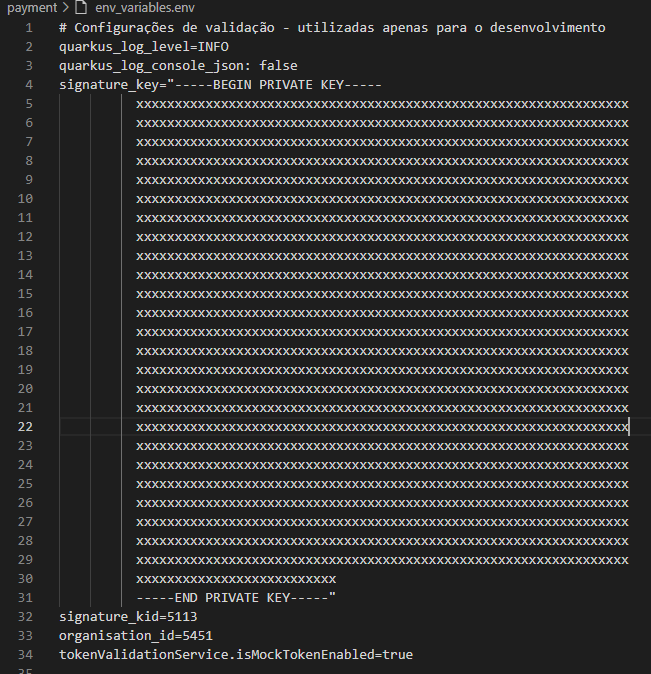
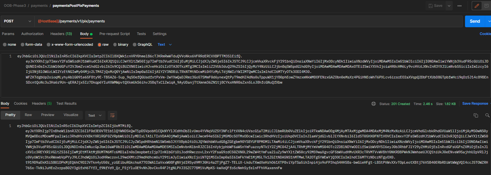
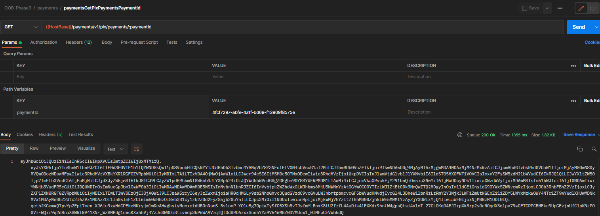
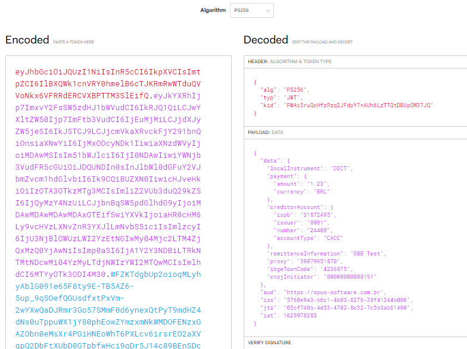
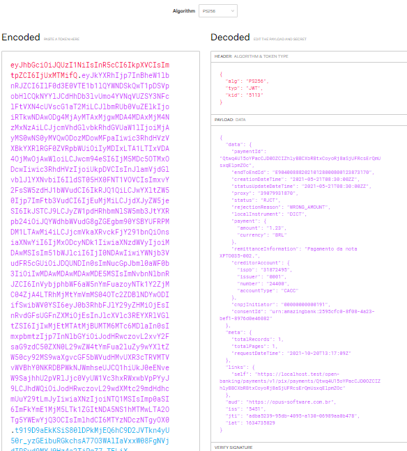
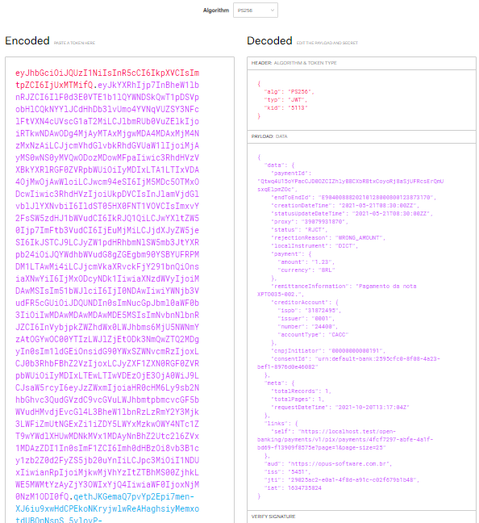
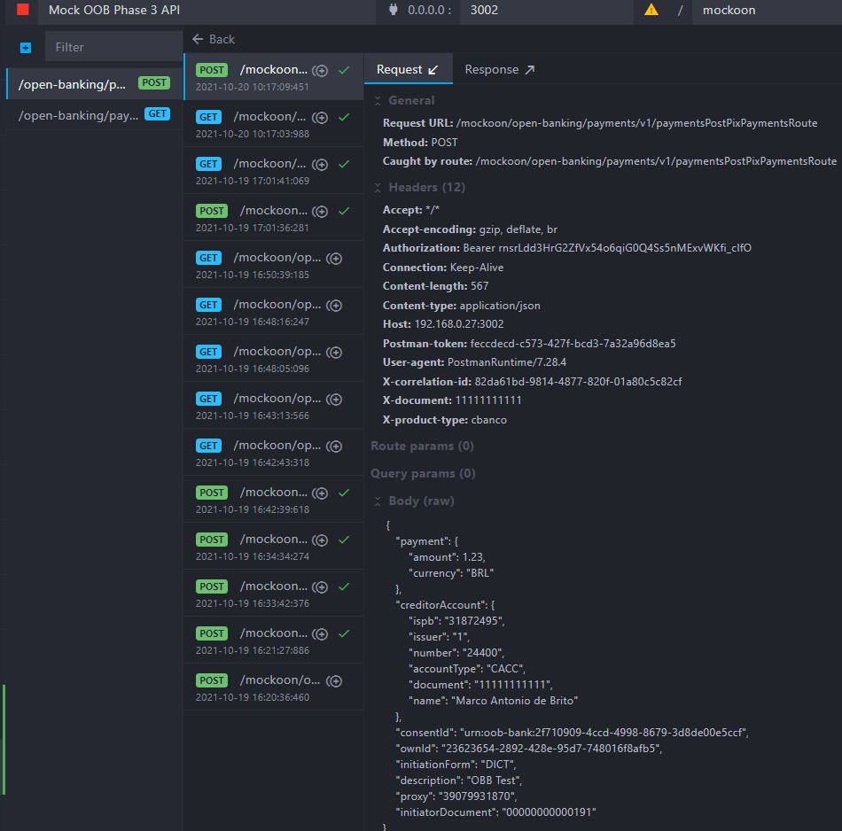

# Example of Creating and Running a Camel Connector

This page describes the creation of an example Camel connector that calls an HTTP service. The example services are the PIX payment API services in the payments module.

&nbsp;

## Mock of the Remote Service

For the function of the service that will be called by the connector, we will use endpoints with fixed responses in the Mockoon tool. The file [mockoon-oob_phase3.json](mockoon-oob_phase3.json) should be imported into the tool, and the mock should be started.



## Creating the Demo Connector

The file [mock-routes.xml](mock-routes.xml) describes two routes that, when executed, call the services of the mock. This example simply describes **and without error handling or configurations** how to call a remote service in a connector. For the test to run, it will be necessary to change the IP of the routes to the address of the host that will run Mockoon.

## Running the Application with Mocks

The container with the payments module should be run using the example Camel connector:

```shell
docker run -it --rm -p 8080:8080 -v "/files/mock-routes.xml":/work/mock-routes.xml \
-e camel.main.routes-include-pattern=file:/work/mock-routes.xml 618430153747.dkr.ecr.sa-east-1.amazonaws.com/opus-open-banking-release/oob-payment:0.9.0.835453b
```

The parameters are:

- `-it`: Creates an interactive session with the Container. Optional.
- `-rm`: Removes the container at the end of execution. Optional.
- `-p 8080:8080`: Maps the container port to the host port.
- `-v "/files/mock-routes.xml":/work/mock-routes.xml`: Allows the Camel connector file to be accessible inside the container. The path `/files/mock-routes.xml` should be adjusted to the file's location on the host running the container.
- `-e camel.main.routes-include-pattern=file:/work/mock-routes.xml`: Indicates to the application where to find the connector file inside the container.

To call the remote service in a connector **with configurations**, you can add them in the `docker run` command or create the `docker-compose.yml`, `Dockerfile`, and `env_variables.env` files with the configurations and execute using the commands `docker-compose build` followed by `docker-compose up`.







If started correctly, the container log should indicate that the routes have been loaded:

```json
{
    "timestamp": "2021-10-20T14:56:56.819-03:00",
    "sequence": 554,
    "loggerClassName": "org.slf4j.impl.Slf4jLogger",
    "loggerName": "org.apache.camel.impl.engine.AbstractCamelContext",
    "level": "INFO",
    "message": "    Started paymentsPostPixPaymentsRoute (direct://paymentsPostPixPayments)",
    "threadName": "main",
    "threadId": 1,
    "mdc": {},
    "ndc": "",
    "hostName": "2d44a51eed49",
    "processName": "NativeImageGeneratorRunner$JDK9Plus",
    "processId": 200
}

{
    "timestamp": "2021-10-20T14:56:56.819-03:00",
    "sequence": 555,
    "loggerClassName": "org.slf4j.impl.Slf4jLogger",
    "loggerName": "org.apache.camel.impl.engine.AbstractCamelContext",
    "level": "INFO",
    "message": "    Started paymentsGetPixPaymentsPaymentIdRoute (direct://paymentsGetPixPaymentsPaymentId)",
    "threadName": "main",
    "threadId": 1,
    "mdc": {},
    "ndc": "",
    "hostName": "2d44a51eed49",
    "processName": "NativeImageGeneratorRunner$JDK9Plus",
    "processId": 200
}
```
## Testing the Connector

To test the Camel connector, we need to call the payments application, and it will execute the connector. The connector, in turn, should call the mock of the remote service.

To execute the calls, we will use the Postman collection contained in the file [OOB-Phase3.postman_collection.json](OOB-Phase3.postman_collection.json).





To decode the request and response bodies, use the [jwt.io](https://jwt.io/) platform. Set the algorithm to **PS256**.

POST Request:



POST Response:



GET Response:



The calls received by Mockoon can be viewed by clicking the "environment logs" button.



