# Development of Connectors

This documentation aims to guide the development of connector to integrate the
OPUS Open Finance Platform to Financial Institution's business backend systems.
&nbsp;

Index:
&nbsp;

- [Development of Connectors](#development-of-connectors)
  - [Introduction](#introduction)
    - [What is a Connector](#what-is-a-connector)
    - [How the OPUS Open Finance Platform Loads the Connector](#how-the-opus-open-finance-platform-loads-the-connector)
    - [Processing Responsibility](#processing-responsibility)
      - [Opus Open Finance Platform](#opus-open-finance-platform)
      - [Connector](#connector)
    - [Docker Image Availability](#docker-image-availability)
  - [Connector Examples and Docker Image Extension](#connector-examples-and-docker-image-extension)
      - [Using Simple Proxy](#using-simple-proxy)
      - [Using Mock](#using-mock)
      - [Adding the Connector to an Existing Image](#adding-the-connector-to-an-existing-image)
        - [Dockerfile for Simple Proxy Connector](#dockerfile-for-the-simple-proxy-connector)
        - [Dockerfile for Mock Connector](#dockerfile-for-the-mock-connector)
  - [Injecting Environment Variables](#injecting-environment-variables)
      - [Injecting Via Dockerfile](#injecting-via-dockerfile)
      - [Examples](#examples)
      - [Injecting Variables at Build Time](#injecting-variables-at-build-time)
      - [Injecting Variables at Container Runtime](#injecting-variables-at-container-runtime)
  - [Consuming Environment Variables via Camel](#consuming-environment-variables-via-camel)
      - [Example with Simple Proxy](#example-with-simple-proxy)
      - [Example with Mock](#example-with-mock)
  - [Error Handling](#error-handling)
  - [Timeout Configuration](#timeout-configuration)
  - [Header Handling](#header-handling)
  - [`camelHelper` Utility Class](#camelhelper-utility-class)
  - [Supported Components](#supported-components)
      - [ACTIVEMQ](#activemq)
      - [AMQP](#amqp)
      - [ATLASMAP](#atlasmap)
      - [DATA FORMAT](#data-format)
      - [DIRECT](#direct)
      - [ELASTICSEARCH REST](#elasticsearch-rest)
      - [EXEC](#exec)
      - [FILE](#file)
      - [HTTP](#http)
      - [JING](#jing)
      - [LOG](#log)
      - [MOCK](#mock)
      - [MSV](#msv)
      - [PLATFORM HTTP](#platform-http)
      - [REF](#ref)
      - [REST](#rest)
      - [SEDA](#seda)
      - [TIMER](#timer)
      - [VALIDATOR](#validator)
      - [VELOCITY](#velocity)
      - [VM](#vm)
  - [Supported Data Formats](#supported-data-formats)
      - [Jackson](#jackson)
      - [Gson](#gson)
      - [CSV](#csv)
      - [Flatpack](#flatpack)
      - [Bindy](#bindy)
      - [TidyMarkup](#tidymarkup)
      - [BASE64](#base64)
      - [JACKSONXML](#jacksonxml)
  - [Supported Languages](#supported-languages)
      - [Bean Method](#bean-method)
      - [CORE](#core)
      - [HL7 Terser](#hl7-terser)
      - [JSON PATH](#json-path)
      - [XML JAXP](#xml-jaxp)
      - [XPATH](#xpath)
      - [XQUERY](#xquery)
  - [Deprecated - Documentation for Previous Versions of Integrations](#deprecated---documentation-for-previous-versions-of-integrations)
    - [Consuming the Consent Object - only for v1 schemas](#consuming-the-consent-object---only-for-v1-schemas)
      - [Simple Proxy Example](#simple-proxy-example)
      - [Obtaining through Camel XML](#obtaining-through-camel-xml)

&nbsp;

## Introduction

### What is a Connector

OPUS Open Finance platform implements a series of APIs that are called by financial institution in the Open Finance Brazil ecosystem to (i) perform an electronic payment or (ii) request customer data. After verifying the consent and validating the request, the platform needs to trigger the backend system responsible for processing the payment or returning the requested data. The set of connectors is precisely responsible for the communication between the platform and the financial institution's backend systems. A different connector is triggered for each type of atomic interaction with the backend systems.

**Note:** The only electronic payment method currently suportted by Open Finance Brazil is *Pix*, which is a hugely popular official instant payment platform created and managed by Brazilian Central Bank (BACEN - Banco Central do Brasil). To more information, [read this](https://en.wikipedia.org/wiki/Pix_(payment_system)).  
&nbsp;

### How the OPUS Open Finance Platform Loads the Connector

Each connector is loaded at runtime by redirecting calls to OPUS Open Finance Platform (OOF) to the routes implemented in the connector.

By default, the OOF platform looks for route files in the `/work` directory of the image. However, this path can be modified in the extended image created by the connector, provided that the environment variable `camel.main.routes-include-pattern` reflects this change, as well as any other files that may be copied to the image and their references (see [Adding the connector to an existing image](#adding-the-connector-to-an-existing-image)).
&nbsp;

### Processing Responsibility

The purpose of this section is to explain the distribuition of responsibility between the platform and a connector when procesing a request.

#### Opus Open Finance Platform

- Verify if there is a valid consent from the client for the `HTTP` request being made and, if not, reject the request;
- Validate if the `request` received in the `HTTP` request (both *headers* and *body*) complies with the standards defined by OBB;
- Return the appropriate error, according to OBB specifications, if the `request` received in the `HTTP` request is not valid;
- Perform the necessary mappings between the `id` of a resource in OBB and its equivalent in the backend system(s) of the financial institution, and vice versa;
- Convert the `response` returned by the connector and add the necessary metadata to return a `response` object in accordance with the OBB specification;
- Validate if the `response` object returned by the connector is in accordance with the spec(s) previously defined by OOF;
- Generate error returns in the formats specified by OBB in case of internal processing errors, connector call errors, or errors in the `response` object returned by the connector.

#### Connector

- Have an input interface in compliance with the spec(s) previously defined by OOF;
- Make calls to the backend system(s) of the financial institution (or any other pertinent system) to obtain the data to be returned in the request;
- Return a `response` object (both in case of success and error) in compliance with the spec(s) previously defined by OOF;
- For calls using *idempotency keys*, properly manage them;
- Make the necessary queries (when applicable) to the consent object sent in the request to decide on the data to be returned.

### Docker Image Availability

Opus will provide the financial institution with two distinct images:

1. Native image without defined routes
2. Image with mock routes

&nbsp;

## Connector Examples and Docker Image Extension

&nbsp;

This section presents some examples of connector creation, as well as a step-by-step guide on how to extend an image to include a new connector.

Here we are giving concise connector examples that make a direct call to an external HTTP service or always return a static JSON. However, it is possible to make calls to various Camel components supported in native mode on Quarkus. In this [section](#supported-components) you can find all the components supported for Quarkus Camel native that are supported by Opus Open Finance Platform.

&nbsp;

### Using Simple Proxy

&nbsp;

The purpose of this example is to demonstrate the steps necessary to create a connector that makes an HTTP request to an external service and directly returns the response obtained from this request.

Assume we will create a connector containing two routes, which listen to calls made to `direct:customersGetPersonalQualifications` and `direct:customersGetBusinessQualifications` and process them through a `HTTP GET` request, directly returning the result obtained.

&nbsp;

To do this, we will create the following Camel route files:

`personal_qualifications_route.xml`

```xml
<routes xmlns:xsi="http://www.w3.org/2001/XMLSchema-instance"
        xmlns="http://camel.apache.org/schema/spring"
        xsi:schemaLocation="
            http://camel.apache.org/schema/spring
            http://camel.apache.org/schema/spring/camel-spring.xsd">

    <route id="customersGetPersonalQualificationsRoute">
        <from uri="direct:customersGetPersonalQualifications"/>
        <to uri="http://mockbin.org/bin/77ef082f-b311-4123-a287-0ee99347bfe1?bridgeEndpoint=true"/>

    </route>
</routes>
```

&nbsp;

`business_qualifications_route.xml`

```xml
<routes xmlns:xsi="http://www.w3.org/2001/XMLSchema-instance"
        xmlns="http://camel.apache.org/schema/spring"
        xsi:schemaLocation="
            http://camel.apache.org/schema/spring
            http://camel.apache.org/schema/spring/camel-spring.xsd">

    <route id="customersGetBusinessQualificationsRoute">
        <from uri="direct:customersGetBusinessQualifications"/>
        <to uri="http://mockbin.org/bin/ad5a2df2-38db-47df-a418-cf260719a3b1?bridgeEndpoint=true"/>

    </route>
</routes>
```

The `bridgeEndpoint` attribute **must** be set to `true`.  
This is necessary so that the URI from which the route originates is ignored in the call, and only the one defined in the created route is called.

&nbsp;

From the images above, we can see that when this connector is added, the `direct:customersGetPersonalQualifications` route will make a request to the URI `http://mockbin.org/bin/77ef082f-b311-4123-a287-0ee99347bfe1`, while the `direct:customersGetBusinessQualifications` route will redirect to `http://mockbin.org/bin/ad5a2df2-38db-47df-a418-cf260719a3b1`.

&nbsp;

With the route files created, it is necessary to extend the image to add the connector by following the steps presented in this [Section](#adding-the-connector-to-an-existing-image).

&nbsp;

### Using Mock

&nbsp;

The purpose of this example is to demonstrate the necessary steps to create a connector that returns a mock contained in an internal file within the connector.

Consider that we will create a connector containing two routes, which listen for calls made to `direct:customersGetPersonalQualifications` and `direct:customersGetBusinessQualifications` and process them, always returning the same data for the same call, which is contained in a mock file.

&nbsp;

To do this, we will create two different types of files:

&nbsp;

Files containing the mocks to be returned

`personal_qualifications.json`

```json
{
    "correlationId": "1fe4ae88-db5f-4bc9-b49b-5290d3acefe4",
    "data": {
        "updateDateTime": "2021-05-21T08:30:00Z",
        "companyCnpj": "50685362000135",
        "occupationCode": "RECEITA_FEDERAL",
        "occupationDescription": "01",
        "informedIncome": {
            "frequency": "DIARIA",
            "amount": "100000.0412",
            "currency": "BRL",
            "date": "2021-05-21"
        },
        "informedPatrimony": {
            "amount": "100000.0498",
            "currency": "BRL",
            "year": 2010
        }
    }
}
```

&nbsp;

`business_qualifications.json`

```json
{
    "correlationId": "64d0ba85-ea54-4bc7-9c33-f949ce166f63",
    "data": {
        "updateDateTime": "2021-05-21T08:30:00Z",
        "economicActivities": [
            {
                "code": 8599604,
                "isMain": true
            }
        ],
        "informedRevenue": {
            "frequency": "DIARIA",
            "frequencyAdditionalInfo": "Informações adicionais",
            "amount": "100000.0415",
            "currency": "BRL",
            "year": 2010
        },
        "informedPatrimony": {
            "amount": "100000.0415",
            "currency": "BRL",
            "date": "2021-05-21"
        }
    }
}
```

&nbsp;

Camel route files

`personal_qualifications_route.xml`

```xml
<routes xmlns:xsi="http://www.w3.org/2001/XMLSchema-instance"
        xmlns="http://camel.apache.org/schema/spring"
        xsi:schemaLocation="
            http://camel.apache.org/schema/spring
            http://camel.apache.org/schema/spring/camel-spring.xsd">

    <route id="customersGetPersonalQualificationsRoute">
        <from uri="direct:customersGetBusinessQualifications"/>
        <to uri="velocity:file:/plugin/mocks/personal_qualifications.json?allowContextMapAll=true&amp;encoding=UTF-8"/>

    </route>
</routes>
```

&nbsp;

`business_qualifications_route.xml`

```xml
<routes xmlns:xsi="http://www.w3.org/2001/XMLSchema-instance"
        xmlns="http://camel.apache.org/schema/spring"
        xsi:schemaLocation="
            http://camel.apache.org/schema/spring
            http://camel.apache.org/schema/spring/camel-spring.xsd">

    <route id="customersGetBusinessQualificationsRoute">
        <from uri="direct:customersGetBusinessQualifications"/>
        <to uri="velocity:file:/plugin/mocks/business_qualifications.json?allowContextMapAll=true&amp;encoding=UTF-8"/>

    </route>
</routes>
```

&nbsp;

With these files created, it is necessary to extend the image to add the connector. The steps required to perform this extension can be found in this [Section](#adding-the-connector-to-an-existing-image).

&nbsp;

### Adding the Connector to an Existing Image

&nbsp;

The purpose of this section is to demonstrate how an existing image can be extended to add a connector that has been created for one or more of its routes. To do this, we will extend a Docker image containing two endpoints: `http://localhost:8080/open-finance/customers/v1/personal/qualifications` and `http://localhost:8080/open-finance/customers/v1/business/qualifications`, which direct to `direct:customersGetPersonalQualifications` and `direct:customersGetBusinessQualifications`, respectively.

&nbsp;

- Consider the Docker image `oob-without-route-example-native` shown below as the one containing the above-mentioned endpoints:

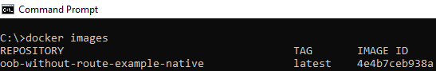

&nbsp;

- Consider that currently, there are no routes in this image listening to calls directed to `direct:customersGetPersonalQualifications` and `direct:customersGetBusinessQualifications`, which results in the error shown below when any of these endpoints are called:

&nbsp;

```sh
curl --location --request GET 'http://localhost:8080/open-finance/customers/v1/personal/qualifications'
```


&nbsp;

```sh
curl --location --request GET 'http://localhost:8080/open-finance/customers/v1/business/qualifications'
```

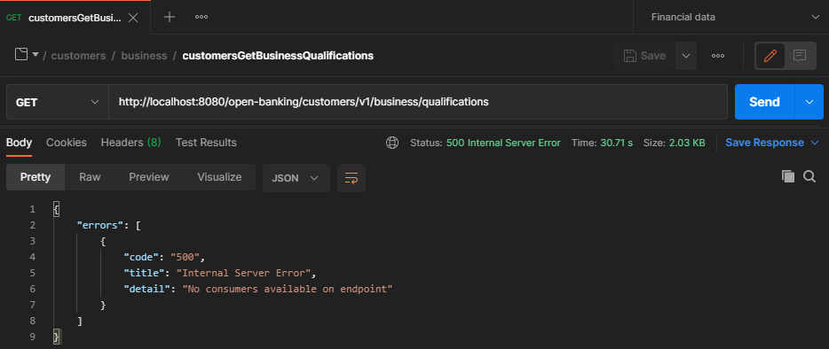

&nbsp;

Assuming the connectors have already been created according to the previous sections, we need to create a `Dockerfile` to extend the image in order to create a new Docker image that contains the initial Docker image along with the created connector. We will extend the image to add the connector with the routes so that calls directed to `direct:customersGetPersonalQualifications` and `direct:customersGetBusinessQualifications` are processed by these new routes.

The following subsections present the steps to be followed to create this `Dockerfile`, considering each of the connector examples presented in the previous sections.

&nbsp;

Once the `Dockerfile` is created, the following command must be executed to extend the existing image with the addition of the newly created connector:

```sh
docker build -t oof-with-connector-example-native .
```

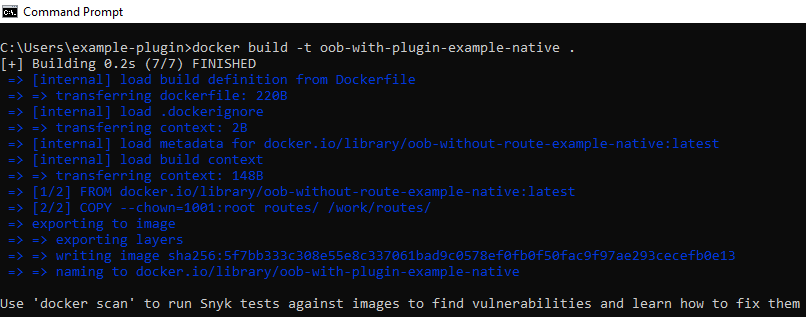

&nbsp;

After creating the image, the following command should be run to execute it:

```sh
docker run -d -p 8080:8080 oof-with-connector-example-native
```

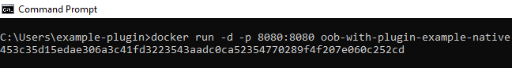

&nbsp;

At this point, making a new request to the endpoints should return the results defined in the routes of the connector added to the image.

```sh
curl --location --request GET 'http://localhost:8080/open-finance/customers/v1/personal/qualifications'
```

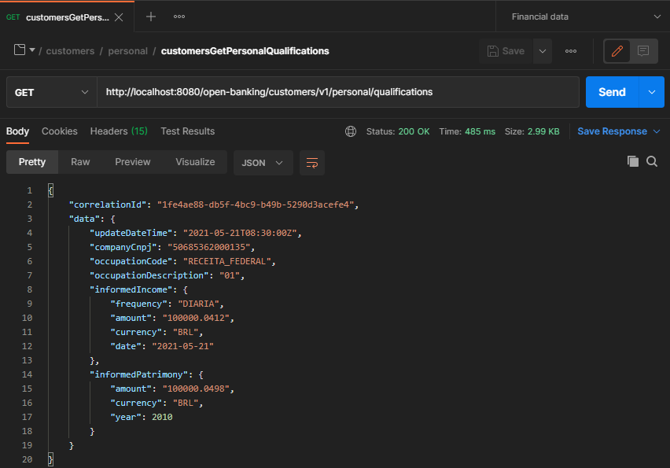

&nbsp;

```sh
curl --location --request GET 'http://localhost:8080/open-finance/customers/v1/business/qualifications'
```

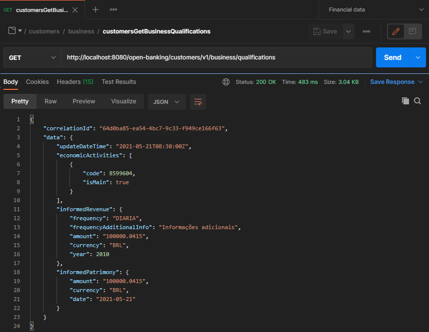

&nbsp;

#### Dockerfile for the Simple Proxy Connector

&nbsp;

Consider that the simple proxy connector created has the following directory structure:

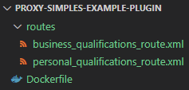

&nbsp;

The `Dockerfile` should be created as follows:

```dockerfile
FROM oof-without-route-example-native:latest
COPY --chown=1001:root routes/ /plugin/routes/

ARG routes=file:/plugin/routes/*_route.xml
ENV camel.main.routes-include-pattern=$routes
```

Where:

- Line 1 indicates the original image to be extended (in this case, `oof-without-route-example-native`);
- Line 2 copies all files contained in the `/routes` directory of the connector to the `/plugin/routes` directory of the image;
- Line 4 creates a variable called `routes` and assigns to it the path pattern where the route files are located in the image. In this specific case, the pattern is being set as all files ending with `_route.xml` within the `/plugin/routes` directory;
- Line 5 assigns the variable created in line 4 to the environment variable `camel.main.routes-include-pattern`. This environment variable is responsible for informing Camel where the route files should be looked for.

&nbsp;

#### Dockerfile for the Mock Connector

&nbsp;

Consider that the mock connector created has the following directory structure:


&nbsp;

The `Dockerfile` should be created as follows:

```dockerfile
FROM oof-without-route-example-native:latest
COPY --chown=1001:root routes/ /plugin/routes/
COPY --chown=1001:root mocks/ /plugin/mocks/

ARG routes=file:/plugin/routes/personal_qualifications_route.xml,file:/plugin/routes/business_qualifications_route.xml
ENV camel.main.routes-include-pattern=$routes
```

Where:

- Line 1 indicates the original image to be extended (in this case, `oof-without-route-example-native`);
- Line 2 copies all files contained in the connector's `/routes` directory to the image’s `/plugin/routes` directory;
- Line 3 copies all files contained in the connector’s `/mocks` directory to the image’s `/plugin/mocks` directory;
- Line 4 creates a variable called `routes` and assigns it a comma-separated list of route files (here, we listed the files one by one to demonstrate the options. However, we could have used a pattern in the same way as in the simple proxy example);
- Line 5 assigns the variable created in line 4 to the environment variable `camel.main.routes-include-pattern`. This environment variable is responsible for informing Camel where the route files should be looked for.

&nbsp;

## Injecting Environment Variables

&nbsp;

### Injecting via Dockerfile

Add the following lines to the Dockerfile:

```dockerfile
ARG <variable_name>=<variable_value>
ENV env_var_name=$<variable_name>
```

&nbsp;

### Examples

The examples below assume that the route files are contained in the `/work` directory of the Docker image.

&nbsp;

Adding a new route file via environment variable:

```dockerfile
ARG route=file:/work/routes.xml
ENV camel.main.routes-include-pattern=$route
```

&nbsp;

Adding multiple route files via environment variable:

```dockerfile
ARG route=file:/work/routes1.xml,file:/work/routes2.xml
ENV camel.main.routes-include-pattern=$route
```

&nbsp;

Adding multiple files from a directory:

```dockerfile
ARG route=file:/work/*.xml
ENV camel.main.routes-include-pattern=$route
```

&nbsp;

### Injecting Variables at Build Time

```shell
docker build -t <image_name> --build-arg <variable_name>=<variable_value> .
```

&nbsp;

### Injecting Variables at Container Runtime

```shell
docker run --env <variable_name>=<variable_value> -p 8080:8080 <image_name>
```

&nbsp;

### Consuming Environment Variables via Camel

&nbsp;

#### Example with Simple Proxy

&nbsp;

Taking the [simple proxy connector](#using-simple-proxy) as an example, consider the `business_qualifications_route.xml` route file presented:

```xml
<routes xmlns:xsi="http://www.w3.org/2001/XMLSchema-instance"
        xmlns="http://camel.apache.org/schema/spring"
        xsi:schemaLocation="
            http://camel.apache.org/schema/spring
            http://camel.apache.org/schema/spring/camel-spring.xsd">

    <route id="getCustomersBusinessQualificationsRoute">
        <from uri="direct:getCustomersBusinessQualifications"/>
        <to uri="http://mockbin.org/bin/ad5a2df2-38db-47df-a418-cf260719a3b1?bridgeEndpoint=true"/>
    </route>

</routes>
```

&nbsp;

We will modify it to use an environment variable called `routes.customers.uri-legado` instead of the static value for the backend system URI `http://mockbin.org/bin/ad5a2df2-38db-47df-a418-cf260719a3b1`.

To do this, we first need to modify the `business_qualifications_route.xml` file so that it consumes the mentioned environment variable, which is done using the `{{env:<variable_name>}}` command:

```xml
<routes xmlns:xsi="http://www.w3.org/2001/XMLSchema-instance"
        xmlns="http://camel.apache.org/schema/spring"
        xsi:schemaLocation="
            http://camel.apache.org/schema/spring
            http://camel.apache.org/schema/spring/camel-spring.xsd">

    <route id="getCustomersBusinessQualificationsRoute">
        <from uri="direct:getCustomersBusinessQualifications"/>
        <to uri="{{env:routes.customers.uri-legado}}?bridgeEndpoint=true"/>

    </route>
</routes>
```

&nbsp;

After this, simply inject the environment variable `routes.customers.uri-legado` using one of the approaches mentioned earlier in this same [section](#injecting-environment-variables).

For example, we could inject the value at runtime via the `run` command:

```shell
docker run --env routes.customers.uri-legado=http://mockbin.org/bin/ad5a2df2-38db-47df-a418-cf260719a3b1 -p 8080:8080 <image_name>
```

&nbsp;

#### Example with Mock

&nbsp;

Taking the [connector with mock file](#using-mock) as an example, consider the `personal_qualifications_route.xml` route file presented:

```xml
<routes xmlns:xsi="http://www.w3.org/2001/XMLSchema-instance"
        xmlns="http://camel.apache.org/schema/spring"
        xsi:schemaLocation="
            http://camel.apache.org/schema/spring
            http://camel.apache.org/schema/spring/camel-spring.xsd">

    <route id="getCustomersPersonalQualificationsRoute">
        <from uri="direct:getCustomersPersonalQualifications"/>
        <to uri="velocity:file://plugin/mocks/personal_qualifications.json?allowContextMapAll=true"/>

    </route>
</routes>
```

&nbsp;

We will modify it to use an environment variable called `routes.customers.personal-identifications` instead of the static value `velocity:file://plugin/sucesso.json?allowContextMapAll=true`.

To do this, we first need to modify the `personal_qualifications_route.xml` file so that it consumes the mentioned environment variable, which is done using the `{{env:<variable_name>}}` command:

```xml
<routes xmlns:xsi="http://www.w3.org/2001/XMLSchema-instance"
        xmlns="http://camel.apache.org/schema/spring"
        xsi:schemaLocation="
            http://camel.apache.org/schema/spring
            http://camel.apache.org/schema/spring/camel-spring.xsd">

    <route id="getCustomersPersonalQualificationsRoute">
        <from uri="direct:getCustomersPersonalQualifications"/>
        <to uri="velocity:{{env:routes.customers.personal-identifications}}"/>

    </route>
</routes>
```

&nbsp;

After this, simply inject the environment variable `routes.customers.personal-identifications` using one of the approaches mentioned earlier in this same [section](#injecting-environment-variables).

For example, we could inject the value via `Dockerfile`, by editing the lines below:

```dockerfile
ARG route=file://plugin/sucesso.json?allowContextMapAll=true
ENV routes.customers.personal-identifications=$route
```

&nbsp;

## Error Handling

In case of connector or remote system failure, the returned object must follow the format described in [response-error-schema.json](error/schemas/response-error-schema.json).

The error messages that are returned may be passed to the TPP or displayed on the screen, so it is important not to include technical errors in the descriptions. If the error is something the user can understand, that description may be returned, but if it is a technical error such as a network or system failure, the error object should contain a generic description like "unable to complete the operation, please try again."

It is important to remember that system failures (5xx codes) can affect the bank's SLA as they are counted as downtime if they occur too frequently.

&nbsp;

## Timeout Configuration

To configure timeouts for external HTTP service calls, it is necessary to add a parameter to the endpoints in the route file, where the time should be specified in milliseconds.

&nbsp;

Example of timeout configuration with a fixed value in the route file:

```xml
<routes xmlns:xsi="http://www.w3.org/2001/XMLSchema-instance"
        xmlns="http://camel.apache.org/schema/spring"
        xsi:schemaLocation="
            http://camel.apache.org/schema/spring
            http://camel.apache.org/schema/spring/camel-spring.xsd">

    <route id="getCustomersPersonalQualificationsRoute">
        <from uri="direct:getCustomersPersonalQualifications"/>
        <to uri="https://endpoint.domain?bridgeEndpoint=true&amp;socketTimeout=5000"/>

    </route>
</routes>
```

&nbsp;

Example of timeout configuration with parameterization via environment variable:

```xml
<routes xmlns:xsi="http://www.w3.org/2001/XMLSchema-instance"
        xmlns="http://camel.apache.org/schema/spring"
        xsi:schemaLocation="
            http://camel.apache.org/schema/spring
            http://camel.apache.org/schema/spring/camel-spring.xsd">

    <route id="getCustomersPersonalQualificationsRoute">
        <from uri="direct:getCustomersPersonalQualifications"/>
        <to uri="https://endpoint.domain?bridgeEndpoint=true&amp;socketTimeout={{env:SOCKET_TIMEOUT}}"/>

    </route>
</routes>
```

&nbsp;

Below are the different types of timeouts that can be configured:

- connectionRequestTimeout: Timeout in milliseconds used when a connection request is made from the connection manager. If the value 0 is used, it is considered infinite timeout. A negative value is interpreted as undefined (default value);

- connectTimeout: Determines the timeout in milliseconds for establishing a connection. If the value 0 is used, it is considered infinite timeout. A negative value is interpreted as undefined (default value);

- socketTimeout: Defines the timeout in milliseconds for waiting for data, i.e., the maximum period of inactivity between two consecutive data packets. If the value 0 is used, it is considered infinite timeout. A negative value is interpreted as undefined (default value);

If the timeout is exceeded, an exception will be thrown, which is handled by the Opus Open Finance Platform, returning an HTTP status code 500 with a generic error message.

&nbsp;

## Header Handling

The headers received by the OPUS Open Finance Platform in the REST request are sent to the connector in the context of Camel. Thus, any header relevant to security analysis (such as FAPI headers and user agent) or any header generated by the TPP or infrastructure can be accessed in the connector.

A header can be obtained in Camel XML with the syntax “${header.headerName}”:
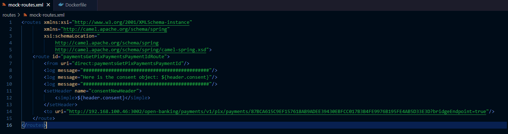

&nbsp;

## camelHelper Utility Class

There is a utility class named `camelHelper` that aims to provide some functions that are useful for the development of connectors, in order to facilitate certain procedures, such as completing strings with a specific character, date conversion, etc. Below are the functions available and how to use them.

### lPad

This function aims to return a string with the specified length, padding it with the specified character on the left. The signature is as follows:

public String lPad(String inputString, char character, int length)

where:

**inputString** -> refers to the original string that should be modified;

**character** -> character to be used to pad the string to the specified length.
Example: '0';

**length** -> total length of the string to be returned;

Example of a call in Camel:

```xml
<setProperty name="lPad">
    <simple>${bean:camelHelper.lPad("191", '0', 14)}</simple>
</setProperty>
```

The result of this call would be: 00000000000191

If the specified length is less than or equal to the input string, it returns the original string without modification.

### getCurrentZonedDateTime

This function aims to return the current date and time of a specific time zone, where the date and time parts will be separated by a string defined in the call. The signature is as follows:

public String getCurrentZonedDateTime(String zone, String separator, String dateFormat,
String timeFormat)

where:

**zone** -> refers to the time zone for which the current date and time are desired. For more information about available zones, [click here](https://en.wikipedia.org/wiki/List_of_tz_database_time_zones).

Example: America/Sao_Paulo;

**separator** -> string that defines the separation between the date and time parts. Example: ";";

**dateFormat** -> Format to return the current date. Example: "dd/MM/yyyy";

**timeFormat** -> Format to return the current time. Example: "HH:mm:ss";

Example of a call in Camel:

```xml
<setProperty name="getCurrentZonedDateTime">
    <simple>${bean:camelHelper.getCurrentZonedDateTime("America/Sao_Paulo", ";", "yyyy-MM-dd", "HH-mm-ss")}</simple>
</setProperty>
```

The result of this call would be something like: 2021-12-21;13-30-00

If the zone or date and time formats are invalid, it logs the error in the console and returns an empty string.

### getSplittedStringFromPosition

This function aims to return the result of splitting a string according to a specified separator, and at the specified position. The signature is as follows:

public String getSplittedStringFromPosition(String text, String separator, int position)

where:

**text** -> text to be split;

**separator** -> string that defines the separator to be used in the string split. Example: ";";

**position** -> position to be returned according to the result of the string split;

Example of a call in Camel:

```xml
<setProperty name="getSplittedStringFromPosition">
    <simple>${bean:camelHelper.getSplittedStringFromPosition("teste;quebra;texto", ";", 0)}</simple>
</setProperty>
```

The result of this call would be: teste

If the specified position is greater than or equal to the total items resulting from the split, it returns the original text.

### getUTCFromDateTimeZoned

This function aims to return the date and time of a specific time zone in UTC, in the ISO format without milliseconds (yyyy-MM-ddTHH:mm:ssZ). The signature is as follows:

public String getUTCFromDateTimeZoned(String dateTime, String pattern, String zoneOrigin)

where:

**dateTime** -> string containing the date and time to be converted. Example: "21/12/2021 13-30-00";

**pattern** -> format of the provided date and time. Example: "dd/MM/yyyy HH-mm-ss";

**zoneOrigin** -> refers to the time zone of origin for the provided date and time. For more information about available zones, [click here](https://en.wikipedia.org/wiki/List_of_tz_database_time_zones).

Example: America/Sao_Paulo;

Example of a call in Camel:

```xml
<setProperty name="getUTCFromDateTimeZoned">
    <simple>${bean:camelHelper.getUTCFromDateTimeZoned("21/12/2021 13-30-00", "dd/MM/yyyy HH-mm-ss", "America/Sao_Paulo")}</simple>
</setProperty>
```

The result of this call would be: 2021-12-21T16:30:00Z

If the date, format, and/or zone are invalid, it logs the error in the console and returns an empty string.

### getStringFromNumberWithPlaces

This function aims to format a number as a string with the specified number of decimal places. The signature is as follows:

public String getStringFromNumberWithPlaces(String number, Integer decimalPlaces)

where:

**number** -> string containing the number to be formatted. Example: "1.1";

**decimalPlaces** -> number of decimal places to format the number. Example: 4;

Example of a call in Camel:

```xml
<setProperty name="getStringFromNumberWithPlaces">
    <simple>${bean:camelHelper.getStringFromNumberWithPlaces("1.1", 4)}</simple>
</setProperty>
```

The result of this call would be: 1.100

If an invalid number is provided, or if it is not in the American format (decimal separator different from "."), it logs the error in the console and returns an empty string.

### concatenateStrings

This function aims to return a string that is the concatenation of the two strings passed as parameters.

public String concatenateStrings(String s1, String s2)

where:

**s1** -> first initial string;

**s2** -> second initial string;

Example of a call in Camel:

```xml
<setProperty name="concatenatedString">
    <simple>${bean:camelHelper.concatenateStrings("ab", "cd")}</simple>
</setProperty>
```

The result of this call would be: abcd

### hmacCalculator

This function aims to calculate a hash of data based on a specific algorithm with a provided secret key.

public String hmacCalculator(String algorithm, String data, String key)

where:

**algorithm** -> hash algorithm used in the calculation;

**data** -> data to be hashed;

**key** -> secret key used in the calculation;

Example of a call in Camel:

```xml
<setProperty name="hmacCalculatated">
    <simple>${bean:camelHelper.hmacCalculator("HmacSHA256", "abcd", "bc19bec7-339f-452f-8548-3daa889e6f79)}</simple>
</setProperty>
```

Supported algorithms:

```text
HmacMD5
HmacSHA1
HmacSHA224
HmacSHA256
HmacSHA384
HmacSHA512
```

### makePostCall

This function is designed to make POST calls with mtls certificate/key configured in Camel's additional variables.

public static String makePostCall(String authorization, String transactionHash,
        String contentType, String endpoint, String payload)

where:

**authorization** -> "Authorization" header, leave blank if not applicable;

**transactionHash** -> "Transaction-Hash" header, leave blank if not applicable;

**contentType** -> "Content-Type" header, leave blank if not applicable;

**endpoint** -> URL of the endpoint to be called;

**payload** -> Body of the call;

Example calls in Camel:

```xml
<setProperty name="makePostCall">
    <simple>${bean:camelHelper.makePostCall(${authorization}, ${transactionHash}, ${contentType}, ${endpoint}, ${body})}</simple>
</setProperty>
```

```xml
<setProperty name="makePostCall">
    <simple>${bean:camelHelper.makePostCall("", "", ${contentType}, ${endpoint}, ${body})}</simple>
</setProperty>
```

### makeGetCall

This function is designed to make GET calls with mtls certificate/key configured in Camel's additional variables.

public static String makeGetCall(String authorization, String transactionHash,
        String contentType, String endpoint)

where:

**authorization** -> "Authorization" header, leave blank if not applicable;

**transactionHash** -> "Transaction-Hash" header, leave blank if not applicable;

**contentType** -> "Content-Type" header, leave blank if not applicable;

**endpoint** -> URL of the endpoint to be called;

Example calls in Camel:

```xml
<setProperty name="makeGetCall">
    <simple>${bean:camelHelper.makeGetCall(${authorization}, ${transactionHash}, ${contentType}, ${endpoint})}</simple>
</setProperty>
```

```xml
<setProperty name="makeGetCall">
    <simple>${bean:camelHelper.makeGetCall("", "", ${contentType}, ${endpoint})}</simple>
</setProperty>
```

### convertFieldToListOfKeyValue

This function aims to transform a field of an object, whose path is provided, into a list with a key-value object. The result of the function always transforms the field into a **list** with a **single** object. This resulting object will always be a pair with a `key` having the value **id** and a `value` that will hold the previous value of the field in question.

public static Map<String, Object> convertFieldToListOfKeyValue(Map<String, Object> jsonMap, String path)

where:

jsonMap -> is the JSON object transformed into a Java Map where the field to be modified is located. It needs to be a type that implements the java.Util.Map interface (usually coming from an unmarshal done in Camel);

path -> is the path in the object of the field that should be modified. The path supports list representation (for example, data[-] or data[0]). You can use a number to indicate which object in the list should be modified or `-` to indicate the change in all objects in the list;

Examples of usage in Camel:

```xml
<unmarshal>
    <json library="Jackson" />
</unmarshal>

<setBody>
    <simple>${bean:camelHelper.convertFieldToListOfKeyValue(${body}, "data[-].accountId")}</simple>
</setBody>

<marshal>
    <json library="Jackson" />
</marshal>
```

Example of input and output of the function:

- input before unmarshal

```json
{
  "data": [
    {
      "brandName": "Organização A",
      "companyCnpj": "21128159000166",
      "type": "CONTA_DEPOSITO_A_VISTA",
      "compeCode": "001",
      "branchCode": "6272",
      "number": "94088392",
      "checkDigit": "4",
      "accountId": "92792126019929279212650822221989319252576"
    },
    {
      "brandName": "Organização A",
      "companyCnpj": "21128159000166",
      "type": "CONTA_DEPOSITO_A_VISTA",
      "compeCode": "001",
      "branchCode": "6272",
      "number": "94088393",
      "checkDigit": "4",
      "accountId": "92792126019929279212650822221989319252577"
    }
  ]
}
```

- output after marshal

```json

{
  "data": [
    {
      "brandName": "Organização A",
      "companyCnpj": "21128159000166",
      "type": "CONTA_DEPOSITO_A_VISTA",
      "compeCode": "001",
      "branchCode": "6272",
      "number": "94088392",
      "checkDigit": "4",
      "accountId": [{"key": "id", "value": "92792126019929279212650822221989319252576"}]
    },
    {
      "brandName": "Organização A",
      "companyCnpj": "21128159000166",
      "type": "CONTA_DEPOSITO_A_VISTA",
      "compeCode": "001",
      "branchCode": "6272",
      "number": "94088393",
      "checkDigit": "4",
      "accountId": [{"key": "id", "value": "92792126019929279212650822221989319252577"}]
    }
  ]
}
```

## Supported Components

The supported software components are listed below.

&nbsp;

### ACTIVEMQ

```text
Send messages to (or consume from) Apache ActiveMQ. This component is an extension of the Camel JMS Component.

Usage and documentation: https://camel.apache.org/camel-quarkus/latest/reference/extensions/activemq.html
```

&nbsp;

### AMQP

```text
Messaging with the AMQP protocol using the Apache QPid Client.

Usage and documentation: https://camel.apache.org/camel-quarkus/latest/reference/extensions/amqp.html

To properly use AMQP, you may need to add configurations to application.properties. The following guide or documentation may be useful:
- https://quarkus.io/guides/jms
- https://github.com/amqphub/quarkus-qpid-jms#configuration
```

&nbsp;

### ATLASMAP

```text
Transforms messages using AtlasMap transformation.

Usage and documentation: https://camel.apache.org/camel-quarkus/latest/reference/extensions/atlasmap.html
```

&nbsp;

### DATA FORMAT

```text
Uses Camel Data Format as a common Camel Component.

Usage and documentation: https://camel.apache.org/camel-quarkus/latest/reference/extensions/dataformat.html
```

&nbsp;

### DIRECT

```text
Synchronous call to another endpoint within the same Camel Context.

Usage and documentation: https://camel.apache.org/camel-quarkus/latest/reference/extensions/dataformat.html
```

&nbsp;

### ELASTICSEARCH REST

```text
Sends requests to ElasticSearch via RESP API.

Usage and documentation: https://camel.apache.org/camel-quarkus/latest/reference/extensions/elasticsearch-rest.html
```

&nbsp;

### EXEC

```text
Executes commands on the operating system in use.

Usage and documentation: https://camel.apache.org/camel-quarkus/latest/reference/extensions/exec.html
```

&nbsp;

### FILE

```text
Reads and writes files.

Usage and documentation: https://camel.apache.org/camel-quarkus/latest/reference/extensions/file.html
```

&nbsp;

### HTTP

```text
Sends requests to external HTTP servers using Apache HTTP Client 4.x.

Usage and documentation: https://camel.apache.org/camel-quarkus/latest/reference/extensions/http.html
```

&nbsp;

### JING

```text
Validates XML against RelaxNG schema (XML Syntax or Compact Syntax) using Jing library.

Usage and documentation: https://camel.apache.org/camel-quarkus/latest/reference/extensions/jing.html
```

&nbsp;

### LOG

```text
Logs messages using the logging mechanism in use.

Usage and documentation: https://camel.apache.org/camel-quarkus/latest/reference/extensions/log.html
```

&nbsp;

### MOCK

```text
Test routes and rules using mocks.

Usage and documentation: https://camel.apache.org/camel-quarkus/latest/reference/extensions/mock.html
```

&nbsp;

### MSV

```text
Validates XML payloads using Multi-Schema Validator (MSV).

Usage and documentation: https://camel.apache.org/camel-quarkus/latest/reference/extensions/msv.html
```

&nbsp;

### PLATFORM HTTP

```text
This extension allows creating HTTP endpoints to consume HTTP requests.

Usage and documentation: https://camel.apache.org/camel-quarkus/latest/reference/extensions/platform-http.html
```

&nbsp;

### REF

```text
Routes messages to an endpoint dynamically by name in the Camel Registry.

Usage and documentation: https://camel.apache.org/camel-quarkus/latest/reference/extensions/ref.html
```

&nbsp;

### REST

```text
Exposes REST services and their OpenAPI specifications or calls external REST services.

Usage and documentation: https://camel.apache.org/camel-quarkus/latest/reference/extensions/rest.html
```

&nbsp;

### SEDA

```text
Asynchronously calls other endpoints within any Camel Context in the same JVM.

Usage and documentation: https://camel.apache.org/camel-quarkus/latest/reference/extensions/seda.html
```

&nbsp;

### TIMER

```text
Generates messages at specified intervals using java.util.Timer.

Usage and documentation: https://camel.apache.org/camel-quarkus/latest/reference/extensions/timer.html
```

&nbsp;

### VALIDATOR

```text
Validates the payload using XML Schema and JAXP Validation.

Usage and documentation: https://camel.apache.org/camel-quarkus/latest/reference/extensions/validator.html
```

&nbsp;

### VELOCITY

```text
Transforms messages using Velocity template.

Usage and documentation: https://camel.apache.org/camel-quarkus/latest/reference/extensions/velocity.html
```

&nbsp;

### VM

```text
Asynchronously calls another endpoint within the same CamelContext.

Usage and documentation: https://camel.apache.org/camel-quarkus/latest/reference/extensions/vm.html
```

&nbsp;

## Supported Data Formats

### Jackson

```text
Maps POJOs to JSON and vice versa using Jackson.

Usage and documentation: https://camel.apache.org/camel-quarkus/latest/reference/extensions/jackson.html
```

&nbsp;

### Gson

```text
Maps POJOs to JSON and vice versa using Gson. Gson is a Data Format that uses the Gson library.

Usage and documentation: https://camel.apache.org/camel-quarkus/latest/reference/extensions/gson.html
```

&nbsp;

### CSV

```text
Handles CSV (Comma Separated Values).

Usage and documentation: https://camel.apache.org/camel-quarkus/latest/reference/extensions/csv.html
```

&nbsp;

### Flatpack

```text
Handles positional files using the FlatPack library.

Usage and documentation: https://camel.apache.org/camel-quarkus/latest/reference/extensions/flatpack.html
```

&nbsp;

### Bindy

```text
Maps between POJOs and CSV (Comma separated values), POJOs and positional files, and POJOs and key-value pairs (KVP) using Camel Bindy.

Usage and documentation: https://camel.apache.org/camel-quarkus/latest/reference/extensions/bindy.html
```

&nbsp;

### TidyMarkup

```text
TidyMarkup is a Data Format that uses TagSoup to clean up HTML. It can be used to convert messy HTML into properly structured HTML.

Usage and documentation: https://camel.apache.org/camel-quarkus/latest/reference/extensions/tagsoup.html
```

&nbsp;

### BASE64

```text
Used for base64 encoding and decoding.

Usage and documentation: https://camel.apache.org/camel-quarkus/latest/reference/extensions/base64.html
```

&nbsp;

### JACKSONXML

```text
Jackson XML is a Data Format that uses the Jackson library with the XMLMapper extension to convert XML payloads into Java objects and vice versa.

Usage and documentation: https://camel.apache.org/camel-quarkus/latest/reference/extensions/jacksonxml.html
```

&nbsp;

## Supported languages

### Bean Method

````text
Calls the specified Java bean method, passing the Exchange, the Body, or specific headers to it.

https://camel.apache.org/camel-quarkus/latest/reference/extensions/bean.html
````

&nbsp;

### CORE

````text
Core functionality and basic Camel languages: Constant, ExchangeProperty, Header, Ref, Simple, and Tokenize.

https://camel.apache.org/camel-quarkus/latest/reference/extensions/core.html
````

&nbsp;

### HL7 Terser

````text
Maps/converts HL7 (Health Care) objects using the HL7 MLLP decoder.

https://camel.apache.org/camel-quarkus/latest/reference/extensions/hl7.html
````

&nbsp;

### JSON PATH

````text
Validates a JsonPath expression against a JSON message body.

https://camel.apache.org/camel-quarkus/latest/reference/extensions/jsonpath.html
````

&nbsp;

### XML JAXP

````text
Tokenizes XML payloads using the specified path expression.

https://camel.apache.org/camel-quarkus/latest/reference/extensions/xml-jaxp.html
````

&nbsp;

### XPATH

````text
Validates an XPath expression against an XML payload.

https://camel.apache.org/camel-quarkus/latest/reference/extensions/xpath.html
````

&nbsp;

### XQUERY

````text
Queries and/or transforms XML payloads using XQuery and Saxon.

https://camel.apache.org/camel-quarkus/latest/reference/extensions/saxon.html
````

&nbsp;

## Deprecated - Documentation for Previous Versions of Integrations

The use of headers to send the consent object was removed starting from version 2.0.0 of the integration interface. The documentation below applies only to versions prior to this.

&nbsp;

### Consuming the Consent Object - Only for v1 Schemas

&nbsp;

Suppose we have the image `oob-phase3-native-with-mocks`, from a service that communicates with a Camel connector:

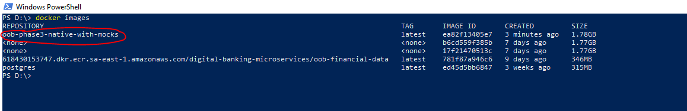

&nbsp;

#### Simple Proxy Example

For a simple proxy example, we have the following phase 3 route, which redirects the call to another API:

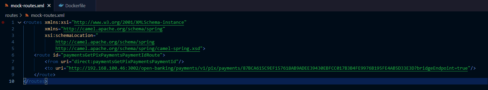

&nbsp;

In this example, it is an API created in Mockoon, for demonstration purposes:

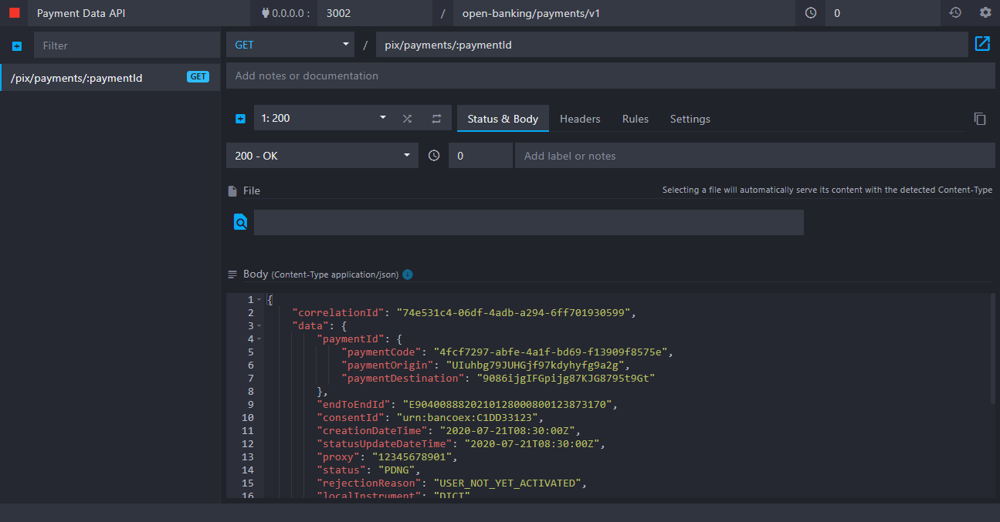

&nbsp;

We will extend the `oob-phase3-native-with-mocks` image so that the route we created is used by the new image:

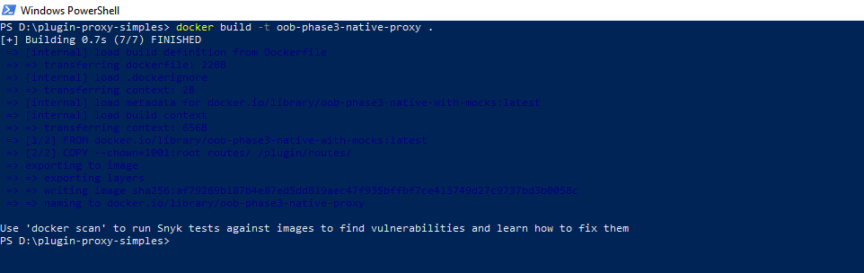

&nbsp;

We will make a call to the route for which the proxy was created, and in the Mockoon API, it will be possible to verify that the consent object was correctly sent and received via the header with the key "consent":


&nbsp;

#### Obtaining Through Camel XML

It is possible to obtain the consent object in the header through Camel XML; to do so, it must be accessed with the syntax `${header.consent}`:


&nbsp;

In this route example, we are logging the content of the "consent" header and creating a new header with the key "consentNewHeader", using the content of the "consent" header as its value.

After extending the original image and running it on port 8080 (see previous steps), the output in the console and the Mockoon API will be as follows:

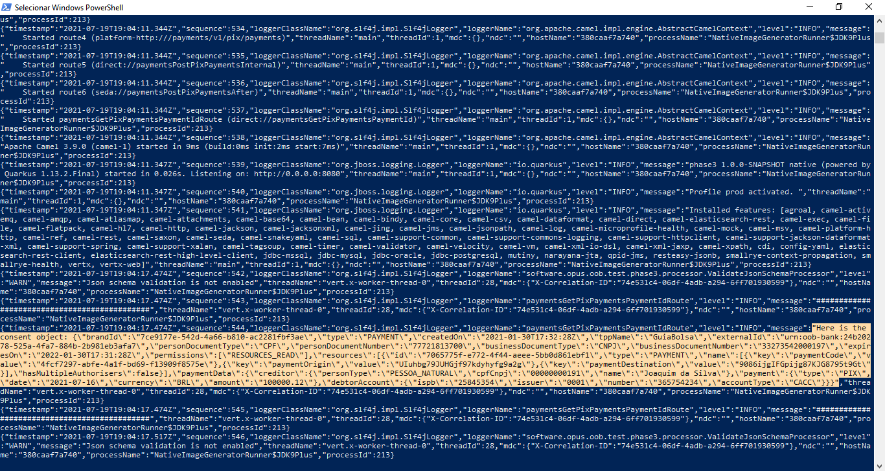

Content of the "consent" header logged in the console.

&nbsp;

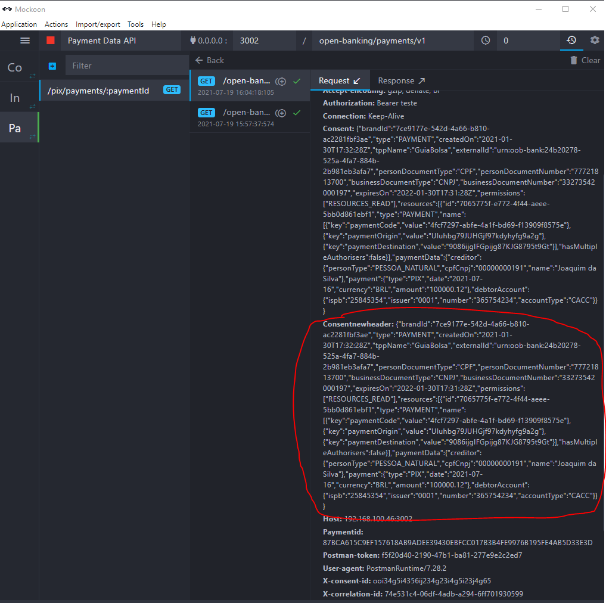

New header with the key "consentNewHeader", containing the same content as the "consent" header.

&nbsp;
