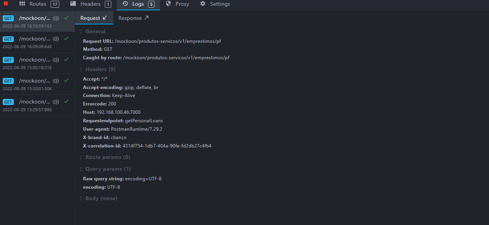

# Example of Creating and Running a Camel Connector for the oob-open-data API

This page describes the creation of a Camel connector example by calling an HTTP service. The example services are from the open data API.

&nbsp;

## Mocking the Remote Service

For the service function that will be called by the connector, we will use endpoints with fixed responses in the Mockoon tool. The file [mockoon-open-data.json](./attachments/open-data-plugin/mockoon-open-data.json) should be imported into the tool, and the mock should be started.

## Creating the Connector

The file [mock-routes.xml](./attachments/open-data-plugin/mock-routes.xml) describes the routes that, when executed, call the mock services. This example provides a simple description **without error handling or configurations** on how to call a remote service in a connector. For testing purposes, it will be necessary to change the IP of the routes to the address of the host running Mockoon.

## Running the Application with Mocks

To call the remote service in a connector **with configurations**, you can add them in the ```docker run``` command or create the docker-compose.yml, Dockerfile, and env_variables.env files with the configurations and execute them through the commands ```docker-compose build``` followed by ```docker-compose up```. See the example connector and its respective files:

[docker-compose.yml](./attachments/open-data-plugin/docker-compose.yml)

[Dockerfile](./attachments/open-data-plugin/Dockerfile)

[env_variables.env](./attachments/open-data-plugin/env_variables.env)

If started correctly, the container log should indicate that the routes were loaded, as shown in the following [example](./attachments/log_open_data.json).

## Step-by-Step for Running the Example

- Download the oob-open-data API image using the command

```bash
docker-pull 618430153747.dkr.ecr.sa-east-1.amazonaws.com/opus-open-banking-release/oob-open-data:1.0.0.76e303c
```

- Import the environment file [mockoon-open-data.json](./attachments/open-data-plugin/mockoon-open-data.json) into the Mockoon tool and start the server.

- Import the collection file [OOB-open-data.postman_collection.json](./attachments/open-data-plugin/OOB-open-data.postman_collection.json) into the Postman tool.

- Navigate to the directory where the example is located.

- Change the value of the ROUTES_OPEN_DATA variable in the [env_variables.env](./attachments/open-data-plugin/env_variables.env) file to specify the IP address of the machine.

- Run the following command to build the connector

```bash
docker-compose build
```

- Run the following command to build the connector

```bash
docker-compose up
```

## Testing the Connector

To test the Camel connector, we need to call the open-data application, which will then execute the connector. The connector, in turn, should call the mock of the remote service.

To execute the calls, we will use the collection in Postman contained in the file [OOB-open-data.postman_collection.json](./attachments/OOB-open-data.postman_collection.json).


The calls received by Mockoon can be viewed by clicking the "Logs" button.


