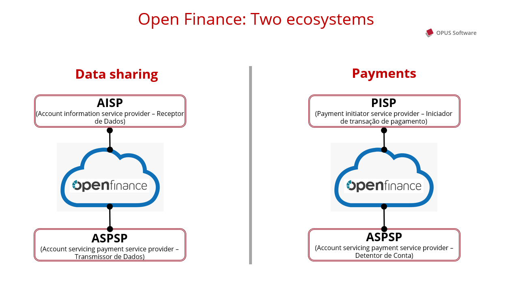
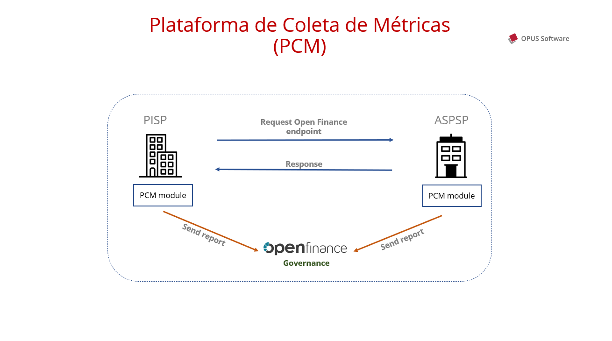

# OPUS Open Finance Platform Documentation

Below is an overview of the OPUS Open Finance platform.

At the end of this page, you will also find a detailed index for technical specifications and deployment, integration, and usage details of the various components of the platform.

## Product Overview

The OPUS Open Finance Platform provides all the necessary resources to integrate Financial Institutions into the Open Finance Brazil ecosystem.

As a comprehensive solution to meet all the regulatory requirements of Open Finance Brazil, the platform implements the necessary functionalities for the operation of financial institutions across all possible profiles:

- Account Holder
- Data Transmitter
- Data Receiver
- Payment Initiation Service Provider (PISP)

Schematically, the OPUS Open Finance Platform functions as a proxy, integrating with the financial institution's backend systems and responding to requests received from other ecosystem participants for creating consents, making payments, transmitting data, etc., as illustrated in the following figure:

Among the features offered by the OPUS Open Finance Platform, we highlight:

1. Management of obtained and provided consents;
1. Multi-brand management allowing product configuration to serve different brands in the same product installation;
1. Registration of unavailability and logging of failures with the Open Finance Brazil participant directory, as per regulatory standards;
1. Authorization server implementing the FAPI-BR (Financial-grade API) security profile required by regulatory standards, including support for DCR (Dynamic Client Registration) and DCM (Dynamic Client Management), duly certified by the OpenID Foundation;
1. Metrics Collection Platform, which sends information regarding operations to the Open Finance Brazil governance group according to regulatory specifications;
1. Log management using a distributed log file model based on Elastic, but which can be replaced by any log tool already used by the financial institution;
1. Integration with the financial institution's backend systems through **connectors**, which are software components that isolate platform complexity and ensure product standardization;
1. Support components to accelerate product validation and deployment, such as the White-label Consent Generation Portal, White-label Handoff Screen, consent screen source code for integration into the financial institution's mobile application, ecosystem simulator for installation validation, and connector validation tester.

To perform Payment Initiation operations via Open Finance or data reception requests, the OPUS Open Finance Platform offers modules that implement security and authentication protocols. These modules are accessible through REST interfaces, greatly simplifying application development.

For audit purposes, all transactions are duly recorded in log files. All data at rest in the solution (whether in logs or databases) is encrypted to ensure confidentiality in case of unauthorized access.

## Solution Modules

### Account Holder Module

Responsible for handling payment requests sent by payment initiators. It integrates with the backend system responsible for payment processing (typically Pix) through a connector that isolates environmental complexity and ensures platform standardization across different execution environments.

Handling payment initiation requests involves creating consent after customer authentication and confirmation, validating consent sent by the initiator, and processing the payment until its complete fulfillment (signaled by a webhook call).

All transaction details are encrypted in the database and recorded in logs, in addition to being sent to the Open Finance Brazil Governance Group through the Metrics Collection Platform, as per regulation.

### Data Transmitter Module

Responsible for handling requests for sharing customer registration and transactional data. It also integrates with backend systems through connectors, ensuring functional isolation and platform standardization.

Handling data sharing requests also involves creating consents after customer authentication and confirmation, but their validity is long, limited to up to 12 months. During its useful life, consent can be used to obtain data according to the permissions included at the time of creation and authorized by the customer.

For each received request, the Data Transmitter Module validates the requesting institution (including cryptographic signatures), consent validity, and verifies if permissions include the requested data. If any of these validations fail, the module automatically returns the appropriate error message. Thus, connectors (and consequently backend systems) are triggered only in cases where the requester is authorized to access registration and transactional data.

The module also sends mandatory reports to the Metrics Collection Platform.

### Payment Initiation Service Provider Module (OPUS PISP)

A Payment Initiation Service Provider (PISP) is a client application that consumes services from an Account Holder. The PISP module of the OPUS Open Finance platform acts as middleware that facilitates payment initiation via Open Finance, abstracting operational flows.

It allows payment initiation consents to be created in a single request to the provided REST API, and once approved, this consent is used to perform the transaction through a second request.

Additionally, the module can also perform DCR (Dynamic Client Registration) and DCM (Dynamic Client Management) in all Account Holding institutions listed in the Open Finance Brazil Participant Directory, as well as automatically send mandatory reports to the Metrics Collection Platform.

Thus, the module enables the development of applications that benefit from payment initiation via Open Finance without the need to implement various security protocols and other requirements.

### Data Reception Module (OPUS PISP)

The Data Reception Module is middleware for consuming Data Transmitter services, allowing the creation of consents for sharing registration and transactional data and their subsequent use.

Similar to the PISP Module, this module also allows consents to be created in a single HTTP request. Once approved, data retrieval proxy endpoints can be used, adding cryptographic signatures and other security requirements, and returning the data provided by the recipient institution.

Thus, it allows the atomic querying of registration and transactional data of customers from institutions participating in Open Finance Brazil. These data include, among other information, personal data such as name, date of birth, address, and transactional data of accounts, credit cards, and credit operations (loans, financing, etc.).

The module also performs DCR and DCM and automatically sends mandatory reports to the Metrics Collection Platform.

### OPUS Open Data Receiver Module

As an extension of the functionalities of the Data Reception Module, the platform also offers the OPUS Open Data Receiver module, capable of aggregating customer data and keeping it updated throughout the validity of obtained consents.

It uses a Scheduler and the capabilities of the Data Reception Module (OPUS PISP) to ensure that data is periodically updated, respecting operational limits defined by Open Finance Brazil regulations.

The module offers an API that consolidates and unifies all data related to the same person. For example, if a customer has accounts at different institutions, it is possible to create various consents to obtain data from all of them. These data are consolidated, and through the Customer Data API, a unified view is offered, returning a centralized statement of all the user's transactions in different financial institutions.

The system also feeds an event queue, which is automatically triggered when technical events occur, such as when a consent expires or is revoked by the user, and also allows the configuration of business rules, such as detecting when a user creates a new loan contract in another institution. This way, it is possible to trigger actions to encourage the user to renew expired consents (e.g., through notifications), integrate with internal CRM systems, etc.

Thus, the Module supports the creation of other applications that use users' financial data without worrying about periodic updates and information consolidation.

## Solution Architecture

The solution architecture is based on microservices to support automatic horizontal scalability and is designed to be deployed in containers (Docker) running in a clustered Kubernetes execution environment. The solution currently runs in production in both managed Kubernetes environments (Google GKE, AWS AKS, and Azure EKS) and manually managed clusters.

### Overall Architecture View

The figure below shows an overall view of the solution architecture.

The `Elastic Stack` component is a suggestion for handling solution logs. Log management can be done in any tool that integrates into the Kubernetes cluster to ingest logs generated by PODs, such as Elastic Stack, Datadog, Loki, and others.

The `Grafana` component is an optional suggestion to complement solution health visibility. The solution's health is automatically monitored by the "Metrics and Status" microservice for all necessary regulatory effects (regulatory APIs `Admin` and `Common`).

The platform is designed to run in a network structure protected by a firewall and requires an API Gateway for its proper configuration. If the financial institution does not have a corporate API Gateway (or does not want to make it available for the Open Finance environment due to cost or governance issues), the installation package includes a pre-configured option to use a Kong Community Edition API Gateway at no additional cost, ensuring the solution can be run autonomously and without external dependencies.

All system modules support autoscaling configuration, allowing Kubernetes to create (or remove) instances based on CPU and memory usage, for example.

Module distribution is done through Helm charts, allowing the definition, installation, and upgrade of the application in Kubernetes, as well as the selection of resources for cluster execution.

The platform also uses open-source infrastructure components, such as Dapr, Grafana, and Prometheus. In this case, Terraform scripts are provided for installation and configuration.

For distributed log management, the solution includes Elastic but can be configured with another product (and incorporated into the solution distribution package) if there is a standard in the financial institution.

## Solution Components

### Consent Management

Responsible for the lifecycle (creation, revocation, and expiration control) of consents created in interaction with Payment Initiators and Data Receivers. It also controls the consents obtained by the financial institution.

It implements an independent API that allows, if desired, the creation of internal institution applications for consultation. Through this API, it handles consultation requests from the financial institution's Mobile and Web applications to display valid and revoked consents. This API also allows the institution to implement consent revocation in its service channels – a requirement of Open Finance Brazil regulatory standards.

### Authorization Server

Implements the mandatory security protocol profiles required by Open Finance Brazil specifications, part of FAPI-BR (Financial-grade API).

It is the component responsible for executing DCR (Dynamic Client Registration) and DCM (Dynamic Client Management) protocols, necessary for registering TPPs (Third-Party Providers) accessing OPUS Open Finance APIs, registering their cryptographic certificates used in subsequent request payload signature validation.

### Multi-brand Management

For institutions that must provide Open Finance APIs for different brands, the platform natively supports the coexistence of multiple brands in the same product installation.

Thus, brands can coexist in the same Kubernetes cluster, benefiting from sharing some essential microservices, generating infrastructure savings and lower operational complexity.

### Log Management

Logs generated by the application can be integrated with any log management tool used by the institution, such as Elastic, Data Dog, etc. Additionally, sensitive final customer information, such as financial and registration data, is dynamically anonymized, following the principles of the General Data Protection Law (LGPD).

### Metrics Collection Platform

The Metrics Collection Platform (MCP) is a mandatory regulatory requirement that requires all participating institutions to report metrics on all API calls made and/or received to the governance structure. Both institutions involved in any operation must send reports containing information such as the accessed endpoint, event date and time, result received, and response time.

The MCP component is an integral part of the OPUS Open Finance platform and transparently performs the necessary information collection and sending to the official governance platform. This is possible thanks to the solution architecture, in which all calls pass through its gateway.

Additionally, the component also groups reports to minimize performance impacts while ensuring delivery within mandatory timeliness SLAs. Additionally, the module handles potential central platform unavailability, storing unsent reports until the structure becomes available again.

The OPUS Open Finance platform's MCP component integrates with all offered modules, i.e., the Account Holder, Data Transmitter, Payment Initiator, and Data Receiver modules.

Thus, there is no need for extra development and concerns about report submission. Once configured and initialized, the MCP module will automatically send all necessary data, minimizing impact and ensuring regulatory compliance.

### Connectors

To ensure functional decoupling and product standardization, the OPUS Open Finance platform integrates with backend systems through **connectors**, which are adapted case by case and ensure transactions and data are accessed according to demand. So, we can say that the integration between OPUS Open Finance Platform and a Financial Institution's business backend systems is based on building or adpating these software components.

The connectors that need to be implemented depend on the Modules (Open Finance profiles) adopted by the institution. For the Account Holder profile, connectors are needed for Pix transaction initiation (immediate and scheduled), status query, and schedule cancellation. Data Transmitter connectors cover open data about products and services offered by the institution, customer registration data, transactional account data, credit card data, investments, and credit contract data (loans, financing, discounted credit rights, etc.).

### Status (health check)

Mandatory service status APIs are implemented by the solution, and all received calls are counted for availability calculations that must be reported to the governance structure.

They inform the momentary availability of the various regulatory endpoints, which can be available, with partial failure, under scheduled maintenance, or unavailable.

### Security and Service Authentication

All security protocols are implemented and certified by the OpenID Foundation. The implementation includes the FAPI-BR (Financial-Grade API) protocols and also the validation and generation of JSON Web Token (JWT) signatures, in addition to DCR (Dynamic Client Registration) and DCM (Dynamic Client Management) protocols, necessary in the process of registering Third-Party Applications (TPP) with Account Holders and Data Transmitters.

### Event Queue

The platform supports generating notifications signaling the occurrence of various events pertinent to different system components. Notifications sent to an event queue are of different natures, including technical events such as HTTP error notifications and business events, such as consent revocation or a DCR registration by a new TPP.

Notifications are organized by topics, which can be independently subscribed to by external applications. Thus, applications such as CRM, Credit Analysis, etc., will only receive relevant notifications and can consume them in real-time.

The platform supports different event queue platforms, as internally DAPR is used, which abstracts particularities and facilitates integration with any platform already used by the financial institution.

### Backoffice Portal

The OPUS Open Finance platform's backoffice portal allows administrative functions to be executed. According to Open Finance Brazil regulatory specifications, participating institutions must meet certain availability levels:

1. 95% uptime every 24 hours
2. 99.5% uptime every 3 months

Therefore, it is necessary to report unavailability, whether caused by system failures or scheduled maintenance events.

### Federated Authentication

Support for Federated authentication allows institutions to use their own Identity Providers (IDP) to control portal access. In other words, users can use the same institutional login they already use in other institution systems.

#### Scheduled Unavailability Registration (regulatory)

The Backoffice Portal offers a graphical interface for registering scheduled unavailability, allowing the system to appropriately signal such events to the governance structure, which are accounted separately from system failures.

#### Failure Logging (regulatory)

Through integration with the status service, the portal provides a dashboard for visualizing detected partial and total unavailability by the platform's self-diagnosis component.

### Auxiliary Tools

#### White-label Consent Generation Portal

The consent generation portal implements mandatory functionalities that allow final customers to view and approve (or reject) payment initiation and registration and transactional data sharing consents.

The portal can be customized through logo and color palette changes and can be used as a tool to accelerate the implementation of the complete cycle of mandatory Open Finance Brazil functionalities.

#### White-label Handoff Screen

In cases of Account Holders and/or Data Transmitters offering only mobile digital channels (i.e., applications) and **not** desktop channels (e.g., Internet Banking), it is mandatory to implement the *handoff* flow, where users using desktop devices must view a QR Code that can be used to authorize the operation via a mobile device.

The platform also offers an optional handoff module that can be customized with image definitions, color palettes, informative texts, and links to Android/iOS app download stores.

#### Mobile App with Authorization Screens

We also offer a mobile application with design examples and source code for implementing the mandatory functionalities of Open Finance Brazil, and complete integration with the OPUS Open Finance platform.

#### Connector Tester

The Connector Tester tool simulates calls coming through the Open Finance Brazil ecosystem and allows exercise and test the integration between connectors and institution's backend systems, facilitating their debugging during development phases.

#### TPP Quick Simulator

The TPP Quick Simulator tool implements the functionalities of a Payment Initiator or Data Receiver application and performs the corresponding calls for consent creation and its subsequent use, in appropriate contexts.

It offers great flexibility in constructing the payloads sent in each request, allowing the creation of various usage and/or exception scenarios, serving as a test, diagnostic, and demonstration tool for Account Holders and Data Transmitters.

#### Mandatory Reports

The Central Bank of Brazil requires the extraction and submission of various reports on the health and usage of Open Finance Brazil services. Both Account Holders and Data Transmitters must send weekly and semi-annual spreadsheets informing the governance structure of various data about consents, transactions, and API availability.

The OPUS Open Finance platform offers a series of scripts and reports for extracting data that must be periodically reported to Central Bank by all institutions.

## Index

1. How to integrate your systems with the OPUS Open Finance platform?
    1. Account Holders and Data Transmitters:
        1. [Integrating with the institution's mobile application](consentimento/app2as/readme.md)
        1. [Integrating with the institution's web interface](consentimento/web2as/readme.md)
        1. [Consent viewing and revocation APIs](portal-backoffice/apis-backoffice/readme.md)
        1. For *app-only* institutions:
            1. [Implementing handoff flow](consentimento/app2as-handoff/readme.md)
            1. [Customizable handoff page configurations](consentimento/app2as-handoff/custom-handoff-config/readme.md)
    1. Backend Integration: **Connectors**
        1. [Overview](integração-plugin/readme.md)
        1. Account Holders:
            1. [Resource discovery (accounts, cards, etc.)](integração-plugin/consent/readme.md#discovery-de-recursos-no-opus-open-banking)
            1. [Payment initiation and query (Pix)](integração-plugin/payments/readme.md)
        1. Data Transmitters:
            1. [Resource discovery (accounts, cards, etc.)](integração-plugin/consent/readme.md#discovery-de-recursos-no-opus-open-banking)
            1. [Open data (products and services)](integração-plugin/open-data/readme.md)
            1. [Registration and transactional data](integração-plugin/financial-data/readme.md)

1. Product Installation:
    1. Kubernetes cluster deployment:
        1. [Overview](deploy/readme.md)
        1. [Configuration using Terraform](deploy/terraform/readme.md)
        1. [Shared definitions](deploy/shared-definitions.md)
        1. Account Holder and Data Transmitter:
            1. [Authorization Server](deploy/oob-authorization-server/readme.md)
            1. [Consents](deploy/oob-consent/readme.md)
            1. [Status](deploy/oob-status/readme.md)
            1. [Event queue](deploy/oof-event-service/readme.md)
            1. [Metrics Collection Platform (PCM)](deploy/oof-pcm-service/readme.md)
        1. Account Holder:
            1. [Payments](deploy/oob-payment/readme.md)
        1. Data Transmitter:
            1. [Open data](deploy/oob-open-data/readme.md)
            1. [Registration and transactional data](deploy/oob-financial-data/readme.md)
        1. Optional:
            1. [Backoffice Portal](deploy/oob-portal-backoffice/readme.md)
            1. [Handoff Web](deploy/oob-handoff-web/readme.md)
    1. Domain and cryptographic certificate configuration
        1. [Account Holder and Data Transmitter](dominios-e-certificados/readme.md)
        1. [Payment Initiator and Data Receiver](dominios-e-certificados/tpp.md)
    1. [API security controls configuration](segurança/readme.md)

1. Mandatory Certification Scripts
    1. [Security Certification Submission (OpenID Foundation)](certification/security/enviando-certificacao.md)
    1. [Functional Certification Execution (Open Finance Brazil Governance)](certification/functional/dcr.md)

1. Useful Tools
    1. Connector debugging: [Connector Tester](ferramentas-auxiliares/connector-tester/readme.md)
    1. Extracting mandatory reports sent to Central Bank of Brazil:
        1. [Semi-annual Availability Report](ferramentas-auxiliares/relatorio-de-disponibilidade-por-grupo-de-apis/readme.md)
        1. [Semi-annual Request Volume Report](ferramentas-auxiliares/relatorio-semestral/readme.md)
        1. Account Holder:
            1. [Functionality Monitoring Report](ferramentas-auxiliares/acompanhamento-do-funcionamento-inicial/fase-3/readme.md)
            1. [Interoperability Report](ferramentas-auxiliares/relatorio-de-interoperabilidade/fase-3/readme.md)
            1. [Non-functional Requirements Report](ferramentas-auxiliares/relatorio-de-requisitos-nao-funcionais/readme.md)
        1. Data Transmitter:
            1. [Consent Inventory Report](ferramentas-auxiliares/retirada-de-informaçoes-sobre-os-consentimentos/readme.md)
    1. Backoffice Portal:
        1. [Installation](deploy/oob-portal-backoffice/readme.md)
        1. [Interface customization](portal-backoffice/customizacao/readme.md)
        1. [Integration with institutional login via *Federation*](portal-backoffice/federation-usuarios-internos/readme.md)
        1. [Usage (user guide)](portal-backoffice/falhas-e-indisponibilidades/readme.md)

