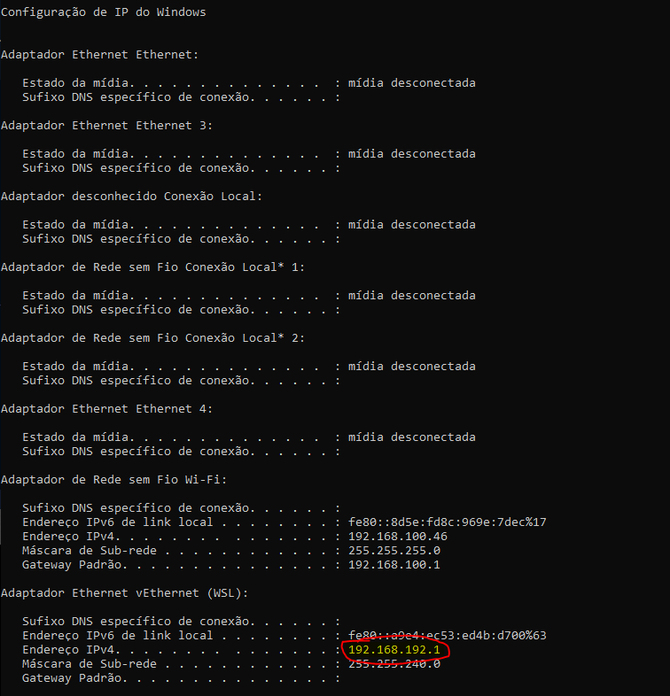

# Documentação para uso do Connector Tester

Esta documentação tem como objetivo guiar o uso da ferramenta connector tester,
e apresentar um exemplo de montagem de ambiente para execução da mesma.

&nbsp;

Índice:

- [Documentação para uso do Connector Tester](#documentação-para-uso-do-connector-tester)
  - [Introdução](#introdução)
  - [Como obter a imagem da ferramenta](#como-obter-a-imagem-da-ferramenta)
  - [Como executar a ferramenta](#como-executar-a-ferramenta)
  - [Como extender a imagem da ferramenta](#como-extender-a-imagem-da-ferramenta)

&nbsp;

## Introdução

Esta ferramenta tem como finalidade facilitar a construção dos conectores Camel,
que devem fazer a integração com os sistemas de retaguarda. Antes utilizava-se como
solução criar mocks das integrações; porém, essa técnica não funciona para o oob-consents
pois ele precisa de um banco de dados e uma sequência de chamadas para chegar ao
ponto onde é possível chamar o conector. Mesmo para o oob-payments é difícil simular
situações diferentes da default, como um consentimento com outros dados.

&nbsp;

A aplicação possui endpoints REST que representam todos os pontos de integração
de todos os módulos do OOB, e é possível incluir as rotas (em arquivos
Camel XML, como é feito hoje) e testar via swagger. Os endpoints não têm lógica
de negócio, eles apenas chamam os conectores exatamente como os módulos do OOB.
Os endpoint recebem um json no formato esperado pelo conector, ou seja, de acordo
com a sua esécificação. Essa ferramenta não tem os endpoints no formato openbank
que precisam ser transformado para o formato do conector. Dessa forma, toda informação
de input do conector (consentimento, headers, etc) deve estar presente na chamada
do swagger.

&nbsp;

A ferramenta é disponibilizada como uma imagem docker, que deve ser extendida com
os templates de mapeamento de request e response e o(s) arquivo(s) de rota(s) que
são responsáveis por direcionar as chamadas e invocas os devidos endpoints.

&nbsp;

## Como obter a imagem da ferramenta

&nbsp;

A ferramenta está disponibilizada no ECS da Opus, e pode ser obtida da seguinte maneira:

```text
docker pull 618430153747.dkr.ecr.sa-east-1.amazonaws.com/digital-banking-microservices/oob-connector-tester:latest
```


&nbsp;

## Como executar a ferramenta

&nbsp;

A imagem da ferramenta pode ser executada sem ser extendida, à partir do seguinte
comando:

```text
docker run -it -p 8080:8080 618430153747.dkr.ecr.sa-east-1.amazonaws.com/digital-banking-microservices/oob-connector-tester:latest
```


&nbsp;

Quando a imagem estiver executando, é possível acessar o swagger da ferramenta à
partir da seguinta URL: <http://localhost:8080/swagger>


## Como extender a imagem da ferramenta

No seguinte [link](attachments/connector_tester_environment) está disponibilizado
um ambiente de teste da ferramenta.
Foi criada a seguinte estrutura para executar
um docker compose, que deverá extender a imagem original do connector
tester e inserir dentro da mesma alguns arquivo de template e o arquivo
de rotas a ser utilizado para direcionar as chamadas.


&nbsp;

O arquivo dockerfile contém os comando para copiar os arquivos necessários para
execução da imagem


&nbsp;

Antes de executar a ambiente é necessário carregar a API mock, utilizando a ferramenta
[mockoon](https://mockoon.com/) para isto, e utilizar o arquivo
[request_example.json](./attachments/connector_tester_environment/mockoon_api.json)
para importar a mesma.


&nbsp;

Deve-se alterar também o valor dentro do [arquivo](./attachments/connector_tester_environment/env_variables.env)
de variáveis de ambiente do docker compose, informando a url da API do mockoon
conforme o IP do adaptador WSL:



&nbsp;

Para executar o ambiente, é necessário acessar o diretório que contém o arquivo
docker-compose.yaml, e executar os seguintes comandos:

```sh
docker-compose build
docker-compose up
```


&nbsp;

Acessar o seguinte endereço para carregar o swagger da ferramenta: <http://localhost:8080/swagger>
&nbsp;
Para este exemplo, iremos executar o endpoint de criar iniciação de pagamento:


&nbsp;

Dentro do exemplo há um arquivo de nome [request_example.json](./attachments/connector_tester_environment/request_example.json)
com o request para esta chamada, sendo que a resposta para a chamada realizada será:


&nbsp;

```json
{
  "data": {
    "paymentId": [
      {
        "key": "instPayId",
        "value": "e33b469a-c121-41b4-87d1-b2c0947c108a"
      }
    ],
    "endToEndId": "E9040088820210128000800123348752",
    "creationDateTime": "2021-10-05T18:00:00Z",
    "statusUpdateDateTime": "2021-10-05T18:00:00Z",
    "localInstrument": "DICT",
    "proxy": "12345678901",
    "status": "PDNG",
    "payment": {
      "amount": "123.45",
      "currency": "BRL"
    },
    "remittanceInformation": "Teste criar pagamento",
    "creditorAccount": {
      "ispb": "12345678",
      "issuer": "1774",
      "number": "6251965162",
      "accountType": "CACC"
    },
    "cnpjInitiator": "00000000000191"
  }
}
```
