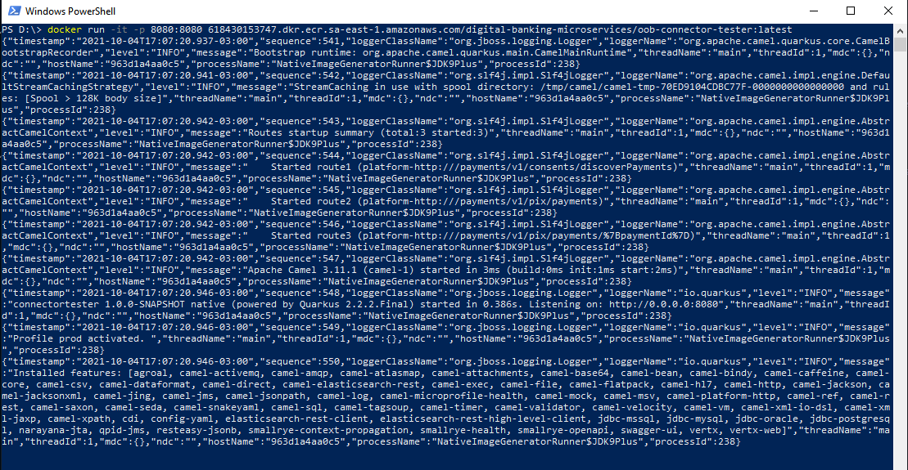
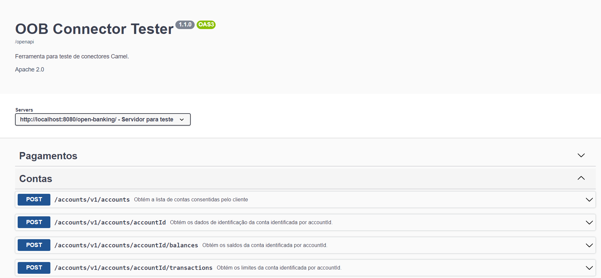

# Documentação para uso do Connector Tester

Esta documentação tem como objetivo guiar o uso da ferramenta connector tester,
e apresentar um exemplo de montagem de ambiente para execução da mesma.

Índice:

- [Documentação para uso do Connector Tester](#documentação-para-uso-do-connector-tester)
  - [Introdução](#introdução)
  - [Estrutura de arquivos](#estrutura-de-arquivos)
  - [Como obter a imagem da ferramenta](#como-obter-a-imagem-da-ferramenta)
  - [Como executar a ferramenta](#como-executar-a-ferramenta)
  - [Como estender a imagem da ferramenta](#como-estender-a-imagem-da-ferramenta)
  - [Changelog](#changelog)

## Introdução

Esta ferramenta tem como finalidade facilitar a construção dos conectores Camel,
que devem fazer a integração com os sistemas de retaguarda, permitindo uma
execução dos conectores desenvolvidos de forma isolada dos contextos de segurança
que o Open Banking exige.

A aplicação possui endpoints REST que representam todos os pontos de integração
de todos os módulos do OOB, e é possível incluir as rotas (os mesmos arquivos Camel
XML que serão usados no ambiente de produção, vide o seguinte [link](../../integração-plugin/readme.md)),
e testar via swagger. Os endpoints não têm lógica de negócio, eles apenas chamam
os conectores exatamente como os módulos do OOB. Os endpoints recebem um json no
formato esperado pelo conector, ou seja, de acordo com a sua especificação. Essa
ferramenta não tem os endpoints no formato openbank que precisam ser transformados
para o formato do conector. Dessa forma, toda informação de input do conector
(consentimento, headers, etc) deve estar presente na chamada do swagger.

A ferramenta é disponibilizada como uma imagem docker, que deve ser estendida com
os templates de mapeamento de request e response e o(s) arquivo(s) de rota(s) que
são responsáveis por direcionar as chamadas aos sistemas de retaguarda da instituição.

## Estrutura de arquivos

Esta ferramenta contempla suporte para payments e financial-data. Como em financial-data
existem muitas rotas, foram colocadas apenas rotas do subgrupo de Accounts como exemplo.
A lista completa de rotas implementadas para o serviço de financial-data pode
ser conferida [aqui](../../integra%C3%A7%C3%A3o-plugin/financial-data/readme.md)

A imagem abaixo mostra a estrutura de
[accounts](attachments/connector_tester_environment/connectorCustom/accounts),
onde estão as pastas de cada endpoint que podem ser usados para testes.

 

 Em [payments](attachments/connector_tester_environment/connectorCustom/payments)
 estão todos os arquivos que podem ser utilizados para realizar os testes dos endpoints
 de pagamento, como mostra a imagem abaixo.

 

 Em [specs](attachments/connector_tester_environment/connectorCustom/specs) estão
 os arquivos de rotas camel, como mostra a imagem abaixo.

 

## Como obter a imagem da ferramenta

A ferramenta está disponibilizada no ECR da Opus, e pode ser obtida da seguinte maneira:

```sh
docker pull 618430153747.dkr.ecr.sa-east-1.amazonaws.com/opus-open-banking-release/oob-connector-tester:latest
```


## Como executar a ferramenta

A imagem da ferramenta pode ser executada sem ser estendida, a partir do seguinte
comando:

```sh
docker run -it -p 8080:8080 618430153747.dkr.ecr.sa-east-1.amazonaws.com/opus-open-banking-release/oob-connector-tester:latest
```



Quando a imagem estiver executando, é possível acessar o swagger da ferramenta a
partir da seguinte URL: <http://localhost:8080/swagger>



## Como estender a imagem da ferramenta

No seguinte [link](attachments/connector_tester_environment) está disponibilizado
um ambiente de exemplo da ferramenta. Neste exemplo utilizamos o mockoon como sistema
de retaguarda no teste, usando integrações do Camel fazendo chamadas API Rest. Foi
criada a seguinte estrutura para executar um docker compose, que deverá estender
a imagem original do connector tester e inserir dentro da mesma alguns arquivos de
template e o arquivo de rotas a ser utilizado para direcionar as chamadas.


O arquivo [dockerfile](attachments/connector_tester_environment/connectorCustom/Dockerfile)
contém os comandos para copiar os arquivos necessários para execução da imagem


Antes de executar a ambiente é necessário carregar a API mock, utilizando a ferramenta
[mockoon](https://mockoon.com/) para isto, e utilizar o arquivo
[mockoon_api.json](./attachments/connector_tester_environment/mockoon_api.json)
para importar a mesma.


Deve-se alterar também o valor dentro do [arquivo](./attachments/connector_tester_environment/connectorCustom/env_variables.env)
de variáveis de ambiente do docker compose, informando a url da API do mockoon
conforme o IP do host do docker.

Para executar o ambiente é necessário acessar o diretório que contém o arquivo
docker-compose.yaml e executar os seguintes comandos:

```sh
docker-compose build
docker-compose up
```


Acessar o seguinte endereço para carregar o swagger da ferramenta: <http://localhost:8080/swagger>

Para este exemplo, iremos executar o endpoint de listar contas:


Vale ressaltar que os endpoints que contém path de identificador de operação na
url estão com valor estático, como por exemplo o `accountId` para as rotas de accounts.

Dentro da pasta `accountsGetAccounts` há um arquivo de nome [request-example.json](./attachments/connector_tester_environment/connectorCustom/accounts/accountsGetAccounts/request-example.json)
com o request para esta chamada; o conteúdo do arquivo deve ser enviado no payload
da chamada no swagger, sendo que a resposta para a chamada realizada será:


```json
{
  "data": [
    {
      "brandName": "Organização A",
      "companyCnpj": "21128159000166",
      "type": "CONTA_DEPOSITO_A_VISTA",
      "compeCode": "001",
      "branchCode": "6272",
      "number": "94088392",
      "checkDigit": "4",
      "accountId": [
        {
          "key": "pk_green",
          "value": "20220511"
        },
        {
          "key": "pk_green",
          "value": "value2"
        },
        {
          "key": "pk_yellow",
          "value": "value3"
        },
        {
          "key": "pk_brown",
          "value": "20220511"
        }
      ]
    },
    {
      "brandName": "Organização A",
      "companyCnpj": "21128159000166",
      "type": "CONTA_DEPOSITO_A_VISTA",
      "compeCode": "001",
      "branchCode": "6272",
      "number": "94088392",
      "checkDigit": "4",
      "accountId": [
        {
          "key": "pk_yellow"
        },
        {
          "key": "pk_yellow",
          "value": "4"
        },
        {
          "key": "pk_yellow",
          "value": "5"
        }
      ]
    },
    {
      "brandName": "Organização A",
      "companyCnpj": "21128159000166",
      "type": "CONTA_DEPOSITO_A_VISTA",
      "compeCode": "001",
      "branchCode": "6272",
      "number": "94088392",
      "checkDigit": "4",
      "accountId": [
        {
          "key": "pk_green"
        },
        {
          "key": "pk_brown",
          "value": "value3"
        },
        {
          "key": "pk_brown",
          "value": "value2"
        },
        {
          "key": "pk_yellow",
          "value": "2"
        },
        {
          "key": "pk_brown",
          "value": "2"
        }
      ]
    }
  ],
  "meta": {
    "totalRecords": 1,
    "totalPages": 1,
    "requestDateTime": "2021-05-21T03:00:00Z"
  }
}
```

## Changelog

### 2022-06-15 - v1.4.0

- Atualizado readme do connector-tester com as informações de accounts
- Ajustado path para os arquivos de payment no connector-tester
- Adicionado rota para accounts no connector-tester e alterado caminho de
arquivos no Dockerfile do connector-tester

### 2022-03-16 - v1.3.0

- Novas rotas referentes ao pagamento ted-tef adicionadas

### 2022-03-04 - v1.2.0

- Novas rotas referentes à funcionalidade de agendamento adicionadas

### 2021-12-23 - v1.1.0

- Complementação do exemplo do uso da ferramenta, implementando
todas as rotas existentes na mesma
- Atualização das imagens da documentação

### 2021-11-05 - v1.0.1

- Correção do bug que concatenava os paths das rotas do Camel XML com os endpoints
de consentimento chamados no swagger
- Correção da URL para baixar a imagem da ferramenta

### 2021-10-07 - v1.0.0

- Versão inicial da documentação
