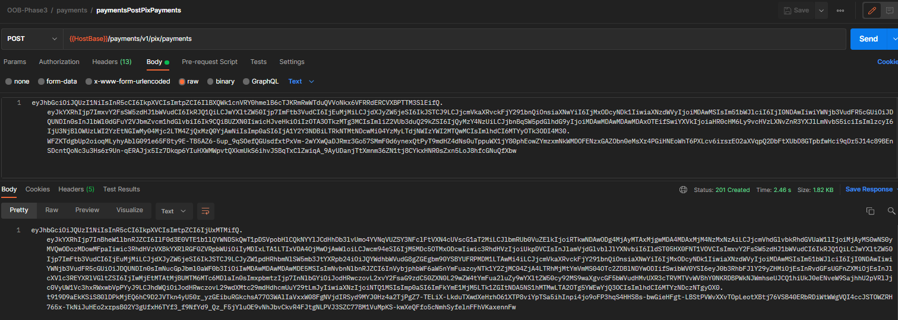
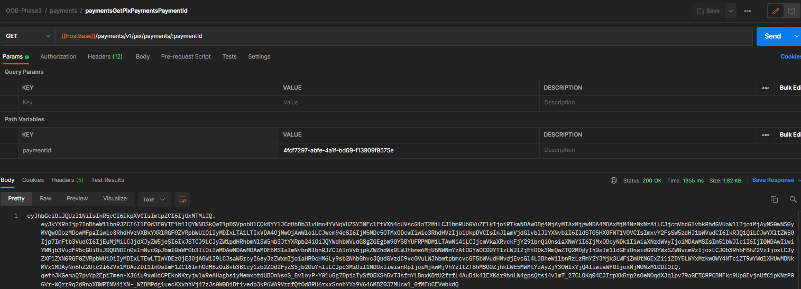

# Documentação para Criação de Plugin Externo

Essa página descreve a criação de um exemplo de plugin Camel chamando um serviço
HTTP. Os serviços de exemplo são os da API de pagamento de PIX no módulo de payments.

&nbsp;

## Mock do serviço remoto

Para a função do serviço que será chamado pelo plugin utilizaremos endpoints com
respostas fixas na ferramenta Mockoon. O arquivo [mockoon-oob_phase3.json](mockoon-oob_phase3.json)
deve ser importado na ferramenta e o mock deve ser iniciado.


## Criação do plugin de demo

O arquivo [mock-routes.xml](mock-routes.xml) descreve duas rotas que ao serem
executadas chamam os serviços do mock. Este exemplo descreve de forma simples
**e sem tratamento de erros ou configurações** como chamar um serviço remoto
em um plugin. Para a execução do teste será necessário alterar o IP das rotas
para o endereço do host que executará o Mockoon.

## Execução da aplicação com os mocks

O container com o módulo payments deve ser executado utilizando o plugin camel
do exemplo:

```shell
docker run -it --rm -p 8080:8080 -v "/files/mock-routes.xml":/work/mock-routes.xml -e camel.main.routes-include-pattern=file:/work/mock-routes.xml 618430153747.dkr.ecr.sa-east-1.amazonaws.com/opus-open-banking-release/oob-payment:0.9.0.835453b
```

Os parâmetros são:

- `-it`: Cria uma sessão interativa com o Container. Opcional.
- `-rm`: Remove o container no término da execução. Opcional.
- `-p 8080:8080`: Mapeia a porta do container para a porta do host.
- `-v "/files/mock-routes.xml":/work/mock-routes.xml`: Permite que o arquivo
do plugin camel esteja acessível dentro do container. O caminho
`/files/mock-routes.xml` deve ser ajustado para a localização do arquivo no host
que está executando o container.
- `-e camel.main.routes-include-pattern=file:/work/mock-routes.xml`: Indica para
a aplicação onde encontrar o arquivo do plugin dentro do container.

Se for iniciado da forma correta o log do container deve indicar que as rotas
foram carregadas:

```json
{"timestamp":"2021-08-05T12:16:09.811-03:00","sequence":538,"loggerClassName":"org.slf4j.impl.Slf4jLogger","loggerName":"org.apache.camel.impl.engine.AbstractCamelContext","level":"INFO","message":"    Started paymentsPostPixPaymentsRoute (direct://paymentsPostPixPayments)","threadName":"main","threadId":1,"mdc":{},"ndc":"","hostName":"bcf30664a105","processName":"NativeImageGeneratorRunner$JDK9Plus","processId":241}

{"timestamp":"2021-08-05T12:16:09.811-03:00","sequence":539,"loggerClassName":"org.slf4j.impl.Slf4jLogger","loggerName":"org.apache.camel.impl.engine.AbstractCamelContext","level":"INFO","message":"    Started paymentsGetPixPaymentsPaymentIdRoute (direct://paymentsGetPixPaymentsPaymentId)","threadName":"main","threadId":1,"mdc":{},"ndc":"","hostName":"bcf30664a105","processName":"NativeImageGeneratorRunner$JDK9Plus","processId":241}
```

## Testando o plugin

Para testar o plugin Camel, devemos chamar a aplicação de payments e ela irá
executar o plugin. O plugin por sua vez deve chamar o mock do serviço remoto.

Para executar as chamadas utilizaremos a collection no Postman contida no arquivo
[OOB-Phase3.postman_collection.json](OOB-Phase3.postman_collection.json).





As chamadas recebidas pelo Mockoon podem ser vistas no botão "environment logs"


