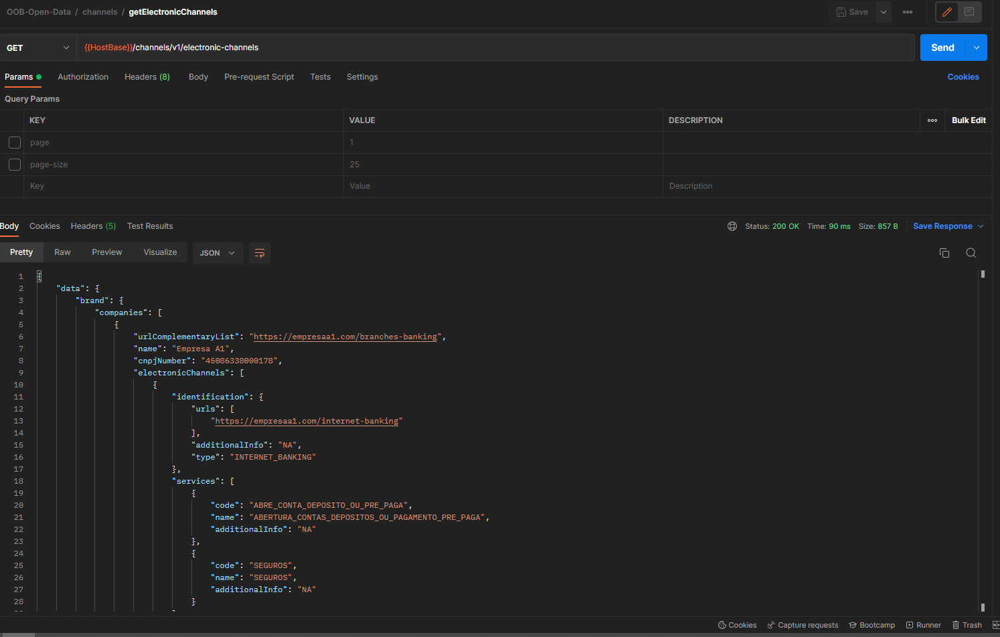
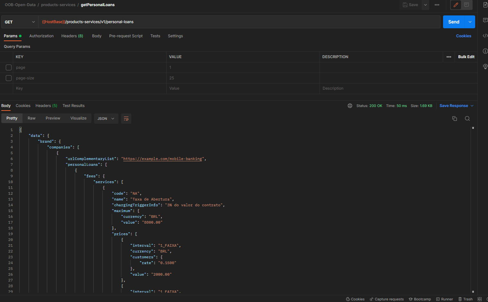
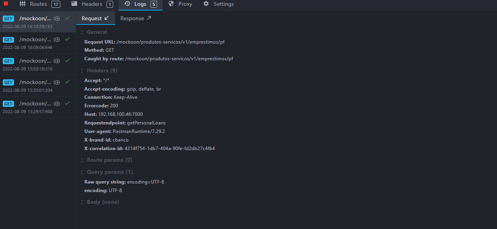

# Exemplo de criação e execução de plugin Camel para a api oob-open-data

Essa página descreve a criação de um exemplo de plugin Camel chamando um serviço
HTTP. Os serviços de exemplo são os da API de open data.

&nbsp;

## Mock do serviço remoto

Para a função do serviço que será chamado pelo plugin utilizaremos endpoints com
respostas fixas na ferramenta Mockoon. O arquivo [mockoon-open-data.json](./attachments/open-data-plugin/mockoon-open-data.json)
deve ser importado na ferramenta e o mock deve ser iniciado.

## Criação do plugin

O arquivo [mock-routes.xml](./attachments/open-data-plugin/mock-routes.xml) descreve as rotas que
ao serem executadas chamam os serviços do mock. Este exemplo descreve de forma simples
**e sem tratamento de erros ou configurações** como chamar um serviço remoto
em um plugin. Para a execução do teste será necessário alterar o IP das rotas
para o endereço do host que executará o Mockoon.

## Execução da aplicação com os mocks

Para chamar o serviço remoto em um plugin **com as configurações**, pode-se
adicioná-las no comando ```docker run``` ou criar os arquivos docker-compose.yml,
Dockerfile e env_variables.env com as configurações e executar através dos
comandos ```docker-compose build``` seguido por ```docker-compose up```. Vide o
exemplo do [plugin](./attachments/open-data-plugin), e seus respectivos arquivos:

[docker-compose.yml](./attachments/open-data-plugin/docker-compose.yml)

[Dockerfile](./attachments/open-data-plugin/Dockerfile)

[env_variables.env](./attachments/open-data-plugin/env_variables.env)

Se for iniciado da forma correta o log do container deve indicar que as rotas
foram carregadas, conforme o seguinte [exemplo](./attachments/log_open_data.json).

## Passo a passo para execução do exemplo

- Baixar a imagem da api oob-open-data através do comando

```bash
docker-pull 618430153747.dkr.ecr.sa-east-1.amazonaws.com/opus-open-banking-release/oob-open-data:1.0.0.76e303c
```

- Importar o arquivo de ambiente [mockoon-open-data.json](./attachments/open-data-plugin/mockoon-open-data.json)
na ferramenta Mockoon e iniciar o servidor

- Importar o arquivo de collection [OOB-open-data.postman_collection.json](./attachments/open-data-plugin/OOB-open-data.postman_collection.json)
na ferramenta Postman

- Acessar o diretório no qual se encontra o exemplo

- Alterar o valor da variável ROUTES_OPEN_DATA no arquivo [env_variables.env](./attachments/open-data-plugin/env_variables.env),
para que seja informado o IP da máquina

- Executar o comando abaixo para construir o plugin

```bash
docker-compose build
```

- Executar o comando abaixo para executar o plugin

```bash
docker-compose up
```

## Testando o plugin

Para testar o plugin Camel, devemos chamar a aplicação de open-data e ela irá
executar o plugin. O plugin por sua vez deve chamar o mock do serviço remoto.

Para executar as chamadas utilizaremos a collection no Postman contida no arquivo
[OOB-open-data.postman_collection.json](./attachments/OOB-open-data.postman_collection.json).





As chamadas recebidas pelo Mockoon podem ser vistas no botão "Logs"


