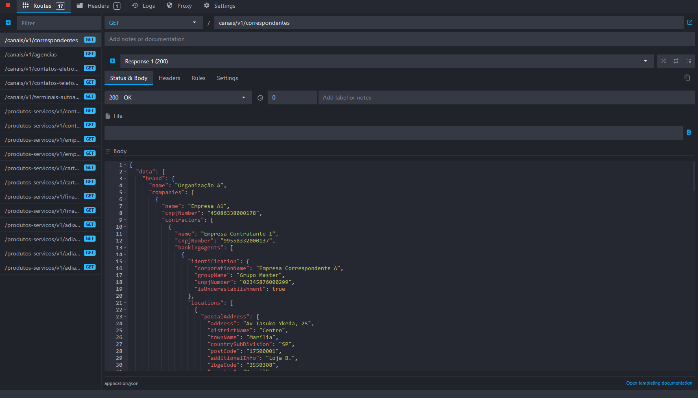
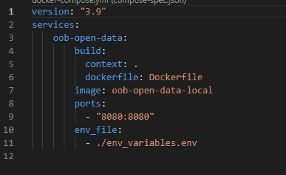
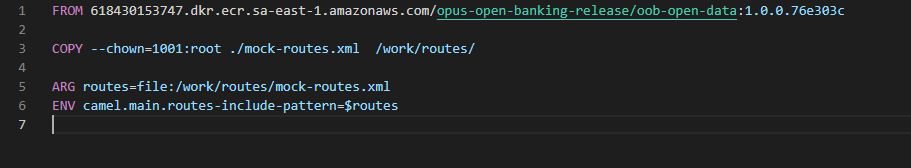

# Exemplo de criação e execução de plugin Camel para a api oob-open-data

Essa página descreve a criação de um exemplo de plugin Camel chamando um serviço
HTTP. Os serviços de exemplo são os da API de open data.

&nbsp;

## Mock do serviço remoto

Para a função do serviço que será chamado pelo plugin utilizaremos endpoints com
respostas fixas na ferramenta Mockoon. O arquivo [mockoon-open-data.json](./attachments/mockoon-open-data.json)
deve ser importado na ferramenta e o mock deve ser iniciado.



## Criação do plugin de demo

O arquivo [mock-routes.xml](./attachments/mock-routes.xml) descreve as rotas que ao serem
executadas chamam os serviços do mock. Este exemplo descreve de forma simples
**e sem tratamento de erros ou configurações** como chamar um serviço remoto
em um plugin. Para a execução do teste será necessário alterar o IP das rotas
para o endereço do host que executará o Mockoon.

## Execução da aplicação com os mocks

Para chamar o serviço remoto em um plugin **com as configurações**, pode-se adicioná-las no comando ```docker run``` ou criar os arquivos docker-compose.yml, Dockerfile e env_variables.env com as configurações e executar através dos comandos ```docker-compose build``` seguido por ```docker-compose up```. Vide o exemplo do [docker-compose](./attachments/)

docker-compose:



Dockerfile:



env_variables.env:


Se for iniciado da forma correta o log do container deve indicar que as rotas
foram carregadas:

```json
[
    {
        "sequence": 549,
        "timestamp": "2022-08-09T19:01:34.713Z",
        "method": "org.apache.camel.quarkus.core.CamelBootstrapRecorder",
        "level": "INFO",
        "message": "Bootstrap runtime: org.apache.camel.quarkus.main.CamelMainRuntime",
        "threadName": "main",
        "correlationId": null,
        "category": null,
        "build": "76e303c",
        "consentId": null,
        "clientId": null,
        "brandId": null,
        "exception": null,
        "stacktrace": null
    },
    {
        "sequence": 550,
        "timestamp": "2022-08-09T19:01:34.715Z",
        "method": "org.apache.camel.main.BaseMainSupport",
        "level": "INFO",
        "message": "Auto-configuration summary",
        "threadName": "main",
        "correlationId": null,
        "category": null,
        "build": "76e303c",
        "consentId": null,
        "clientId": null,
        "brandId": null,
        "exception": null,
        "stacktrace": null
    },
    {
        "sequence": 551,
        "timestamp": "2022-08-09T19:01:34.715Z",
        "method": "org.apache.camel.main.BaseMainSupport",
        "level": "INFO",
        "message": "    camel.main.routesIncludePattern=file:/work/routes/mock-routes.xml",
        "threadName": "main",
        "correlationId": null,
        "category": null,
        "build": "76e303c",
        "consentId": null,
        "clientId": null,
        "brandId": null,
        "exception": null,
        "stacktrace": null
    },
    {
        "sequence": 552,
        "timestamp": "2022-08-09T19:01:34.715Z",
        "method": "org.apache.camel.main.RoutesConfigurer",
        "level": "INFO",
        "message": "Loaded 1 additional RoutesBuilder from: file:/work/routes/mock-routes.xml (took 0ms)",
        "threadName": "main",
        "correlationId": null,
        "category": null,
        "build": "76e303c",
        "consentId": null,
        "clientId": null,
        "brandId": null,
        "exception": null,
        "stacktrace": null
    },
    {
        "sequence": 553,
        "timestamp": "2022-08-09T19:01:34.752Z",
        "method": "org.apache.camel.impl.engine.DefaultStreamCachingStrategy",
        "level": "INFO",
        "message": "StreamCaching in use with spool directory: /tmp/camel/camel-tmp-D99BEE9EFA57555-0000000000000000 and rules: [Spool > 128K body size]",
        "threadName": "main",
        "correlationId": null,
        "category": null,
        "build": "76e303c",
        "consentId": null,
        "clientId": null,
        "brandId": null,
        "exception": null,
        "stacktrace": null
    },
    {
        "sequence": 554,
        "timestamp": "2022-08-09T19:01:34.763Z",
        "method": "org.apache.camel.impl.engine.AbstractCamelContext",
        "level": "INFO",
        "message": "Routes startup summary (total:70 started:70)",
        "threadName": "main",
        "correlationId": null,
        "category": null,
        "build": "76e303c",
        "consentId": null,
        "clientId": null,
        "brandId": null,
        "exception": null,
        "stacktrace": null
    },
    {
        "sequence": 555,
        "timestamp": "2022-08-09T19:01:34.763Z",
        "method": "org.apache.camel.impl.engine.AbstractCamelContext",
        "level": "INFO",
        "message": "    Started route1 (platform-http:///products-services/v1/business-credit-cards)",
        "threadName": "main",
        "correlationId": null,
        "category": null,
        "build": "76e303c",
        "consentId": null,
        "clientId": null,
        "brandId": null,
        "exception": null,
        "stacktrace": null
    },
    {
        "sequence": 556,
        "timestamp": "2022-08-09T19:01:34.763Z",
        "method": "org.apache.camel.impl.engine.AbstractCamelContext",
        "level": "INFO",
        "message": "    Started route2 (direct://getBusinessCreditCardsInternal)",
        "threadName": "main",
        "correlationId": null,
        "category": null,
        "build": "76e303c",
        "consentId": null,
        "clientId": null,
        "brandId": null,
        "exception": null,
        "stacktrace": null
    },
    {
        "sequence": 557,
        "timestamp": "2022-08-09T19:01:34.763Z",
        "method": "org.apache.camel.impl.engine.AbstractCamelContext",
        "level": "INFO",
        "message": "    Started route3 (seda://getBusinessCreditCardsAfter)",
        "threadName": "main",
        "correlationId": null,
        "category": null,
        "build": "76e303c",
        "consentId": null,
        "clientId": null,
        "brandId": null,
        "exception": null,
        "stacktrace": null
    },
    {
        "sequence": 558,
        "timestamp": "2022-08-09T19:01:34.763Z",
        "method": "org.apache.camel.impl.engine.AbstractCamelContext",
        "level": "INFO",
        "message": "    Started route4 (platform-http:///products-services/v1/business-financings)",
        "threadName": "main",
        "correlationId": null,
        "category": null,
        "build": "76e303c",
        "consentId": null,
        "clientId": null,
        "brandId": null,
        "exception": null,
        "stacktrace": null
    },
    {
        "sequence": 559,
        "timestamp": "2022-08-09T19:01:34.763Z",
        "method": "org.apache.camel.impl.engine.AbstractCamelContext",
        "level": "INFO",
        "message": "    Started route5 (direct://getBusinessFinancingsInternal)",
        "threadName": "main",
        "correlationId": null,
        "category": null,
        "build": "76e303c",
        "consentId": null,
        "clientId": null,
        "brandId": null,
        "exception": null,
        "stacktrace": null
    },
    {
        "sequence": 560,
        "timestamp": "2022-08-09T19:01:34.763Z",
        "method": "org.apache.camel.impl.engine.AbstractCamelContext",
        "level": "INFO",
        "message": "    Started route6 (seda://getBusinessFinancingsAfter)",
        "threadName": "main",
        "correlationId": null,
        "category": null,
        "build": "76e303c",
        "consentId": null,
        "clientId": null,
        "brandId": null,
        "exception": null,
        "stacktrace": null
    },
    {
        "sequence": 561,
        "timestamp": "2022-08-09T19:01:34.763Z",
        "method": "org.apache.camel.impl.engine.AbstractCamelContext",
        "level": "INFO",
        "message": "    Started route7 (platform-http:///products-services/v1/personal-unarranged-account-overdraft)",
        "threadName": "main",
        "correlationId": null,
        "category": null,
        "build": "76e303c",
        "consentId": null,
        "clientId": null,
        "brandId": null,
        "exception": null,
        "stacktrace": null
    },
    {
        "sequence": 562,
        "timestamp": "2022-08-09T19:01:34.763Z",
        "method": "org.apache.camel.impl.engine.AbstractCamelContext",
        "level": "INFO",
        "message": "    Started route8 (direct://getPersonalUnarrangedAccountOverdraftInternal)",
        "threadName": "main",
        "correlationId": null,
        "category": null,
        "build": "76e303c",
        "consentId": null,
        "clientId": null,
        "brandId": null,
        "exception": null,
        "stacktrace": null
    },
    {
        "sequence": 563,
        "timestamp": "2022-08-09T19:01:34.763Z",
        "method": "org.apache.camel.impl.engine.AbstractCamelContext",
        "level": "INFO",
        "message": "    Started route9 (seda://getPersonalUnarrangedAccountOverdraftAfter)",
        "threadName": "main",
        "correlationId": null,
        "category": null,
        "build": "76e303c",
        "consentId": null,
        "clientId": null,
        "brandId": null,
        "exception": null,
        "stacktrace": null
    },
    {
        "sequence": 564,
        "timestamp": "2022-08-09T19:01:34.763Z",
        "method": "org.apache.camel.impl.engine.AbstractCamelContext",
        "level": "INFO",
        "message": "    Started route10 (platform-http:///products-services/v1/business-accounts)",
        "threadName": "main",
        "correlationId": null,
        "category": null,
        "build": "76e303c",
        "consentId": null,
        "clientId": null,
        "brandId": null,
        "exception": null,
        "stacktrace": null
    },
    {
        "sequence": 565,
        "timestamp": "2022-08-09T19:01:34.763Z",
        "method": "org.apache.camel.impl.engine.AbstractCamelContext",
        "level": "INFO",
        "message": "    Started route11 (direct://getBusinessAccountsInternal)",
        "threadName": "main",
        "correlationId": null,
        "category": null,
        "build": "76e303c",
        "consentId": null,
        "clientId": null,
        "brandId": null,
        "exception": null,
        "stacktrace": null
    },
    {
        "sequence": 566,
        "timestamp": "2022-08-09T19:01:34.764Z",
        "method": "org.apache.camel.impl.engine.AbstractCamelContext",
        "level": "INFO",
        "message": "    Started route12 (seda://getBusinessAccountsAfter)",
        "threadName": "main",
        "correlationId": null,
        "category": null,
        "build": "76e303c",
        "consentId": null,
        "clientId": null,
        "brandId": null,
        "exception": null,
        "stacktrace": null
    },
    {
        "sequence": 567,
        "timestamp": "2022-08-09T19:01:34.764Z",
        "method": "org.apache.camel.impl.engine.AbstractCamelContext",
        "level": "INFO",
        "message": "    Started route13 (platform-http:///products-services/v1/personal-credit-cards)",
        "threadName": "main",
        "correlationId": null,
        "category": null,
        "build": "76e303c",
        "consentId": null,
        "clientId": null,
        "brandId": null,
        "exception": null,
        "stacktrace": null
    },
    {
        "sequence": 568,
        "timestamp": "2022-08-09T19:01:34.764Z",
        "method": "org.apache.camel.impl.engine.AbstractCamelContext",
        "level": "INFO",
        "message": "    Started route14 (direct://getPersonalCreditCardsInternal)",
        "threadName": "main",
        "correlationId": null,
        "category": null,
        "build": "76e303c",
        "consentId": null,
        "clientId": null,
        "brandId": null,
        "exception": null,
        "stacktrace": null
    },
    {
        "sequence": 569,
        "timestamp": "2022-08-09T19:01:34.764Z",
        "method": "org.apache.camel.impl.engine.AbstractCamelContext",
        "level": "INFO",
        "message": "    Started route15 (seda://getPersonalCreditCardsAfter)",
        "threadName": "main",
        "correlationId": null,
        "category": null,
        "build": "76e303c",
        "consentId": null,
        "clientId": null,
        "brandId": null,
        "exception": null,
        "stacktrace": null
    },
    {
        "sequence": 570,
        "timestamp": "2022-08-09T19:01:34.764Z",
        "method": "org.apache.camel.impl.engine.AbstractCamelContext",
        "level": "INFO",
        "message": "    Started route16 (platform-http:///channels/v1/shared-automated-teller-machines)",
        "threadName": "main",
        "correlationId": null,
        "category": null,
        "build": "76e303c",
        "consentId": null,
        "clientId": null,
        "brandId": null,
        "exception": null,
        "stacktrace": null
    },
    {
        "sequence": 571,
        "timestamp": "2022-08-09T19:01:34.764Z",
        "method": "org.apache.camel.impl.engine.AbstractCamelContext",
        "level": "INFO",
        "message": "    Started route17 (direct://getSharedAutomatedTellerMachinesInternal)",
        "threadName": "main",
        "correlationId": null,
        "category": null,
        "build": "76e303c",
        "consentId": null,
        "clientId": null,
        "brandId": null,
        "exception": null,
        "stacktrace": null
    },
    {
        "sequence": 572,
        "timestamp": "2022-08-09T19:01:34.764Z",
        "method": "org.apache.camel.impl.engine.AbstractCamelContext",
        "level": "INFO",
        "message": "    Started route18 (seda://getSharedAutomatedTellerMachinesAfter)",
        "threadName": "main",
        "correlationId": null,
        "category": null,
        "build": "76e303c",
        "consentId": null,
        "clientId": null,
        "brandId": null,
        "exception": null,
        "stacktrace": null
    },
    {
        "sequence": 573,
        "timestamp": "2022-08-09T19:01:34.764Z",
        "method": "org.apache.camel.impl.engine.AbstractCamelContext",
        "level": "INFO",
        "message": "    Started route19 (platform-http:///products-services/v1/business-unarranged-account-overdraft)",
        "threadName": "main",
        "correlationId": null,
        "category": null,
        "build": "76e303c",
        "consentId": null,
        "clientId": null,
        "brandId": null,
        "exception": null,
        "stacktrace": null
    },
    {
        "sequence": 574,
        "timestamp": "2022-08-09T19:01:34.764Z",
        "method": "org.apache.camel.impl.engine.AbstractCamelContext",
        "level": "INFO",
        "message": "    Started route20 (direct://getBusinessUnarrangedAccountOverdraftInternal)",
        "threadName": "main",
        "correlationId": null,
        "category": null,
        "build": "76e303c",
        "consentId": null,
        "clientId": null,
        "brandId": null,
        "exception": null,
        "stacktrace": null
    },
    {
        "sequence": 575,
        "timestamp": "2022-08-09T19:01:34.764Z",
        "method": "org.apache.camel.impl.engine.AbstractCamelContext",
        "level": "INFO",
        "message": "    Started route21 (seda://getBusinessUnarrangedAccountOverdraftAfter)",
        "threadName": "main",
        "correlationId": null,
        "category": null,
        "build": "76e303c",
        "consentId": null,
        "clientId": null,
        "brandId": null,
        "exception": null,
        "stacktrace": null
    },
    {
        "sequence": 576,
        "timestamp": "2022-08-09T19:01:34.764Z",
        "method": "org.apache.camel.impl.engine.AbstractCamelContext",
        "level": "INFO",
        "message": "    Started route22 (platform-http:///products-services/v1/personal-invoice-financings)",
        "threadName": "main",
        "correlationId": null,
        "category": null,
        "build": "76e303c",
        "consentId": null,
        "clientId": null,
        "brandId": null,
        "exception": null,
        "stacktrace": null
    },
    {
        "sequence": 577,
        "timestamp": "2022-08-09T19:01:34.764Z",
        "method": "org.apache.camel.impl.engine.AbstractCamelContext",
        "level": "INFO",
        "message": "    Started route23 (direct://getPersonalInvoiceFinancingsInternal)",
        "threadName": "main",
        "correlationId": null,
        "category": null,
        "build": "76e303c",
        "consentId": null,
        "clientId": null,
        "brandId": null,
        "exception": null,
        "stacktrace": null
    },
    {
        "sequence": 578,
        "timestamp": "2022-08-09T19:01:34.764Z",
        "method": "org.apache.camel.impl.engine.AbstractCamelContext",
        "level": "INFO",
        "message": "    Started route24 (seda://getPersonalInvoiceFinancingsAfter)",
        "threadName": "main",
        "correlationId": null,
        "category": null,
        "build": "76e303c",
        "consentId": null,
        "clientId": null,
        "brandId": null,
        "exception": null,
        "stacktrace": null
    },
    {
        "sequence": 579,
        "timestamp": "2022-08-09T19:01:34.764Z",
        "method": "org.apache.camel.impl.engine.AbstractCamelContext",
        "level": "INFO",
        "message": "    Started route25 (platform-http:///products-services/v1/personal-financings)",
        "threadName": "main",
        "correlationId": null,
        "category": null,
        "build": "76e303c",
        "consentId": null,
        "clientId": null,
        "brandId": null,
        "exception": null,
        "stacktrace": null
    },
    {
        "sequence": 580,
        "timestamp": "2022-08-09T19:01:34.764Z",
        "method": "org.apache.camel.impl.engine.AbstractCamelContext",
        "level": "INFO",
        "message": "    Started route26 (direct://getPersonalFinancingsInternal)",
        "threadName": "main",
        "correlationId": null,
        "category": null,
        "build": "76e303c",
        "consentId": null,
        "clientId": null,
        "brandId": null,
        "exception": null,
        "stacktrace": null
    },
    {
        "sequence": 581,
        "timestamp": "2022-08-09T19:01:34.764Z",
        "method": "org.apache.camel.impl.engine.AbstractCamelContext",
        "level": "INFO",
        "message": "    Started route27 (seda://getPersonalFinancingsAfter)",
        "threadName": "main",
        "correlationId": null,
        "category": null,
        "build": "76e303c",
        "consentId": null,
        "clientId": null,
        "brandId": null,
        "exception": null,
        "stacktrace": null
    },
    {
        "sequence": 582,
        "timestamp": "2022-08-09T19:01:34.764Z",
        "method": "org.apache.camel.impl.engine.AbstractCamelContext",
        "level": "INFO",
        "message": "    Started route28 (platform-http:///channels/v1/branches)",
        "threadName": "main",
        "correlationId": null,
        "category": null,
        "build": "76e303c",
        "consentId": null,
        "clientId": null,
        "brandId": null,
        "exception": null,
        "stacktrace": null
    },
    {
        "sequence": 583,
        "timestamp": "2022-08-09T19:01:34.764Z",
        "method": "org.apache.camel.impl.engine.AbstractCamelContext",
        "level": "INFO",
        "message": "    Started route29 (direct://getBranchesInternal)",
        "threadName": "main",
        "correlationId": null,
        "category": null,
        "build": "76e303c",
        "consentId": null,
        "clientId": null,
        "brandId": null,
        "exception": null,
        "stacktrace": null
    },
    {
        "sequence": 584,
        "timestamp": "2022-08-09T19:01:34.765Z",
        "method": "org.apache.camel.impl.engine.AbstractCamelContext",
        "level": "INFO",
        "message": "    Started route30 (seda://getBranchesAfter)",
        "threadName": "main",
        "correlationId": null,
        "category": null,
        "build": "76e303c",
        "consentId": null,
        "clientId": null,
        "brandId": null,
        "exception": null,
        "stacktrace": null
    },
    {
        "sequence": 585,
        "timestamp": "2022-08-09T19:01:34.765Z",
        "method": "org.apache.camel.impl.engine.AbstractCamelContext",
        "level": "INFO",
        "message": "    Started route31 (platform-http:///products-services/v1/personal-loans)",
        "threadName": "main",
        "correlationId": null,
        "category": null,
        "build": "76e303c",
        "consentId": null,
        "clientId": null,
        "brandId": null,
        "exception": null,
        "stacktrace": null
    },
    {
        "sequence": 586,
        "timestamp": "2022-08-09T19:01:34.765Z",
        "method": "org.apache.camel.impl.engine.AbstractCamelContext",
        "level": "INFO",
        "message": "    Started route32 (direct://getPersonalLoansInternal)",
        "threadName": "main",
        "correlationId": null,
        "category": null,
        "build": "76e303c",
        "consentId": null,
        "clientId": null,
        "brandId": null,
        "exception": null,
        "stacktrace": null
    },
    {
        "sequence": 587,
        "timestamp": "2022-08-09T19:01:34.765Z",
        "method": "org.apache.camel.impl.engine.AbstractCamelContext",
        "level": "INFO",
        "message": "    Started route33 (seda://getPersonalLoansAfter)",
        "threadName": "main",
        "correlationId": null,
        "category": null,
        "build": "76e303c",
        "consentId": null,
        "clientId": null,
        "brandId": null,
        "exception": null,
        "stacktrace": null
    },
    {
        "sequence": 588,
        "timestamp": "2022-08-09T19:01:34.765Z",
        "method": "org.apache.camel.impl.engine.AbstractCamelContext",
        "level": "INFO",
        "message": "    Started route34 (platform-http:///products-services/v1/personal-accounts)",
        "threadName": "main",
        "correlationId": null,
        "category": null,
        "build": "76e303c",
        "consentId": null,
        "clientId": null,
        "brandId": null,
        "exception": null,
        "stacktrace": null
    },
    {
        "sequence": 589,
        "timestamp": "2022-08-09T19:01:34.765Z",
        "method": "org.apache.camel.impl.engine.AbstractCamelContext",
        "level": "INFO",
        "message": "    Started route35 (direct://getPersonalAccountsInternal)",
        "threadName": "main",
        "correlationId": null,
        "category": null,
        "build": "76e303c",
        "consentId": null,
        "clientId": null,
        "brandId": null,
        "exception": null,
        "stacktrace": null
    },
    {
        "sequence": 590,
        "timestamp": "2022-08-09T19:01:34.765Z",
        "method": "org.apache.camel.impl.engine.AbstractCamelContext",
        "level": "INFO",
        "message": "    Started route36 (seda://getPersonalAccountsAfter)",
        "threadName": "main",
        "correlationId": null,
        "category": null,
        "build": "76e303c",
        "consentId": null,
        "clientId": null,
        "brandId": null,
        "exception": null,
        "stacktrace": null
    },
    {
        "sequence": 591,
        "timestamp": "2022-08-09T19:01:34.765Z",
        "method": "org.apache.camel.impl.engine.AbstractCamelContext",
        "level": "INFO",
        "message": "    Started route37 (platform-http:///channels/v1/banking-agents)",
        "threadName": "main",
        "correlationId": null,
        "category": null,
        "build": "76e303c",
        "consentId": null,
        "clientId": null,
        "brandId": null,
        "exception": null,
        "stacktrace": null
    },
    {
        "sequence": 592,
        "timestamp": "2022-08-09T19:01:34.765Z",
        "method": "org.apache.camel.impl.engine.AbstractCamelContext",
        "level": "INFO",
        "message": "    Started route38 (direct://getBankingAgentsInternal)",
        "threadName": "main",
        "correlationId": null,
        "category": null,
        "build": "76e303c",
        "consentId": null,
        "clientId": null,
        "brandId": null,
        "exception": null,
        "stacktrace": null
    },
    {
        "sequence": 593,
        "timestamp": "2022-08-09T19:01:34.765Z",
        "method": "org.apache.camel.impl.engine.AbstractCamelContext",
        "level": "INFO",
        "message": "    Started route39 (seda://getBankingAgentsAfter)",
        "threadName": "main",
        "correlationId": null,
        "category": null,
        "build": "76e303c",
        "consentId": null,
        "clientId": null,
        "brandId": null,
        "exception": null,
        "stacktrace": null
    },
    {
        "sequence": 594,
        "timestamp": "2022-08-09T19:01:34.765Z",
        "method": "org.apache.camel.impl.engine.AbstractCamelContext",
        "level": "INFO",
        "message": "    Started route40 (platform-http:///channels/v1/phone-channels)",
        "threadName": "main",
        "correlationId": null,
        "category": null,
        "build": "76e303c",
        "consentId": null,
        "clientId": null,
        "brandId": null,
        "exception": null,
        "stacktrace": null
    },
    {
        "sequence": 595,
        "timestamp": "2022-08-09T19:01:34.765Z",
        "method": "org.apache.camel.impl.engine.AbstractCamelContext",
        "level": "INFO",
        "message": "    Started route41 (direct://getPhoneChannelsInternal)",
        "threadName": "main",
        "correlationId": null,
        "category": null,
        "build": "76e303c",
        "consentId": null,
        "clientId": null,
        "brandId": null,
        "exception": null,
        "stacktrace": null
    },
    {
        "sequence": 596,
        "timestamp": "2022-08-09T19:01:34.765Z",
        "method": "org.apache.camel.impl.engine.AbstractCamelContext",
        "level": "INFO",
        "message": "    Started route42 (seda://getPhoneChannelsAfter)",
        "threadName": "main",
        "correlationId": null,
        "category": null,
        "build": "76e303c",
        "consentId": null,
        "clientId": null,
        "brandId": null,
        "exception": null,
        "stacktrace": null
    },
    {
        "sequence": 597,
        "timestamp": "2022-08-09T19:01:34.765Z",
        "method": "org.apache.camel.impl.engine.AbstractCamelContext",
        "level": "INFO",
        "message": "    Started route43 (platform-http:///products-services/v1/business-invoice-financings)",
        "threadName": "main",
        "correlationId": null,
        "category": null,
        "build": "76e303c",
        "consentId": null,
        "clientId": null,
        "brandId": null,
        "exception": null,
        "stacktrace": null
    },
    {
        "sequence": 598,
        "timestamp": "2022-08-09T19:01:34.765Z",
        "method": "org.apache.camel.impl.engine.AbstractCamelContext",
        "level": "INFO",
        "message": "    Started route44 (direct://getBusinessInvoiceFinancingsInternal)",
        "threadName": "main",
        "correlationId": null,
        "category": null,
        "build": "76e303c",
        "consentId": null,
        "clientId": null,
        "brandId": null,
        "exception": null,
        "stacktrace": null
    },
    {
        "sequence": 599,
        "timestamp": "2022-08-09T19:01:34.766Z",
        "method": "org.apache.camel.impl.engine.AbstractCamelContext",
        "level": "INFO",
        "message": "    Started route45 (seda://getBusinessInvoiceFinancingsAfter)",
        "threadName": "main",
        "correlationId": null,
        "category": null,
        "build": "76e303c",
        "consentId": null,
        "clientId": null,
        "brandId": null,
        "exception": null,
        "stacktrace": null
    },
    {
        "sequence": 600,
        "timestamp": "2022-08-09T19:01:34.766Z",
        "method": "org.apache.camel.impl.engine.AbstractCamelContext",
        "level": "INFO",
        "message": "    Started route46 (platform-http:///products-services/v1/business-loans)",
        "threadName": "main",
        "correlationId": null,
        "category": null,
        "build": "76e303c",
        "consentId": null,
        "clientId": null,
        "brandId": null,
        "exception": null,
        "stacktrace": null
    },
    {
        "sequence": 601,
        "timestamp": "2022-08-09T19:01:34.766Z",
        "method": "org.apache.camel.impl.engine.AbstractCamelContext",
        "level": "INFO",
        "message": "    Started route47 (direct://getBusinessLoansInternal)",
        "threadName": "main",
        "correlationId": null,
        "category": null,
        "build": "76e303c",
        "consentId": null,
        "clientId": null,
        "brandId": null,
        "exception": null,
        "stacktrace": null
    },
    {
        "sequence": 602,
        "timestamp": "2022-08-09T19:01:34.766Z",
        "method": "org.apache.camel.impl.engine.AbstractCamelContext",
        "level": "INFO",
        "message": "    Started route48 (seda://getBusinessLoansAfter)",
        "threadName": "main",
        "correlationId": null,
        "category": null,
        "build": "76e303c",
        "consentId": null,
        "clientId": null,
        "brandId": null,
        "exception": null,
        "stacktrace": null
    },
    {
        "sequence": 603,
        "timestamp": "2022-08-09T19:01:34.766Z",
        "method": "org.apache.camel.impl.engine.AbstractCamelContext",
        "level": "INFO",
        "message": "    Started route49 (platform-http:///channels/v1/electronic-channels)",
        "threadName": "main",
        "correlationId": null,
        "category": null,
        "build": "76e303c",
        "consentId": null,
        "clientId": null,
        "brandId": null,
        "exception": null,
        "stacktrace": null
    },
    {
        "sequence": 604,
        "timestamp": "2022-08-09T19:01:34.766Z",
        "method": "org.apache.camel.impl.engine.AbstractCamelContext",
        "level": "INFO",
        "message": "    Started route50 (direct://getElectronicChannelsInternal)",
        "threadName": "main",
        "correlationId": null,
        "category": null,
        "build": "76e303c",
        "consentId": null,
        "clientId": null,
        "brandId": null,
        "exception": null,
        "stacktrace": null
    },
    {
        "sequence": 605,
        "timestamp": "2022-08-09T19:01:34.766Z",
        "method": "org.apache.camel.impl.engine.AbstractCamelContext",
        "level": "INFO",
        "message": "    Started route51 (seda://getElectronicChannelsAfter)",
        "threadName": "main",
        "correlationId": null,
        "category": null,
        "build": "76e303c",
        "consentId": null,
        "clientId": null,
        "brandId": null,
        "exception": null,
        "stacktrace": null
    },
    {
        "sequence": 606,
        "timestamp": "2022-08-09T19:01:34.766Z",
        "method": "org.apache.camel.impl.engine.AbstractCamelContext",
        "level": "INFO",
        "message": "    Started getPersonalAccountsRoute (direct://getPersonalAccounts)",
        "threadName": "main",
        "correlationId": null,
        "category": null,
        "build": "76e303c",
        "consentId": null,
        "clientId": null,
        "brandId": null,
        "exception": null,
        "stacktrace": null
    },
    {
        "sequence": 607,
        "timestamp": "2022-08-09T19:01:34.766Z",
        "method": "org.apache.camel.impl.engine.AbstractCamelContext",
        "level": "INFO",
        "message": "    Started getBusinessAccountsRoute (direct://getBusinessAccounts)",
        "threadName": "main",
        "correlationId": null,
        "category": null,
        "build": "76e303c",
        "consentId": null,
        "clientId": null,
        "brandId": null,
        "exception": null,
        "stacktrace": null
    },
    {
        "sequence": 608,
        "timestamp": "2022-08-09T19:01:34.767Z",
        "method": "org.apache.camel.impl.engine.AbstractCamelContext",
        "level": "INFO",
        "message": "    Started getPersonalLoansRoute (direct://getPersonalLoans)",
        "threadName": "main",
        "correlationId": null,
        "category": null,
        "build": "76e303c",
        "consentId": null,
        "clientId": null,
        "brandId": null,
        "exception": null,
        "stacktrace": null
    },
    {
        "sequence": 609,
        "timestamp": "2022-08-09T19:01:34.767Z",
        "method": "org.apache.camel.impl.engine.AbstractCamelContext",
        "level": "INFO",
        "message": "    Started getBusinessLoansRoute (direct://getBusinessLoans)",
        "threadName": "main",
        "correlationId": null,
        "category": null,
        "build": "76e303c",
        "consentId": null,
        "clientId": null,
        "brandId": null,
        "exception": null,
        "stacktrace": null
    },
    {
        "sequence": 610,
        "timestamp": "2022-08-09T19:01:34.767Z",
        "method": "org.apache.camel.impl.engine.AbstractCamelContext",
        "level": "INFO",
        "message": "    Started getPersonalFinancingsRoute (direct://getPersonalFinancings)",
        "threadName": "main",
        "correlationId": null,
        "category": null,
        "build": "76e303c",
        "consentId": null,
        "clientId": null,
        "brandId": null,
        "exception": null,
        "stacktrace": null
    },
    {
        "sequence": 611,
        "timestamp": "2022-08-09T19:01:34.767Z",
        "method": "org.apache.camel.impl.engine.AbstractCamelContext",
        "level": "INFO",
        "message": "    Started getBusinessFinancingsRoute (direct://getBusinessFinancings)",
        "threadName": "main",
        "correlationId": null,
        "category": null,
        "build": "76e303c",
        "consentId": null,
        "clientId": null,
        "brandId": null,
        "exception": null,
        "stacktrace": null
    },
    {
        "sequence": 612,
        "timestamp": "2022-08-09T19:01:34.768Z",
        "method": "org.apache.camel.impl.engine.AbstractCamelContext",
        "level": "INFO",
        "message": "    Started getPersonalInvoiceFinancingsRoute (direct://getPersonalInvoiceFinancings)",
        "threadName": "main",
        "correlationId": null,
        "category": null,
        "build": "76e303c",
        "consentId": null,
        "clientId": null,
        "brandId": null,
        "exception": null,
        "stacktrace": null
    },
    {
        "sequence": 613,
        "timestamp": "2022-08-09T19:01:34.768Z",
        "method": "org.apache.camel.impl.engine.AbstractCamelContext",
        "level": "INFO",
        "message": "    Started getBusinessInvoiceFinancingsRoute (direct://getBusinessInvoiceFinancings)",
        "threadName": "main",
        "correlationId": null,
        "category": null,
        "build": "76e303c",
        "consentId": null,
        "clientId": null,
        "brandId": null,
        "exception": null,
        "stacktrace": null
    },
    {
        "sequence": 614,
        "timestamp": "2022-08-09T19:01:34.768Z",
        "method": "org.apache.camel.impl.engine.AbstractCamelContext",
        "level": "INFO",
        "message": "    Started getPersonalCreditCardsRoute (direct://getPersonalCreditCards)",
        "threadName": "main",
        "correlationId": null,
        "category": null,
        "build": "76e303c",
        "consentId": null,
        "clientId": null,
        "brandId": null,
        "exception": null,
        "stacktrace": null
    },
    {
        "sequence": 615,
        "timestamp": "2022-08-09T19:01:34.769Z",
        "method": "org.apache.camel.impl.engine.AbstractCamelContext",
        "level": "INFO",
        "message": "    Started getBusinessCreditCardsRoute (direct://getBusinessCreditCards)",
        "threadName": "main",
        "correlationId": null,
        "category": null,
        "build": "76e303c",
        "consentId": null,
        "clientId": null,
        "brandId": null,
        "exception": null,
        "stacktrace": null
    },
    {
        "sequence": 616,
        "timestamp": "2022-08-09T19:01:34.769Z",
        "method": "org.apache.camel.impl.engine.AbstractCamelContext",
        "level": "INFO",
        "message": "    Started getPersonalUnarrangedAccountOverdraftRoute (direct://getPersonalUnarrangedAccountOverdraft)",
        "threadName": "main",
        "correlationId": null,
        "category": null,
        "build": "76e303c",
        "consentId": null,
        "clientId": null,
        "brandId": null,
        "exception": null,
        "stacktrace": null
    },
    {
        "sequence": 617,
        "timestamp": "2022-08-09T19:01:34.769Z",
        "method": "org.apache.camel.impl.engine.AbstractCamelContext",
        "level": "INFO",
        "message": "    Started getBusinessUnarrangedAccountOverdraftRoute (direct://getBusinessUnarrangedAccountOverdraft)",
        "threadName": "main",
        "correlationId": null,
        "category": null,
        "build": "76e303c",
        "consentId": null,
        "clientId": null,
        "brandId": null,
        "exception": null,
        "stacktrace": null
    },
    {
        "sequence": 618,
        "timestamp": "2022-08-09T19:01:34.769Z",
        "method": "org.apache.camel.impl.engine.AbstractCamelContext",
        "level": "INFO",
        "message": "    Started getBankingAgentsRoute (direct://getBankingAgents)",
        "threadName": "main",
        "correlationId": null,
        "category": null,
        "build": "76e303c",
        "consentId": null,
        "clientId": null,
        "brandId": null,
        "exception": null,
        "stacktrace": null
    },
    {
        "sequence": 619,
        "timestamp": "2022-08-09T19:01:34.769Z",
        "method": "org.apache.camel.impl.engine.AbstractCamelContext",
        "level": "INFO",
        "message": "    Started getBranchesRoute (direct://getBranches)",
        "threadName": "main",
        "correlationId": null,
        "category": null,
        "build": "76e303c",
        "consentId": null,
        "clientId": null,
        "brandId": null,
        "exception": null,
        "stacktrace": null
    },
    {
        "sequence": 620,
        "timestamp": "2022-08-09T19:01:34.769Z",
        "method": "org.apache.camel.impl.engine.AbstractCamelContext",
        "level": "INFO",
        "message": "    Started getElectronicChannelsRoute (direct://getElectronicChannels)",
        "threadName": "main",
        "correlationId": null,
        "category": null,
        "build": "76e303c",
        "consentId": null,
        "clientId": null,
        "brandId": null,
        "exception": null,
        "stacktrace": null
    },
    {
        "sequence": 621,
        "timestamp": "2022-08-09T19:01:34.770Z",
        "method": "org.apache.camel.impl.engine.AbstractCamelContext",
        "level": "INFO",
        "message": "    Started getPhoneChannelsRoute (direct://getPhoneChannels)",
        "threadName": "main",
        "correlationId": null,
        "category": null,
        "build": "76e303c",
        "consentId": null,
        "clientId": null,
        "brandId": null,
        "exception": null,
        "stacktrace": null
    },
    {
        "sequence": 622,
        "timestamp": "2022-08-09T19:01:34.770Z",
        "method": "org.apache.camel.impl.engine.AbstractCamelContext",
        "level": "INFO",
        "message": "    Started getSharedAutomatedTellerMachinesRoute (direct://getSharedAutomatedTellerMachines)",
        "threadName": "main",
        "correlationId": null,
        "category": null,
        "build": "76e303c",
        "consentId": null,
        "clientId": null,
        "brandId": null,
        "exception": null,
        "stacktrace": null
    },
    {
        "sequence": 623,
        "timestamp": "2022-08-09T19:01:34.771Z",
        "method": "org.apache.camel.impl.engine.AbstractCamelContext",
        "level": "INFO",
        "message": "    Started responseCacheRoute (direct://responseCache)",
        "threadName": "main",
        "correlationId": null,
        "category": null,
        "build": "76e303c",
        "consentId": null,
        "clientId": null,
        "brandId": null,
        "exception": null,
        "stacktrace": null
    },
    {
        "sequence": 624,
        "timestamp": "2022-08-09T19:01:34.772Z",
        "method": "org.apache.camel.impl.engine.AbstractCamelContext",
        "level": "INFO",
        "message": "    Started getErrorResponseRoute (direct://getErrorResponse)",
        "threadName": "main",
        "correlationId": null,
        "category": null,
        "build": "76e303c",
        "consentId": null,
        "clientId": null,
        "brandId": null,
        "exception": null,
        "stacktrace": null
    },
    {
        "sequence": 625,
        "timestamp": "2022-08-09T19:01:34.772Z",
        "method": "org.apache.camel.impl.engine.AbstractCamelContext",
        "level": "INFO",
        "message": "Apache Camel 3.11.1 (camel-1) started in 54ms (build:0ms init:19ms start:35ms)",
        "threadName": "main",
        "correlationId": null,
        "category": null,
        "build": "76e303c",
        "consentId": null,
        "clientId": null,
        "brandId": null,
        "exception": null,
        "stacktrace": null
    },
    {
        "sequence": 626,
        "timestamp": "2022-08-09T19:01:34.776Z",
        "method": "io.quarkus",
        "level": "INFO",
        "message": "opendata 1.0.0-SNAPSHOT native (powered by Quarkus 2.2.2.Final) started in 0.112s. Listening on: http://0.0.0.0:8080",
        "threadName": "main",
        "correlationId": null,
        "category": null,
        "build": "76e303c",
        "consentId": null,
        "clientId": null,
        "brandId": null,
        "exception": null,
        "stacktrace": null
    },
    {
        "sequence": 627,
        "timestamp": "2022-08-09T19:01:34.776Z",
        "method": "io.quarkus",
        "level": "INFO",
        "message": "Profile prod activated. ",
        "threadName": "main",
        "correlationId": null,
        "category": null,
        "build": "76e303c",
        "consentId": null,
        "clientId": null,
        "brandId": null,
        "exception": null,
        "stacktrace": null
    },
    {
        "sequence": 628,
        "timestamp": "2022-08-09T19:01:34.777Z",
        "method": "io.quarkus",
        "level": "INFO",
        "message": "Installed features: [agroal, cache, camel-activemq, camel-amqp, camel-atlasmap, camel-attachments, camel-base64, camel-bean, camel-bindy, camel-caffeine, camel-core, camel-csv, camel-dataformat, camel-direct, camel-exec, camel-file, camel-flatpack, camel-hl7, camel-http, camel-jackson, camel-jacksonxml, camel-jing, camel-jms, camel-jsonpath, camel-log, camel-microprofile-health, camel-mock, camel-msv, camel-platform-http, camel-ref, camel-rest, camel-saxon, camel-seda, camel-snakeyaml, camel-sql, camel-tagsoup, camel-timer, camel-validator, camel-velocity, camel-vm, camel-xml-io-dsl, camel-xml-jaxp, camel-xpath, cdi, config-yaml, jdbc-mssql, jdbc-mysql, jdbc-oracle, jdbc-postgresql, logging-json, narayana-jta, qpid-jms, resteasy-jsonb, smallrye-context-propagation, smallrye-health, vertx, vertx-web]",
        "threadName": "main",
        "correlationId": null,
        "category": null,
        "build": "76e303c",
        "consentId": null,
        "clientId": null,
        "brandId": null,
        "exception": null,
        "stacktrace": null
    }
]
```

## Testando o plugin

Para testar o plugin Camel, devemos chamar a aplicação de open-data e ela irá
executar o plugin. O plugin por sua vez deve chamar o mock do serviço remoto.

Para executar as chamadas utilizaremos a collection no Postman contida no arquivo
[OOB-open-data.postman_collection.json](./attachments/OOB-open-data.postman_collection.json).


As chamadas recebidas pelo Mockoon podem ser vistas no botão "Logs"


