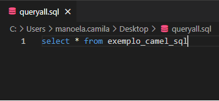
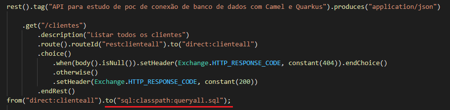
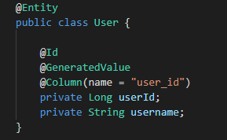
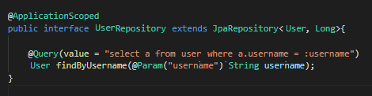
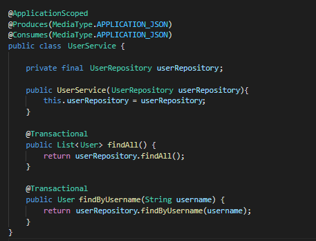
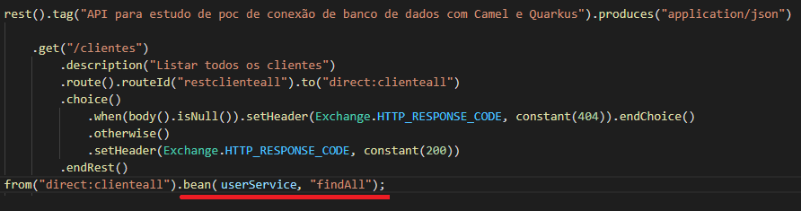
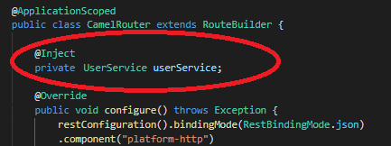

# Documentation for plugin build

This documentation aims to guide the development of the plugins for services related to Open Bankings's phase 2.

Índice:
- [Simple Proxy](#simple-proxy)
- [Phase 2 routes](#phase-2-routes)
- [Phase 3 routes](#phase-3-routes)
- [Environment Variables](#injecting-environment-variables)
- [Database Access](#database-access)
- [Supported Components](#supported-components)
- [Supported Data Formats](#supported-data-formats)
- [Supported Languages](#supported-languages)

## Simple Proxy

The idea of this type of plugin, as the topic itself mentions, is to simply redirect API calls to an external plugin. To do this, it will be necessary to extend the docker image that contains the API (s), adding a new route file.

Below are the steps to be followed to carry out the process:

- Suppose the container containing the API(s) has the name “oob-customers2-native”, which will run at 8080 port:


When running the image that will be extended (without modifications), and making a call to an API, we receive the following response:

```sh
curl --location --request GET 'http://localhost:8080/credit-cards-accounts/v1/accounts/ET54K75G572AR/bills/5449926XXTRZ/transactions'
```


```sh
{
  "data": [
    {
      "identificationNumber": 4453,
      "lineName": "CREDITO_A_VISTA",
      "transactionName": "PGTO",
      "billIdentification": "5449926XXTRZ",
      "creditDebitType": "DEBITO",
      "transactionType": "CASHBACK",
      "transactionalAdditionalInfo": "NA",
      "paymentType": "A_VISTA",
      "feeType": "ANUIDADE",
      "feeTypeAdditionalInfo": "NA",
      "otherCreditsType": "CREDITO_ROTATIVO",
      "otherCreditsAdditionalInfo": "NA",
      "chargeIdentifier": "PARCELA_1",
      "chargeNumber": 3,
      "brazilianAmount": "100000.0434",
      "amount": "100000.0464",
      "currency": "BRL",
      "transactionDate": "2021-05-21T08:30:00Z",
      "billPostDate": "2021-05-21T08:30:00Z",
      "payeeMCC": 5137
    }
  ],
  "meta": {
    "totalRecords": 1,
    "totalPages": 1
  }
}
```

&nbsp;

- Here are the folder and file structures to allow the extension of the docker image


&nbsp;

- We have the following files, which basically contains the camel routes, and the JSON file with the response:


&nbsp;


&nbsp;

In this example, we are redirecting to a static JSON, that will be returned as response; however, it is possible to make calls to camel components that are supported in quarkus native mode. In this [link](#supported-components) we have a section that explains all the supported components for native quarkus camel.\
The new routes file path must be added to the environment variable "camel.main.routes-include-pattern". In this [link](#injecting-environment-variables) you can find an example of how to do that.

&nbsp;

- We will extend the docker image with the route file for an external plugin; a dockerfile must be created, which must contain the following commands:


- With the two files (routes and dockerfile) created, we will execute the command on the directory where the files are stored to extend the image of the API(s):

```sh
docker build -t oob-customers2-native-plugin .
```


- We will run the newly created image that was extended from oob-customers2-native:

```sh
docker run -p 8080: 8080 oob-customers2-native-plugin
```


- When making the API call, we are now able to get feedback from the plugin:


```sh
curl --location --request GET 'http://localhost:8080/credit-cards-accounts/v1/accounts/ET54K75G572AR/bills/5449926XXTRZ/transactions'
```

```sh
{
    "data": [
        {
            "paymentType": "PARCELADO",
            "feeType": "SAQUE_CARTAO_BRASIL",
            "feeTypeAdditionalInfo": "NA",
            "otherCreditsType": "PARCELAMENTO_FATURA",
            "billIdentification": "5449926XXTRZ",
            "creditDebitType": "DEBITO",
            "transactionType": "CASHBACK",
            "transactionalAdditionalInfo": "NA",
            "chargeIdentifier": "PARCELA_1",
            "chargeNumber": 3,
            "currency": "BRL",
            "transactionDate": "2021-05-21T08:30:00Z",
            "billPostDate": "2021-05-21T08:30:00Z",
            "payeeMCC": 5137,
            "otherCreditsAdditionalInfo": "NA",
            "identificationNumber": 4453,
            "lineName": "SAQUE_CREDITO_BRASIL",
            "transactionName": "SAQUE",
            "brazilianAmount": 100000.0434,
            "amount": 100000.0464
        }
    ],
    "meta": {
        "totalRecords": 1,
        "totalPages": 1
    }
}
```

## Phase 2 routes

Below are all the operationIds and the referring endpoints that need to have camel routes, and for which it is necessary to create plugins, grouped by API:

&nbsp;

### Accounts

| Operation Id                                 | Endpoint                                  |
|----------------------------------------------|-------------------------------------------|
| accountsGetAccounts                          | /accounts                                 |
| accountsGetAccountsAccountId                 | /accounts/\{accountId\}                   |
| accountsGetAccountsAccountIdBalances         | /accounts/\{accountId\}/balances          |
| accountsGetAccountsAccountIdTransactions     | /accounts/\{accountId\}/transactions      |
| accountsGetAccountsAccountIdOverdraftLimits  | /accounts/\{accountId\}/overdraft-limits  |

&nbsp;

### Credit Cards

&nbsp;

| Operation Id                                                      | Endpoint                                                   |
|-------------------------------------------------------------------|------------------------------------------------------------|
| creditCardsGetAccounts                                            | /accounts                                                  |
| creditCardsGetAccountsCreditCardAccountId                         | /accounts/\{creditCardAccountId\}                          |
| creditCardsGetAccountsCreditCardAccountIdBills                    | /accounts/\{creditCardAccountId\}/bills                    |
| creditCardsGetAccountsCreditCardAccountIdBillsBillIdTransactions  | /accounts/\{creditCardAccountId\}/\{billId\}/transactions  |
| creditCardsGetAccountsCreditCardAccountIdLimits                   | /accounts/\{creditCardAccountId\}/limits                   |
| creditCardsGetAccountsCreditCardAccountIdTransactions             | /accounts/\{creditCardAccountId\}/transactions             |

&nbsp;

### Customers

&nbsp;

| Operation Id                              | Endpoint                       |
|-------------------------------------------|--------------------------------|
| customersGetPersonalIdentifications       | /personal/identifications      |
| customersGetPersonalQualifications        | /personal/qualifications       |
| customersGetPersonalFinancialRelations    | /personal/financial-relations  |
| customersGetBusinessIdentifications       | /business/identifications      |
| customersGetBusinessQualifications        | /business/qualifications       |
| customersGetBusinessFinancialRelations    | /business/financial-relations  |

&nbsp;

### Financings

&nbsp;

| Operation Id                                          | Endpoint                                         |
|-------------------------------------------------------|--------------------------------------------------|
| financingsGetContracts                                | /contracts                                       |
| financingsGetContractsContractId                      | /contracts/\{contractId\}                        |
| financingsGetContractsContractIdWarranties            | /contracts/\{contractId\}/warranties             |
| financingsGetContractsContractIdScheduledInstalments  | /contracts/\{contractId\}/scheduled-instalments  |
| financingsGetContractsContractIdPayments              | /contracts/\{contractId\}/payments               |

&nbsp;

### Invoice Financings

&nbsp;

| Operation Id                                                 | Endpoint                                         |
|--------------------------------------------------------------|--------------------------------------------------|
| invoiceFinancingsGetContracts                                | /contracts                                       |
| invoiceFinancingsGetContractsContractId                      | /contracts/\{contractId\}                        |
| invoiceFinancingsGetContractsContractIdWarranties            | /contracts/\{contractId\}/warranties             |
| invoiceFinancingsGetContractsContractIdScheduledInstalments  | /contracts/\{contractId\}/scheduled-instalments  |
| invoiceFinancingsGetContractsContractIdPayments              | /contracts/\{contractId\}/payments               |

&nbsp;

### Loans

&nbsp;

| Operation Id                                     | Endpoint                                         |
|--------------------------------------------------|--------------------------------------------------|
| loansGetContracts                                | /contracts                                       |
| loansGetContractsContractId                      | /contracts/\{contractId\}                        |
| loansGetContractsContractIdWarranties            | /contracts/\{contractId\}/warranties             |
| loansGetContractsContractIdScheduledInstalments  | /contracts/\{contractId\}/scheduled-instalments  |
| loansGetContractsContractIdPayments              | /contracts/\{contractId\}/payments               |

&nbsp;

### Unarranged Accounts Overdraft

&nbsp;

| Operation Id                                                           | Endpoint                                         |
|------------------------------------------------------------------------|--------------------------------------------------|
| unarrangedAccountsOverdraftGetContracts                                | /contracts                                       |
| unarrangedAccountsOverdraftGetContractsContractId                      | /contracts/\{contractId\}                        |
| unarrangedAccountsOverdraftGetContractsContractIdWarranties            | /contracts/\{contractId\}/warranties             |
| unarrangedAccountsOverdraftGetContractsContractIdScheduledInstalments  | /contracts/\{contractId\}/scheduled-instalments  |
| unarrangedAccountsOverdraftGetContractsContractIdPayments              | /contracts/\{contractId\}/payments               |

&nbsp;

## Phase 3 routes

Below are all the operationIds and the referring endpoints that need to have camel routes for phase 3.

&nbsp;

### Payments

&nbsp;

| Operation Id                                 | Endpoint                                  |
|----------------------------------------------|-------------------------------------------|
| paymentsPostPixPayments                      | /pix/payments                             |
| paymentsGetPixPaymentsPaymentId              | /pix/payments/\{paymentId\}               |

&nbsp;

## Injecting Environment Variables

### Injecting Via Dockerfile
Add these lines on Dockerfile
```
ARG buildtime_variable=default_value
ENV env_var_name=$buildtime_variable
```

#### Examples

Add single route via environment variable
```
ARG route=file:/work/routes.xml
ENV camel.main.routes-include-pattern=$route
```

Add multiple route files
```
ARG route=file:/work/routes1.xml,file:/work/routes2.xml
ENV camel.main.routes-include-pattern=$route
```

Add multiple files from a folder
```
ARG route=file:/work/*.xml
ENV camel.main.routes-include-pattern=$route
```

### Injecting Variables on Build

```
docker build -t oob-customers2-native-plugin --build-arg buildtime_variable=a_new_value .
```

### Consuming environment variable via camel

Considering the following `routes.xml` route file:
```
<routes xmlns:xsi="http://www.w3.org/2001/XMLSchema-instance"
        xmlns="http://camel.apache.org/schema/spring"
        xsi:schemaLocation="
            http://camel.apache.org/schema/spring
            http://camel.apache.org/schema/spring/camel-spring.xsd">
    <route id="getCustomersPersonalIdentificationsRoute">
        <from uri="direct:getCustomersPersonalIdentifications"/>
        <to uri="velocity:file://work/sucesso.json?allowContextMapAll=true"/>
    </route>
</routes>
```

Add these lines on Dockerfile
```
ARG route=file://work/sucesso.json?allowContextMapAll=true
ENV routes.customers.personal-identifications=$route
```

Change the `routes.xml` file, so it can consume the above environment variable by using `{{env:ENV_NAME}}`:
```
<routes xmlns:xsi="http://www.w3.org/2001/XMLSchema-instance"
        xmlns="http://camel.apache.org/schema/spring"
        xsi:schemaLocation="
            http://camel.apache.org/schema/spring
            http://camel.apache.org/schema/spring/camel-spring.xsd">
    <route id="getCustomersPersonalIdentificationsRoute">
        <from uri="direct:getCustomersPersonalIdentifications"/>
        <to uri="velocity:{{env:routes.customers.personal-identifications}}"/>
    </route>
</routes>
```

### Enabling schema validation

In production, the schema validation is disabled, but it can be enabled by injecting the environment variable apis.is-validate-schema-enabled with the value true.

#### Injecting Via Dockerfile
Add these lines on Dockerfile
```
ARG validate_schema=true
ENV apis.is-validate-schema-enabled=$validate_schema
```

#### Injecting Variables on Build

```
docker build -t oob-customers2-native-plugin --build-arg apis.is-validate-schema-enabled=true .
```

### Changing consent to base64

If the consent is sent in base64 encoding, it is possible to set a configuration to decode it, injecting the environment variable consent.is-base64 with the value true

#### Injecting Via Dockerfile
Add these lines on Dockerfile
```
ARG isbase64=true
ENV consent.is-base64=$isbase64
```

#### Injecting Variables on Build

```
docker build -t oob-customers2-native-plugin --build-arg consent.is-base64=true .
```

## Database Access

The following databases are supported by the application:

- PostgreSql
- MySQL
- SQL Server
- Oracle

To configure the connection to such databases, the following environment variables must be added ([Here](#Injecting-environment-variables) you find an example of how to configure environment variables):

````
quarkus.datasource.db-kind=<type of database to connect>
quarkus.datasource.username=<username>
quarkus.datasource.password=<password>
quarkus.datasource.jdbc.url=<url_connection>
````

For the `quarkus.datasource.db-kind` and `quarkus.datasource.jdbc.url` properties, they must be filled in according to the table below, for each database:

| Database        | db-kind     | jdbc.url                                    |
|-----------------|-------------|---------------------------------------------|
| PostgreSQL      | postgresql  | jdbc:postgresql://\<url>:\<port>/\<banco>   |
| MySQL           | mysql       | jdbc:mysql://\<url>:\<port>/\<banco>        |
| SQL Server      | mssql       | jdbc:sqlserver://\<url>:\<port>             |
| Oracle          | oracle      | jdbc:oracle:thin:@//\<url>:\<port>/\<banco>  |

\* For information about multiple connections, please refer to this [link](https://quarkus.io/guides/hibernate-orm#multiple-persistence-units)

From that, it is possible to use one of the [Supported Components](#Supported-Components) to perform sql calls.

### Example using Camel SQL component

This section presents an example using the `quarkus-camel-sql` component with a `.sql` file containing the query to be executed. For this, we will assume that there is a table in the connected database, called `example_camel_sql`. The steps below must be followed:

1. Add environment variable required to reference the `.sql` file containing the query. In the case presented, it is located in the application's `classpath`:
````
quarkus.camel.sql.script-files=classpath:queryall.sql
````



2. The call to the `.sql` file on your Camel route should be made as follows:




### Example using Quarkus JPA

This section presents an example using the Quarkus JPA dependency. For this example, it is necessary that a Quarkus project is created on the plugin side, as a parallel process, which will have JPA repositories for database access.

#### Dependencies

Add the following dependencies to `pom.xml`:

````
<dependency>
    <groupId>io.quarkus</groupId>
    <artifactId> quarkus-agroal </artifactId>
</dependency>
<dependency>
    <groupId> io.quarkus </groupId>
    <artifactId>quarkus-spring-data-jpa</artifactId>
</dependency>
<dependency>
    <groupId>org.apache.camel.quarkus</groupId>
    <artifactId>camel-quarkus-bean</artifactId>
</dependency>

* The JDBC for the database you will be using:
<dependency>
    <groupId>io.quarkus</groupId>
    <artifactId>quarkus-jdbc-oracle</artifactId>
</dependency>
<dependency>
    <groupId>io.quarkus</groupId>
    <artifactId>quarkus-jdbc-mysql</artifactId>
</dependency>
<dependency>
    <groupId>io.quarkus</groupId>
    <artifactId> quarkus-jdbc-postgresql </artifactId>
</dependency>
<dependency>
    <groupId>io.quarkus</groupId>
    <artifactId>quarkus-jdbc-mssql</artifactId>
</dependency>
````

#### Environment variables

Environment variables must be set as presented at the beginning of this section.

#### Entity and Repository

For this example, we will assume the existence of a database containing the `user` class with the columns `user_id` and `username`.

The following entity class has been created for the example:



Along with the JPA repository:



And, finally, the service below (the creation of the service was done at the example level, but the call to the JPA repository could be done directly):



#### Camel Route

With the above elements created, the Camel route performs the query using the following call:



To use the `bean` of the created service (or the repository directly, if the call is made directly by the repository), its injection is necessary in the Camel route:



## Supported Components

### ACTIVEMQ
```
Send messages to (or consume from) Apache ActiveMQ. This component extends the Camel JMS component.

For usage and documentation: https://camel.apache.org/camel-quarkus/latest/reference/extensions/activemq.html
```

### AMQP
```
Messaging with AMQP protocol using Apache QPid Client.

For usage and documentation: https://camel.apache.org/camel-quarkus/latest/reference/extensions/amqp.html

To use AMQP properly you may need additional application.properties configurations, these guide and documentation can be useful:
- https://quarkus.io/guides/jms
- https://github.com/amqphub/quarkus-qpid-jms#configuration
```

### ATLASMAP
```
Transforms the message using an AtlasMap transformation.

For usage and documentation: https://camel.apache.org/camel-quarkus/latest/reference/extensions/atlasmap.html
```

### DATA FORMAT
```
Use a Camel Data Format as a regular Camel Component.

For usage and documentation: https://camel.apache.org/camel-quarkus/latest/reference/extensions/dataformat.html
```

### DIRECT
```
Call another endpoint from the same Camel Context synchronously.

For usage and documentation: https://camel.apache.org/camel-quarkus/latest/reference/extensions/dataformat.html
```

### ELASTICSEARCH REST
```
Send requests to with an ElasticSearch via REST API.

For usage and documentation: https://camel.apache.org/camel-quarkus/latest/reference/extensions/elasticsearch-rest.html
```

### EXEC
```
Execute commands on the underlying operating system.

For usage and documentation: https://camel.apache.org/camel-quarkus/latest/reference/extensions/exec.html
```

### FILE
```
Read and write files.

For usage and documentation: https://camel.apache.org/camel-quarkus/latest/reference/extensions/file.html
```

### HTTP
```
Send requests to external HTTP servers using Apache HTTP Client 4.x.

For usage and documentation: https://camel.apache.org/camel-quarkus/latest/reference/extensions/http.html
```

### JING
```
Validate XML against a RelaxNG schema (XML Syntax or Compact Syntax) using Jing library.

For usage and documentation: https://camel.apache.org/camel-quarkus/latest/reference/extensions/jing.html
```

### LOG
```
Log messages to the underlying logging mechanism.

For usage and documentation: https://camel.apache.org/camel-quarkus/latest/reference/extensions/log.html
```

### MOCK
```
Test routes and mediation rules using mocks.

For usage and documentation: https://camel.apache.org/camel-quarkus/latest/reference/extensions/mock.html
```

### MSV
```
Validate XML payloads using Multi-Schema Validator (MSV).

For usage and documentation: https://camel.apache.org/camel-quarkus/latest/reference/extensions/msv.html
```

### PLATFORM HTTP
```
This extension allows for creating HTTP endpoints for consuming HTTP requests.

For usage and documentation: https://camel.apache.org/camel-quarkus/latest/reference/extensions/platform-http.html
```

### REF
```
Route messages to an endpoint looked up dynamically by name in the Camel Registry.

For usage and documentation: https://camel.apache.org/camel-quarkus/latest/reference/extensions/ref.html
```

### REST
```
Expose REST services and their OpenAPI Specification or call external REST services.

For usage and documentation: https://camel.apache.org/camel-quarkus/latest/reference/extensions/rest.html
```

### SEDA
```
Asynchronously call another endpoint from any Camel Context in the same JVM.

For usage and documentation: https://camel.apache.org/camel-quarkus/latest/reference/extensions/seda.html
```

### TIMER
```
Generate messages in specified intervals using java.util.Timer.

For usage and documentation: https://camel.apache.org/camel-quarkus/latest/reference/extensions/timer.html
```

### VALIDATOR
```
Validate the payload using XML Schema and JAXP Validation.

For usage and documentation: https://camel.apache.org/camel-quarkus/latest/reference/extensions/validator.html
```

### VELOCITY
```
Transform messages using a Velocity template.

For usage and documentation: https://camel.apache.org/camel-quarkus/latest/reference/extensions/velocity.html
```

### VM
```
Call another endpoint in the same CamelContext asynchronously.

For usage and documentation: https://camel.apache.org/camel-quarkus/latest/reference/extensions/vm.html
```

## Supported Data Formats

### Jackson
```
Marshal POJOs to JSON and back using Jackson.

For usage and documentation: https://camel.apache.org/camel-quarkus/latest/reference/extensions/jackson.html
```

### Gson
```
Marshal POJOs to JSON and back using Gson. Gson is a Data Format which uses the Gson Library.

For usage and documentation: https://camel.apache.org/camel-quarkus/latest/reference/extensions/gson.html
```

### CSV
```
Handle CSV (Comma Separated Values) payloads.

For usage and documentation: https://camel.apache.org/camel-quarkus/latest/reference/extensions/csv.html
```

### Flatpack
```
Parse fixed width and delimited files using the FlatPack library.

For usage and documentation: https://camel.apache.org/camel-quarkus/latest/reference/extensions/flatpack.html
```

### Bindy
```
Marshal and unmarshal between POJOs and Comma separated values (CSV) format using Camel Bindy Marshal and unmarshal between POJOs and fixed field length format using Camel Bindy Marshal and unmarshal between POJOs and key-value pair (KVP) format using Camel Bindy.

For usage and documentation: https://camel.apache.org/camel-quarkus/latest/reference/extensions/bindy.html
```

### TidyMarkup
```
TidyMarkup is a Data Format that uses the TagSoup to tidy up HTML. It can be used to parse ugly HTML and return it as pretty wellformed HTML.

For usage and documentation: https://camel.apache.org/camel-quarkus/latest/reference/extensions/tagsoup.html
```

### BASE64
```
The Base64 data format is used for base64 encoding and decoding.

For usage and documentation: https://camel.apache.org/camel-quarkus/latest/reference/extensions/base64.html
```

### JACKSONXML
```
Jackson XML is a Data Format which uses the Jackson library with the XMLMapper extension to unmarshal an XML payload into Java objects or to marshal Java objects into an XML payload.

For usage and documentation: https://camel.apache.org/camel-quarkus/latest/reference/extensions/jacksonxml.html
```

## Supported Languages

### Bean Method
````
Call a method of the specified Java bean passing the Exchange, Body or specific headers to it.

https://camel.apache.org/camel-quarkus/latest/reference/extensions/bean.html
````

### CORE
````
Camel core functionality and basic Camel languages: Constant, ExchangeProperty, Header, Ref, Ref, Simple and Tokeinze.

https://camel.apache.org/camel-quarkus/latest/reference/extensions/core.html
````

### HL7 Terser
````
Marshal and unmarshal HL7 (Health Care) model objects using the HL7 MLLP codec.

https://camel.apache.org/camel-quarkus/latest/reference/extensions/hl7.html
````

### JSON PATH
````
Evaluate a JsonPath expression against a JSON message body.

https://camel.apache.org/camel-quarkus/latest/reference/extensions/jsonpath.html
````

### XML JAXP
````
Tokenize XML payloads using the specified path expression.

https://camel.apache.org/camel-quarkus/latest/reference/extensions/xml-jaxp.html
````

### XPATH
````
Evaluate an XPath expression against an XML payload.

https://camel.apache.org/camel-quarkus/latest/reference/extensions/xpath.html
````

### XQUERY
````
Query and/or transform XML payloads using XQuery and Saxon.

https://camel.apache.org/camel-quarkus/latest/reference/extensions/saxon.html
````
