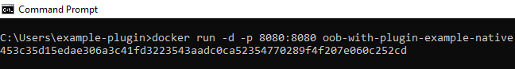
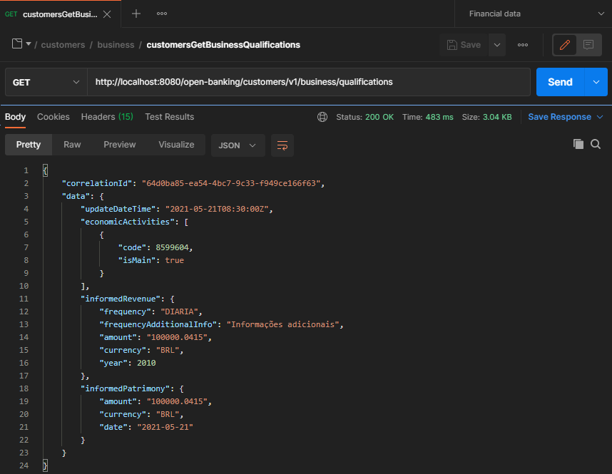

# Documentação para Criação de Plugin Externo

Esta documentação tem como objetivo guiar o desenvolvimento de plugins para
serviços relacionados à(s) fase(s) do Open Banking Brasil (OBB).

&nbsp;

Índice:

- [Documentação para Criação de Plugin Externo](#documentação-para-criação-de-plugin-externo)
  - [Introdução](#introdução)
    - [O que é um Plugin](#o-que-é-um-plugin)
    - [Como a Aplicação Realiza o Carregamento do Plugin](#como-a-aplicação-realiza-o-carregamento-do-plugin)
    - [Responsabilidade de Processamento](#responsabilidade-de-processamento)
    - [OOB - Opus Open Banking](#oob---opus-open-banking)
    - [Plugin](#plugin)
    - [Disponibilização de Imagens Docker](#disponibilização-de-imagens-docker)
  - [Exemplo de Plugins e Extensão da Imagem Docker](#exemplo-de-plugins-e-extensão-da-imagem-docker)
    - [Utilizando Proxy Simples](#utilizando-proxy-simples)
    - [Utilizando Mock](#utilizando-mock)
    - [Adicionando o Plugin à Uma Imagem Existente](#adicionando-o-plugin-à-uma-imagem-existente)
      - [Dockerfile Para o Plugin de Proxy Simples](#dockerfile-para-o-plugin-de-proxy-simples)
      - [Dockerfile Para o Plugin de Mock](#dockerfile-para-o-plugin-de-mock)
  - [Injetando Variáveis de Ambiente](#injetando-variáveis-de-ambiente)
    - [Injetando Via Dockerfile](#injetando-via-dockerfile)
    - [Exemplos](#exemplos)
    - [Injetando Variáveis no Build](#injetando-variáveis-no-build)
    - [Injetando Variáveis na Execução do Container](#injetando-variáveis-na-execução-do-container)
    - [Consumindo Variáveis de Ambiente via Camel](#consumindo-variáveis-de-ambiente-via-camel)
      - [Exemplo com Proxy Simples](#exemplo-com-proxy-simples)
      - [Exemplo com Mock](#exemplo-com-mock)
  - [Tratamento de erro](#tratamento-de-erro)
  - [Configuração de timeout](#configuração-de-timeout)
  - [Tratamento de headers](#tratamento-de-headers)
  - [Implementação de cache](./cache/readme.md)
  - [Classe utilitária camelHelper](#classe-utilitária-camelHelper)
  - [Componentes Suportados](#componentes-suportados)
    - [ACTIVEMQ](#activemq)
    - [AMQP](#amqp)
    - [ATLASMAP](#atlasmap)
    - [DATA FORMAT](#data-format)
    - [DIRECT](#direct)
    - [ELASTICSEARCH REST](#elasticsearch-rest)
    - [EXEC](#exec)
    - [FILE](#file)
    - [HTTP](#http)
    - [JING](#jing)
    - [LOG](#log)
    - [MOCK](#mock)
    - [MSV](#msv)
    - [PLATFORM HTTP](#platform-http)
    - [REF](#ref)
    - [REST](#rest)
    - [SEDA](#seda)
    - [TIMER](#timer)
    - [VALIDATOR](#validator)
    - [VELOCITY](#velocity)
    - [VM](#vm)
  - [Data Formats Suportados](#data-formats-suportados)
    - [Jackson](#jackson)
    - [Gson](#gson)
    - [CSV](#csv)
    - [Flatpack](#flatpack)
    - [Bindy](#bindy)
    - [TidyMarkup](#tidymarkup)
    - [BASE64](#base64)
    - [JACKSONXML](#jacksonxml)
  - [Linguagens suportadas](#linguagens-suportadas)
    - [Bean Method](#bean-method)
    - [CORE](#core)
    - [HL7 Terser](#hl7-terser)
    - [JSON PATH](#json-path)
    - [XML JAXP](#xml-jaxp)
    - [XPATH](#xpath)
    - [XQUERY](#xquery)
  - [Descontinuado - documentação de versões anteriores das integrações](#descontinuado---documentação-de-versões-anteriores-das-integrações)
    - [Consumindo o objeto de consentimento **(somente para schemas v1)**](#consumindo-o-objeto-de-consentimento-somente-para-schemas-v1)
      - [Exemplo de proxy simples](#exemplo-de-proxy-simples)
      - [Obtendo através do Camel XML](#obtendo-através-do-camel-xml)

&nbsp;

## Introdução

&nbsp;

### O que é um Plugin

&nbsp;

Um plugin é um artefato responsável por estender uma ou mais funcionalidades de
um software.

No caso do Opus Open Banking (OOB) espeficamente, espera-se que o plugin receba
um objeto de entrada conforme spec(s) previamente definida(s) por parte do OOB e,
 a partir dele, realize a(s) chamada(s) necessária(s) ao(s) sistema(s) legado(s)
 (ou quaisquer outros que sejam pertinentes) da instituição financeira,
 retornando para o OOB um objeto de resposta, de sucesso ou erro, em
 conformidade com spec(s) previamente definida(s).

&nbsp;

### Como a Aplicação Realiza o Carregamento do Plugin

&nbsp;

O carregamento do plugin é feito em tempo de execução através do
redirecionamento das chamadas realizadas no OOB para as rotas a serem
implementadas no plugin.

Por padrão, a aplicação do OOB busca os arquivos de rota no diretório `/work` da
imagem. Porém, tal caminho pode ser modificado na imagem estendida criada pelo
plugin, desde que a variável de ambiente `camel.main.routes-include-pattern`
(vide [Variáveis de Configuração Suportadas](#variáveis-de-configuração-suportadas))
reflita essa mudança, assim como quaisquer outros arquivos que venham a ser
copiados para a imagem e suas referências
(vide [Adicionando o plugin à uma imagem existente](#adicionando-o-plugin-à-uma-imagem-existente)).

&nbsp;

### Responsabilidade de Processamento

&nbsp;

### OOB - Opus Open Banking

- Verificar se existe um consentimento válido por parte do cliente para a
requisição `HTTP` sendo realizada e, caso não haja, recusar a requisição;
- Validar se o `request` recebido na requisição `HTTP` (tanto *headers* quanto
*body*) está de acordo com os padrões definidos pelo OBB;
- Retorna o devido erro, de acordo com as especificações do OBB, caso o `request`
recebido na requisição `HTTP` não seja válido;
- Realizar os mapeamentos necessários entre o `id` de um recurso no OBB e o
equivalente no(s) sistema(s) legado(s) da instituição financeira, e vice-versa;
- Converter o `response` retornado pelo plugin e adicionar os metadados
necessário para retornar um objeto de `response` em conformidade com a
especificação do OBB;
- Validar se o objeto de `response` retornado pelo plugin está em acordo com a(s)
spec(s) previamente definidas pelo OOB;
- Gerar retornos de erros nos formatos especificados pelo OBB no caso de haver
erros de processamento interno, ou na chamada do plugin, ou no objeto de
`response` retornado pelo plugin.

### Plugin

- Possuir uma interface de entrada em conformidade com a(s) spec(s) previamente
definidas pelo OOB;
- Realizar chamadas ao(s) sistema(s) legado(s) da instituição financeira (ou
qualquer outro sistema que seja pertinente) para obtenção dos dados a serem
retornados na requisição;
- Retornar um objeto de `response` (tanto em caso de sucesso, quanto de erro) em
conformidade com a(s) spec(s) previamente definidas pelo OOB;
- Para as chamadas que utilizam *id de idempotência*, realizar o devido controle
do mesmo;
- Realizar as consultas necessárias (quando houver) ao objeto de consentimento
enviado na requisição para decisão em relação aos dados a serem retornados.

&nbsp;

### Disponibilização de Imagens Docker

&nbsp;

A Opus entregará à instituição financeira duas imagens distintas:

1. Imagem nativa sem rotas definidas
2. Imagem com rotas de mocks

&nbsp;

## Exemplo de Plugins e Extensão da Imagem Docker

&nbsp;

Nesta seção são apresentados alguns exemplos de criação de plugin, assim como um
passo a passo de como estender uma imagem para incluir um plugin.

Aqui nós estamos dando exemplos de plugin suscintos que realizam uma chamada
direta à um serviço HTTP externo ou que retorna um JSON estático sempre. Porém,
é possível realizar chamadas para diversos componentes do Camel que são suportados
em modo nativo no Quarkus. Nesta [seção](#componentes-suportados) você encontra
todos os componentes suportados para quarkus camel nativo que são suportados pelo
OOB.

&nbsp;

### Utilizando Proxy Simples

&nbsp;

O intuito deste exemplo é demonstrar os passos necessário para criação de um
plugin que realiza uma requisição HTTP para um serviço externo e retorna
diretamente o response obtido a partir desta requisição.

Considere que iremos criar um plugin contendo duas rotas, as quais escutam chamadas
realizadas em `direct:customersGetPersonalQualifications` e `direct:customersGetBusinessQualifications`
e as processa através de uma requisição a um endpoint `HTTP GET`, retornando o
resultado obtido diretamente.

&nbsp;

Para isso, iremos criar os seguintes arquivos de rota do Camel:

`personal_qualifications_route.xml`

```xml
<routes xmlns:xsi="http://www.w3.org/2001/XMLSchema-instance"
        xmlns="http://camel.apache.org/schema/spring"
        xsi:schemaLocation="
            http://camel.apache.org/schema/spring
            http://camel.apache.org/schema/spring/camel-spring.xsd">

    <route id="customersGetPersonalQualificationsRoute">
        <from uri="direct:customersGetPersonalQualifications"/>
        <to uri="http://mockbin.org/bin/77ef082f-b311-4123-a287-0ee99347bfe1?bridgeEndpoint=true"/>

    </route>
</routes>
```

&nbsp;

`business_qualifications_route.xml`

```xml
<routes xmlns:xsi="http://www.w3.org/2001/XMLSchema-instance"
        xmlns="http://camel.apache.org/schema/spring"
        xsi:schemaLocation="
            http://camel.apache.org/schema/spring
            http://camel.apache.org/schema/spring/camel-spring.xsd">

    <route id="customersGetBusinessQualificationsRoute">
        <from uri="direct:customersGetBusinessQualifications"/>
        <to uri="http://mockbin.org/bin/ad5a2df2-38db-47df-a418-cf260719a3b1?bridgeEndpoint=true"/>

    </route>
</routes>
```

O atributo `bridgeEndpoint` deve **obrigatoriamente** ser atribuído como `true`.
Ele é necessário para que a URI da qual a rota é proveniente seja ignorada na
chamada e somente a que foi definida na rota criada seja chamada.

&nbsp;

A partir das imagens acima, podemos verificar que quando este plugin for adicionado,
a rota `direct:customersGetPersonalQualifications` passará a realizar uma requisição
para a URI `http://mockbin.org/bin/77ef082f-b311-4123-a287-0ee99347bfe1`, enquanto
que a rota `direct:customersGetBusinessQualifications` irá redirecionar para o
endereço `http://mockbin.org/bin/ad5a2df2-38db-47df-a418-cf260719a3b1`.

&nbsp;

Com os arquivos de rotas criados, é necessário realizar a extensão da imagem para
adição do plugin através dos passos apresentados nesta [Seção](#adicionando-o-plugin-à-uma-imagem-existente).

&nbsp;

### Utilizando Mock

&nbsp;

O intuito deste exemplo é demonstrar os passos necessário para criação de um
plugin que retorna um mock contido em um arquivo interno ao plugin.

Considere que iremos criar um plugin contendo duas rotas, as quais escutam chamadas
realizadas em `direct:customersGetPersonalQualifications` e `direct:customersGetBusinessQualifications`
e as processa retornando sempre os mesmo dados para uma mesma chamada, os quais
estão contidos em um arquivo de mock.

&nbsp;

Para isso, iremos criar dois tipos de arquivos distintos:

&nbsp;

Arquivos contendo os mocks a serem retornado

`personal_qualifications.json`

```json
{
    "correlationId": "1fe4ae88-db5f-4bc9-b49b-5290d3acefe4",
    "data": {
        "updateDateTime": "2021-05-21T08:30:00Z",
        "companyCnpj": "50685362000135",
        "occupationCode": "RECEITA_FEDERAL",
        "occupationDescription": "01",
        "informedIncome": {
            "frequency": "DIARIA",
            "amount": "100000.0412",
            "currency": "BRL",
            "date": "2021-05-21"
        },
        "informedPatrimony": {
            "amount": "100000.0498",
            "currency": "BRL",
            "year": 2010
        }
    }
}
```

&nbsp;

`business_qualifications.json`

```json
{
    "correlationId": "64d0ba85-ea54-4bc7-9c33-f949ce166f63",
    "data": {
        "updateDateTime": "2021-05-21T08:30:00Z",
        "economicActivities": [
            {
                "code": 8599604,
                "isMain": true
            }
        ],
        "informedRevenue": {
            "frequency": "DIARIA",
            "frequencyAdditionalInfo": "Informações adicionais",
            "amount": "100000.0415",
            "currency": "BRL",
            "year": 2010
        },
        "informedPatrimony": {
            "amount": "100000.0415",
            "currency": "BRL",
            "date": "2021-05-21"
        }
    }
}
```

&nbsp;

Arquivos de rotas do Camel

`personal_qualifications_route.xml`

```xml
<routes xmlns:xsi="http://www.w3.org/2001/XMLSchema-instance"
        xmlns="http://camel.apache.org/schema/spring"
        xsi:schemaLocation="
            http://camel.apache.org/schema/spring
            http://camel.apache.org/schema/spring/camel-spring.xsd">

    <route id="customersGetPersonalQualificationsRoute">
        <from uri="direct:customersGetBusinessQualifications"/>
        <to uri="velocity:file:/plugin/mocks/personal_qualifications.json?allowContextMapAll=true&amp;encoding=UTF-8"/>

    </route>
</routes>
```

&nbsp;

`business_qualifications_route.xml`

```xml
<routes xmlns:xsi="http://www.w3.org/2001/XMLSchema-instance"
        xmlns="http://camel.apache.org/schema/spring"
        xsi:schemaLocation="
            http://camel.apache.org/schema/spring
            http://camel.apache.org/schema/spring/camel-spring.xsd">

    <route id="customersGetBusinessQualificationsRoute">
        <from uri="direct:customersGetBusinessQualifications"/>
        <to uri="velocity:file:/plugin/mocks/business_qualifications.json?allowContextMapAll=true&amp;encoding=UTF-8"/>

    </route>
</routes>
```

&nbsp;

Com esses arquivos criados, é necessário realizar a extensão da imagem para adição
do plugin. Os passos necessários para realizar essa extensão podem ser vistos nesta
[Seção](#adicionando-o-plugin-à-uma-imagem-existente).

&nbsp;

### Adicionando o Plugin à Uma Imagem Existente

&nbsp;

O intuito desta seção é demonstrar como uma imagem existente pode ser estentida
para adicionar um plugin que tenha sido criado para uma u mais de suas rotas.
Para isso, iremos estender uma imagem docker contendo dois endpoints:
`http://localhost:8080/open-banking/customers/v1/personal/qualifications` e
`http://localhost:8080/open-banking/customers/v1/business/qualifications`;
os quais direcionam para `direct:customersGetPersonalQualifications` e `direct:customersGetBusinessQualifications`,
respectivamente.

&nbsp;

- Considere a imagem docker `oob-without-route-example-native` abaixo apresentada
como sendo aquela contendo os endpoints acima mencionados:


&nbsp;

- Considere que atualmente não existe nenhuma rota nessa imagem escutando as chamadas
direcionadas para `direct:customersGetPersonalQualifications` e `direct:customersGetBusinessQualifications`,
o que ocasiona no erro abaixo apresentado quando quaisquer desses endpoints são chamados:

&nbsp;

```sh
curl --location --request GET 'http://localhost:8080/open-banking/customers/v1/personal/qualifications'
```


&nbsp;

```sh
curl --location --request GET 'http://localhost:8080/open-banking/customers/v1/business/qualifications'
```


&nbsp;

Assumindo que os plugins tenham sido já criados de acordo com as seções anteriores,
precisamos criar um `Dockerfile` para realizar a extensão da imagem de forma a criar
uma nova imagem docker que contém a imagem docker inicial juntamente com o plugin
criado. Iremos estender a imagem para adição do plugin com as rotas, de forma que
as chamadas direcionadas a `direct:customersGetPersonalQualifications` e `direct:customersGetBusinessQualifications`
sejam processadas por essas novas rotas.

As subseções seguintes apresentam os passos a serem seguidos para criação desse `Dockerfile`,
considerando cada um dos exemplos de plugins apresentados nas seções anteriores.

&nbsp;

Uma vez criado o `Dockerfile`, o seguinte comando deve ser executado para que a
imagem existente seja estendida com a adição do plugin recém criado:

```sh
docker build -t oob-with-plugin-example-native .
```


&nbsp;

Após criação da imagem, o seguinte comando deve ser rodado para que ela seja executada:

```sh
docker run -d -p 8080:8080 oob-with-plugin-example-native
```



&nbsp;

Neste ponto, ao realizar uma nova requisição aos endpoints deve-se obter como resposta
os resultados definidos nas rotas do plugin adicionado à imagem.

```sh
curl --location --request GET 'http://localhost:8080/open-banking/customers/v1/personal/qualifications'
```


&nbsp;

```sh
curl --location --request GET 'http://localhost:8080/open-banking/customers/v1/business/qualifications'
```



&nbsp;

#### Dockerfile Para o Plugin de Proxy Simples

&nbsp;

Considere que o plugin de proxy simples criado possui a seguinte estrutura de diretórios:


&nbsp;

O `Dockerfile` deve ser criado como segue:

```dockerfile
FROM oob-without-route-example-native:latest
COPY --chown=1001:root routes/ /plugin/routes/

ARG routes=file:/plugin/routes/*_route.xml
ENV camel.main.routes-include-pattern=$routes
```

Onde:

- A linha 1 indica a imagem original a ser estendida (no caso `oob-without-route-example-native`);
- A linha 2 copia todos os arquivos contidos no diretório `/routes` do plugin para
o diretório `/plugin/routes` da imagem;
- A linha 4 cria uma variárel chamada `routes` e atribui à ela o padrão de caminho
onde estão os arquivos de rota na imagem. Nesse caso espeífico, o padrão está sendo
determinado como todos os arquivos cuja a nomenclatura terminal com `_route.xml`
dentro do diretório `/plugin/routes`;
- A linha 5 atribui a variável criada na linha 4 à variável de ambiente `camel.main.routes-include-pattern`.
Essa variável de ambiente é responsável por informar ao Camel onde os arquivos de
rotas devem ser procurados.

&nbsp;

#### Dockerfile Para o Plugin de Mock

&nbsp;

Considere que o plugin de mock criado possui a seguinte estrutura de diretórios:


&nbsp;

O `Dockerfile` deve ser criado como segue:

```dockerfile
FROM oob-without-route-example-native:latest
COPY --chown=1001:root routes/ /plugin/routes/
COPY --chown=1001:root mocks/ /plugin/mocks/

ARG routes=file:/plugin/routes/personal_qualifications_route.xml,file:/plugin/routes/business_qualifications_route.xml
ENV camel.main.routes-include-pattern=$routes
```

Onde:

- A linha 1 indica a imagem original a ser estendida (no caso `oob-without-route-example-native`);
- A linha 2 copia todos os arquivos contidos no diretório `/routes` do plugin para
o diretório `/plugin/routes` da imagem;
- A linha 2 copia todos os arquivos contidos no diretório `/mocks` do plugin para
o diretório `/plugin/mocks` da imagem;
- A linha 4 cria uma variárel chamada `routes` e atribui uma lista de arquivos de
rota separados por vírgulas (aqui foram colocados os arquivos um a um no intuito
de desmonstrar a opções. Porém, poderíamos ter utilizado um padrão da mesma forma
do exemplo de proxy simples);
- A linha 5 atribui a variável criada na linha 4 à variável de ambiente `camel.main.routes-include-pattern`.
Essa variável de ambiente é responsável por informar ao Camel onde os arquivos
de rotas devem ser procurados.

&nbsp;

## Injetando Variáveis de Ambiente

&nbsp;

### Injetando Via Dockerfile

Necessário adicionar as seguintes linhas no Dockerfile

```dockerfile
ARG <nome_variavel>=<valor_variavel>
ENV env_var_name=$<nome_variavel>
```

&nbsp;

### Exemplos

Os exemplos abaixo assumem que os arquivos de rota estão contidos no diretório
`/work` da imagem docker.

&nbsp;

Adicionando um novo arquivo de rota via variável de ambiente

```dockerfile
ARG route=file:/work/routes.xml
ENV camel.main.routes-include-pattern=$route
```

&nbsp;

Adicionando múltiplos arquivos de rota via variável de ambiente

```dockerfile
ARG route=file:/work/routes1.xml,file:/work/routes2.xml
ENV camel.main.routes-include-pattern=$route
```

&nbsp;

Adicionando múltiplos arquivos de um diretório

```dockerfile
ARG route=file:/work/*.xml
ENV camel.main.routes-include-pattern=$route
```

&nbsp;

### Injetando Variáveis no Build

```shell
docker build -t <nome_imagem> --build-arg <nome_variavel>=<valor_variavel> .
```

&nbsp;

### Injetando Variáveis na Execução do Container

```shell
docker run --env <nome_variavel>=<valor_variavel> -p 8080:8080 <nome_imagem>
```

&nbsp;

### Consumindo Variáveis de Ambiente via Camel

&nbsp;

#### Exemplo com Proxy Simples

&nbsp;

Tomando como exemplo o [plugin com proxy simples](#utilizando-proxy-simples),
considere o arquivo de rotas `business_qualifications_route.xml` apresentado:

```xml
<routes xmlns:xsi="http://www.w3.org/2001/XMLSchema-instance"
        xmlns="http://camel.apache.org/schema/spring"
        xsi:schemaLocation="
            http://camel.apache.org/schema/spring
            http://camel.apache.org/schema/spring/camel-spring.xsd">

    <route id="getCustomersBusinessQualificationsRoute">
        <from uri="direct:getCustomersBusinessQualifications"/>
        <to uri="http://mockbin.org/bin/ad5a2df2-38db-47df-a418-cf260719a3b1?bridgeEndpoint=true"/>
    </route>

</routes>
```

&nbsp;

Iremos modificá-lo para utilizar uma variável de ambiente chamada `routes.customers.uri-legado`
no lugar do valor estático para a URI do sistema legado
`http://mockbin.org/bin/ad5a2df2-38db-47df-a418-cf260719a3b1`.

Para isso, precisamos inicialmente modicar o arquivo `business_qualifications_route.xml`,
de forma que ele consuma a variável de ambiente mencionada, o que é feito através
do comando `{{env:<nome_variavel>}}`:

```xml
<routes xmlns:xsi="http://www.w3.org/2001/XMLSchema-instance"
        xmlns="http://camel.apache.org/schema/spring"
        xsi:schemaLocation="
            http://camel.apache.org/schema/spring
            http://camel.apache.org/schema/spring/camel-spring.xsd">

    <route id="getCustomersBusinessQualificationsRoute">
        <from uri="direct:getCustomersBusinessQualifications"/>
        <to uri="{{env:routes.customers.uri-legado}}?bridgeEndpoint=true"/>

    </route>
</routes>
```

&nbsp;

Após isso, basta realizar a injeção do variável de ambiente `routes.customers.uri-legado`
utilizando umas das abordagens apresentadas mas acima nesta mesma [seção](#injetando-variáveis-de-ambiente).

Por exemplo, poderíamos injetar o valor no momento de execução da imagem, via
comando `run`:

```shell
docker run --env routes.customers.uri-legado=
http://mockbin.org/bin/ad5a2df2-38db-47df-a418-cf260719a3b1 -p 8080:8080 <nome_imagem>
```

&nbsp;

#### Exemplo com Mock

&nbsp;

Tomando como exemplo o [plugin com arquivo de mock](#utilizando-mock), considere
o arquivo de rotas `personal_qualifications_route.xml` apresentado:

```xml
<routes xmlns:xsi="http://www.w3.org/2001/XMLSchema-instance"
        xmlns="http://camel.apache.org/schema/spring"
        xsi:schemaLocation="
            http://camel.apache.org/schema/spring
            http://camel.apache.org/schema/spring/camel-spring.xsd">

    <route id="getCustomersPersonalQualificationsRoute">
        <from uri="direct:getCustomersPersonalQualifications"/>
        <to uri="velocity:file://plugin/mocks/personal_qualifications.json?allowContextMapAll=true"/>

    </route>
</routes>
```

&nbsp;

Iremos modificá-lo para utilizar uma variável de ambiente chamada `routes.customers.personal-identifications`
no lugar do valor estático `velocity:file://plugin/sucesso.json?allowContextMapAll=true`.

Para isso, precisamos inicialmente modicar o arquivo `personal_qualifications_route.xml`,
de forma que ele consuma a variável de ambiente mencionada, o que é feito através
do comando `{{env:<nome_variavel>}}`:

```xml
<routes xmlns:xsi="http://www.w3.org/2001/XMLSchema-instance"
        xmlns="http://camel.apache.org/schema/spring"
        xsi:schemaLocation="
            http://camel.apache.org/schema/spring
            http://camel.apache.org/schema/spring/camel-spring.xsd">

    <route id="getCustomersPersonalQualificationsRoute">
        <from uri="direct:getCustomersPersonalQualifications"/>
        <to uri="velocity:{{env:routes.customers.personal-identifications}}"/>

    </route>
</routes>
```

&nbsp;

Após isso, basta realizar a injeção do variável de ambiente `routes.customers.personal-identifications`
utilizando umas das abordagens apresentadas mas acima nesta mesma [seção](#injetando-variáveis-de-ambiente).

Por exemplo, poderíamos injetar o valor via `Dockerfile`, através da edição das
linhas abaixo:

```dockerfile
ARG route=file://plugin/sucesso.json?allowContextMapAll=true
ENV routes.customers.personal-identifications=$route
```

&nbsp;

## Tratamento de erro

Em caso de falha no plugin ou sistema remoto o objeto retornado deve seguir o
formato descrito em [response-error-schema.json](error/schemas/response-error-schema.json).

As mensagens de erro que são retornadas podem ser retornadas para o TPP ou exibidas
na tela então é importante não incluir erros técnicos nas descrições.
Se o erro foi gerado por algo que o usuário pode compreender essa descrição pode
ser retornada mas se for um erro técnico como falha de rede ou de sistema o
objeto de erro deve conter uma descrição genérica como "não foi possível
realizar a operação, tente novamente".

É importante lembrar que falhas de sistema (códigos 5xx) podem afetar o SLA
do banco pois são contabilizadas como indisponibilidade se forem muito frequentes.

&nbsp;

## Configuração de timeout

Para configurar timeouts para chamadas de serviços http externos é necessário
adicionar uma parametrização nos endpoints do arquivo de rotas, sendo que o
tempo deve ser informado em milissegundos.

&nbsp;

Exemplo de configuração de timeout com valor fixo no arquivo de rotas:

```xml
<routes xmlns:xsi="http://www.w3.org/2001/XMLSchema-instance"
        xmlns="http://camel.apache.org/schema/spring"
        xsi:schemaLocation="
            http://camel.apache.org/schema/spring
            http://camel.apache.org/schema/spring/camel-spring.xsd">

    <route id="getCustomersPersonalQualificationsRoute">
        <from uri="direct:getCustomersPersonalQualifications"/>
        <to uri="https://endpoint.dominio?bridgeEndpoint=true&amp;socketTimeout=5000"/>

    </route>
</routes>
```

&nbsp;

Exemplo de configuração de timeout com parametrização por meio de variável de ambiente:

```xml
<routes xmlns:xsi="http://www.w3.org/2001/XMLSchema-instance"
        xmlns="http://camel.apache.org/schema/spring"
        xsi:schemaLocation="
            http://camel.apache.org/schema/spring
            http://camel.apache.org/schema/spring/camel-spring.xsd">

    <route id="getCustomersPersonalQualificationsRoute">
        <from uri="direct:getCustomersPersonalQualifications"/>
        <to uri="https://endpoint.dominio?bridgeEndpoint=true&amp;socketTimeout={{env:SOCKET_TIMEOUT}}"/>

    </route>
</routes>
```

&nbsp;

Abaixo seguem os diferentes tipos de timeout que podem ser configurados:

- connectionRequestTimeout: Timeout em milissegundos utilizado quando é feita uma
requisição de conexão à partir do gerenciador de conexão. Se for utilizado o
valor 0, é considerado timeout infinito. Um valor negativo é interpretado como
indefinido (valor padrão);

- connectTimeout: Determina o timeout em milissegundos para que seja estabelecida
uma conexão. Se for utilizado o valor 0, é considerado timeout infinito. Um valor
negativo é interpretado como indefinido (valor padrão);

- socketTimeout: Define o timeout em milissegundos para aguardar dados, ou seja,
o período máximo de inatividade entre dois pacotes seguidos de dados. Se for
utilizado o valor 0, é considerado timeout infinito. Um valor negativo é
interpretado como indefinido (valor padrão);

Caso o timeout seja excedido, será lançada uma exceção, cujo tratamento é
realizado pelo OOB, devolvendo um http status code 500, com uma mensagem
genérica de erro.

&nbsp;

&nbsp;

## Tratamento de headers

Os headers recebidos pelo OOB no request REST são enviados para o conector no
contexto do Camel. Dessa forma, qualquer header relevante para a análise de
segurança (como headers FAPI e user agent) ou qualquer header gerado pelo TPP ou
infraestrutura pode se acessado no conector.

É possível obter um header no XML do Camel com a sintaxe “${header.nomeHeader}”:


&nbsp;

## Classe utilitária camelHelper

Existe uma classe utilitária de nome camelHelper que tem como objetivo fornecer
algumas funções que são úteis para o desenvolvimentos dos conectores, a fim de
facilitar alguns procedimentos, tais como completar strings com determinado caractere,
conversão de datas, etc. Abaixo seguem as funções disponíveis na mesma, e a maneira
para utilizar as funcionalidades.

### lPad

Esta função tem como objetivo retornar uma string com o tamanho informado,
completando a mesma com o caractere informado à esquerda. Segue a assinatura
da mesma:

public String lPad(String inputString, char character, int length)

onde:

**inputString** -> refere-se à string original que deve ser modificada;

**character** -> caractere que deve ser utilizado para completar a string para
atingir o tamanho especificado.
Exemplo: '0';

**length** -> tamanho total da string a ser retornada;

Exemplo de chamada no camel:

```xml
<setProperty name="lPad">
    <simple>${bean:camelHelper.lPad("191", '0', 14)}</simple>
</setProperty>
```

O resultado desta chamada seria: 00000000000191

Caso o tamanho informado seja menor ou igual ao da string de entrada, retorna a mesma
sem modificação.

### getCurrentZonedDateTime

Esta função tem como objetivo retornar a data e hora de um determinado fuso horário,
sendo que as partes de data e hora serão separadas por uma string definida na chamada.
Segue a assinatura da mesma:

public String getCurrentZonedDateTime(String zone, String separator, String dateFormat,
String timeFormat)

onde:

**zone** -> refere-se ao time zone para o qual deseja-se obter a data e hora atuais.
Para mais informações sobre as zonas disponíveis, [clique aqui](https://en.wikipedia.org/wiki/List_of_tz_database_time_zones).

Exemplo: America/Sao_Paulo;

**separator** -> string que define a separação entre as partes de data e hora.
Exemplo: ";";

**dateFormat** -> Formato para retornar a data atual. Exemplo: "dd/MM/yyyy";

**timeFormat** -> Formato para retornar a hora atual. Exemplo: "HH:mm:ss";

Exemplo de chamada no camel:

```xml
<setProperty name="getCurrentZonedDateTime">
    <simple>${bean:camelHelper.getCurrentZonedDateTime("America/Sao_Paulo", ";", "yyyy-MM-dd", "HH-mm-ss")}</simple>
</setProperty>
```

O resultado desta chamada seria algo do tipo: 2021-12-21;13-30-00

Caso a zona ou formatos de data e hora sejam inválidos, loga o erro no console,
e retorna uma string vazia.

### getSplittedStringFromPosition

Esta função tem como objetivo retornar o resultado da quebra de uma string conforme
um separador especificado, e na posição informada. Segue a assinatura da mesma:

public String getSplittedStringFromPosition(String text, String separator, int position)

onde:

**text** -> texto que deve ser quebrado;

**separator** -> string que define o separador a ser utilizado na quebra da string.
Exemplo: ";";

**position** -> posição a ser retornada conforme o resultado da quebra da string;

Exemplo de chamada no camel:

```xml
<setProperty name="getSplittedStringFromPosition">
    <simple>${bean:camelHelper.getSplittedStringFromPosition("teste;quebra;texto", ";", 0)}</simple>
</setProperty>
```

O resultado desta chamada seria: teste

Caso a posição informada seja maior ou igual ao total de itens resultantes da quebra,
retorna o texto original.

### getUTCFromDateTimeZoned

Esta função tem como objetivo retornar a data e hora de um determinado fuso horário
no fuso UTC, e no formato ISO sem milissegundos (yyyy-MM-ddTHH:mm:ssZ). Segue a
assinatura da mesma:

public String getUTCFromDateTimeZoned(String dateTime, String pattern, String zoneOrigin)

onde:

**dateTime** -> string que contém a data e hora a serem convertidas.
Exemplo: "21/12/2021 13-30-00";

**pattern** -> formato da data e hora informados. Exemplo: "dd/MM/yyyy HH-mm-ss";

**zoneOrigin** -> refere-se ao time zone de origem da data e hora informados.
Para mais informações sobre as zonas disponíveis, [clique aqui](https://en.wikipedia.org/wiki/List_of_tz_database_time_zones).

Exemplo: America/Sao_Paulo;

Exemplo de chamada no camel:

```xml
<setProperty name="getUTCFromDateTimeZoned">
    <simple>${bean:camelHelper.getUTCFromDateTimeZoned("21/12/2021 13-30-00", "dd/MM/yyyy HH-mm-ss", "America/Sao_Paulo")}</simple>
</setProperty>
```

O resultado desta chamada seria: 2021-12-21T16:30:00Z

Caso a data, formato e/ou zona sejam inválidos, loga o erro no console e retorna
uma string vazia.

### getStringFromNumberWithPlaces

Esta função tem como objetivo um número na forma de string, e com a quantidade
de casas decimais informadas. Segue a assinatura da mesma:

public String getStringFromNumberWithPlaces(String number, Integer decimalPlaces)

onde:

**number** -> string que contém o número a ser formatado.
Exemplo: "1.1";

**decimalPlaces** -> quantidade de casas decimais para formatar o número.
Exemplo: 4;

Exemplo de chamada no camel:

```xml
<setProperty name="getStringFromNumberWithPlaces">
    <simple>${bean:camelHelper.getStringFromNumberWithPlaces("1.1", 4)}</simple>
</setProperty>
```

O resultado desta chamada seria: 1.100

Caso seja informado um número inválido, ou fora do formato americano (separador
decimal diferente de "."), loga o erro no console, e retorna uma string vazia.

### concatenateStrings

Esta função tem como objetivo retornar uma string que é a concatenação das duas
strings passadas como parâmetros.

public String concatenateStrings(String s1, String s2)

onde:

**s1** -> primeira string inicial;

**s2** -> segunda string inicial;

Exemplo de chamada no camel:

```xml
<setProperty name="concatenatedString">
    <simple>${bean:camelHelper.concatenateStrings("ab", "cd")}</simple>
</setProperty>
```

O resultado desta chamada seria: abcd

### hmacCalculator

Esta função tem como objetivo fazer fazer o cálculo de hash de um data com base
num algoritmo específico com uma chave secreta fornecida.

public String hmacCalculator(String algorithm, String data, String key)

onde:

**algorithm** -> algoritmo de hash utilizado no cálculo;

**data** -> data a ser calculada;

**key** -> chave secreta utilizada no cálculo;

Exemplo de chamada no camel:

```xml
<setProperty name="hmacCalculatated">
    <simple>${bean:camelHelper.hmacCalculator("HmacSHA256", "abcd", "bc19bec7-339f-452f-8548-3daa889e6f79)}</simple>
</setProperty>
```

Algorimos suportados:

```text
HmacMD5
HmacSHA1
HmacSHA224
HmacSHA256
HmacSHA384
HmacSHA512
```

## Componentes Suportados

### ACTIVEMQ

```text
Envie mensagens para(ou consome do) Apache ActiveMQ. Esse componente é uma
extensão do Camel JMS Component.

Usabilidade e documentação: https://camel.apache.org/camel-quarkus/latest/reference/extensions/activemq.html
```

&nbsp;

### AMQP

```text
Mensagens com o AMQP protocol usando o Apache QPid Client

Usabilidade e documentação: https://camel.apache.org/camel-quarkus/latest/reference/extensions/amqp.html

Para a utilização do AMQP de forma apropriada talvez seja necessário adicionar
configurações ao application.properties, o guia a seguir ou a documentação podem
ser úteis para a utilização.
- https://quarkus.io/guides/jms
- https://github.com/amqphub/quarkus-qpid-jms#configuration
```

&nbsp;

### ATLASMAP

```text
Transforma mensagens usando o AtrasMap transformation.

Usabilidade e documentação: https://camel.apache.org/camel-quarkus/latest/reference/extensions/atlasmap.html
```

&nbsp;

### DATA FORMAT

```text
Usa o Camel Data Format como um Camel Component comum.

Usabilidade e documentação: https://camel.apache.org/camel-quarkus/latest/reference/extensions/dataformat.html
```

&nbsp;

### DIRECT

```text
Chamada de outro endpoint pelo mesmo Camel Context de forma síncrona.

Usabilidade e documentação: https://camel.apache.org/camel-quarkus/latest/reference/extensions/dataformat.html
```

&nbsp;

### ELASTICSEARCH REST

```text
Envia requisições para com ElasticSearch via RESP API.

Usabilidade e documentação: https://camel.apache.org/camel-quarkus/latest/reference/extensions/elasticsearch-rest.html
```

&nbsp;

### EXEC

```text
Executa comandos no sistema operacional em uso.

Usabilidade e documentação: https://camel.apache.org/camel-quarkus/latest/reference/extensions/exec.html
```

&nbsp;

### FILE

```text
Lê e escreve arquivos.

Usabilidade e documentação: https://camel.apache.org/camel-quarkus/latest/reference/extensions/file.html
```

&nbsp;

### HTTP

```text
Envia requisições para servidores HTTP externos usando o Apache HTTP Client 4.x.

Usabilidade e documentação: https://camel.apache.org/camel-quarkus/latest/reference/extensions/http.html
```

&nbsp;

### JING

```text
Valida XML em comparação ao RelaxNG schema (XML Syntax ou Compact Syntax) usando
Jing library.

Usabilidade e documentação: https://camel.apache.org/camel-quarkus/latest/reference/extensions/jing.html
```

&nbsp;

### LOG

```text
Cria log de mensagens no mecanismo de log em uso.

Usabilidade e documentação: https://camel.apache.org/camel-quarkus/latest/reference/extensions/log.html
```

&nbsp;

### MOCK

```text
Teste rotas e regras usando mocks.

Usabilidade e documentação: https://camel.apache.org/camel-quarkus/latest/reference/extensions/mock.html
```

&nbsp;

### MSV

```text
Valida XML payloads usando Multi-Shema Validator (MSV).

Usabilidade e documentação: https://camel.apache.org/camel-quarkus/latest/reference/extensions/msv.html
```

&nbsp;

### PLATFORM HTTP

```text
Essa extensão permite a criação de endpoints HTTP para consumir requisições HTTP.

Usabilidade e documentação: https://camel.apache.org/camel-quarkus/latest/reference/extensions/platform-http.html
```

&nbsp;

### REF

```text
Roteia mensagens para um endpoint de forma dinâmica pelo nome no Camel Registry.

Usabilidade e documentação: https://camel.apache.org/camel-quarkus/latest/reference/extensions/ref.html
```

&nbsp;

### REST

```text
Expõe serviçõs REST e suas especificações OpenApi ou chama serviçoes REST externos.

Usabilidade e documentação: https://camel.apache.org/camel-quarkus/latest/reference/extensions/rest.html
```

&nbsp;

### SEDA

```text
Chama outros endpoints assícronamente em qualquer Camel Context no mesmo JVM.

Usabilidade e documentação: https://camel.apache.org/camel-quarkus/latest/reference/extensions/seda.html
```

&nbsp;

### TIMER

```text
Gera mensagens em intervalos específicos usando java.util.Timer.

Usabilidade e documentação: https://camel.apache.org/camel-quarkus/latest/reference/extensions/timer.html
```

&nbsp;

### VALIDATOR

```text
Valida o payload usando XML Schema e JAXP Validation.

Usabilidade e documentação: https://camel.apache.org/camel-quarkus/latest/reference/extensions/validator.html
```

&nbsp;

### VELOCITY

```text
Transforma mensagens usando o Velocity template.

Usabilidade e documentação: https://camel.apache.org/camel-quarkus/latest/reference/extensions/velocity.html
```

&nbsp;

### VM

```text
Chama outro endpoint no mesmo CamelContext de forma assíncrona.

Usabilidade e documentação: https://camel.apache.org/camel-quarkus/latest/reference/extensions/vm.html
```

&nbsp;

## Data Formats Suportados

### Jackson

```text
Combinação de POJOs para JSON e vice-versa usando Jackson.

Conversão e documentação: https://camel.apache.org/camel-quarkus/latest/reference/extensions/jackson.html
```

&nbsp;

### Gson

```text
Conversão de POJOs para JSON e vice-versa usando Gson. Gson é um Data Format que
utiliza a biblioteca Gson.

Usabilidade e documentação: https://camel.apache.org/camel-quarkus/latest/reference/extensions/gson.html
```

&nbsp;

### CSV

```text
Manipulação de CSV (Comma Separated Values).

Usabilidade e documentação: https://camel.apache.org/camel-quarkus/latest/reference/extensions/csv.html
```

&nbsp;

### Flatpack

```text
Manipulação de arquivo posicional utilizando a biblioteca FlatPack.

Usabilidade e documentação: https://camel.apache.org/camel-quarkus/latest/reference/extensions/flatpack.html
```

&nbsp;

### Bindy

```text
Conversão entre POJOs e CSV (Comma separated values), POJOs e arquivo posicional
and entre POJOs e pares chave-valor (KVP) utilizando Camel Bindy.

Usabilidade e documentação: https://camel.apache.org/camel-quarkus/latest/reference/extensions/bindy.html
```

&nbsp;

### TidyMarkup

```text
TidyMarkup é um Data Format que utiliza TagSoup para organizar HTML. Pode ser
utilizado para converter HTML desorganizados, retornando um  HTML devidamente estruturado.

Usabilidade e documentação: https://camel.apache.org/camel-quarkus/latest/reference/extensions/tagsoup.html
```

&nbsp;

### BASE64

```text
Utilizado para codificação e decodificação de base64.

Usabilidade e documentação: https://camel.apache.org/camel-quarkus/latest/reference/extensions/base64.html
```

&nbsp;

### JACKSONXML

```text
Jackson XML é um Data Format que utiliza a biblioteca Jackson com a extensão
XMLMapper para converter payloads XML em objetos Java e vice-versa.

Usabilidade e documentação: https://camel.apache.org/camel-quarkus/latest/reference/extensions/jacksonxml.html
```

&nbsp;

## Linguagens suportadas

### Bean Method

````text
Chama o método do Java bean especificado passando o Exchange, o Corpo ou cabeçalhos
específicos para ele.

https://camel.apache.org/camel-quarkus/latest/reference/extensions/bean.html
````

&nbsp;

### CORE

````text
Funcionalidade central e linguagens básicas do Camel: Constant, ExchangeProperty,
Header, Ref, Ref, Simple e Tokeinze.

https://camel.apache.org/camel-quarkus/latest/reference/extensions/core.html
````

&nbsp;

### HL7 Terser

````text
Combinação/conversão de objetos HL7 (Health Care) utilizando o decodificador
HL7 MLLP.

https://camel.apache.org/camel-quarkus/latest/reference/extensions/hl7.html
````

&nbsp;

### JSON PATH

````text
Valida uma expressão JsonPath em relação a um corpo de mensagem JSON.

https://camel.apache.org/camel-quarkus/latest/reference/extensions/jsonpath.html

````

&nbsp;

### XML JAXP

````text
Tokeniza cargas úteis XML usando a expressão de caminho especificada.

https://camel.apache.org/camel-quarkus/latest/reference/extensions/xml-jaxp.html

````

&nbsp;

### XPATH

````text
Valida uma expressão XPath em relação a uma carga XML.

https://camel.apache.org/camel-quarkus/latest/reference/extensions/xpath.html
````

&nbsp;

### XQUERY

````text
Consulta e/ou transforma payloads XML usando XQuery e Saxon.

https://camel.apache.org/camel-quarkus/latest/reference/extensions/saxon.html
````

&nbsp;

## Descontinuado - documentação de versões anteriores das integrações

A utilização de headers para enviar o objeto de consentimento foi removida a
partir da versão 2.0.0 da interface de integração. A documentação abaixo
aplica-se somente à versões anteriores a esta.

&nbsp;

### Consumindo o objeto de consentimento **(somente para schemas v1)**

&nbsp;

Suponha que temos a imagem oob-phase3-native-with-mocks, de um serviço que se
comunica com um conector camel:


&nbsp;

#### Exemplo de proxy simples

Para um exemplo de proxy simples, temos a seguinte rota da fase 3, que
redireciona a chamada para uma outra API:


&nbsp;

Neste exemplo, trata-se de uma API criada no Mockoon, para fins de demonstração:


&nbsp;

Iremos estender a imagem oob-phase3-native-with-mocks, para que a rota que
criamos seja utilizada pela nova imagem:


&nbsp;

Faremos a chamada para a rota que foi criado o proxy, e na API do Mockoon será
possível verificar que o objeto do consentimento foi enviado e recebido
corretamente pelo header de chave “consent”:


&nbsp;

#### Obtendo através do Camel XML

É possível obter o objeto do consentimento que está no header através do Camel
XML; para tal, o mesmo deve ser acessado com a sintaxe “${header.consent}”:


&nbsp;

Neste exemplo de rota, estamos logando o conteúdo do header “consent", e criando
um novo header com a chave “consentNewHeader”, e utilizando como valor o
conteúdo do header “consent”.

Após realizar o procedimento de estender a imagem original e executar a mesma na
porta 8080 (vide passos anteriores), teremos como retorno no console e na API do
Mockoon respectivamente:


Conteúdo do header “consent” logado no console

&nbsp;


Novo header de chave “consentNewHeader”, com o mesmo conteúdo do header de chave
“consent”.

&nbsp;
