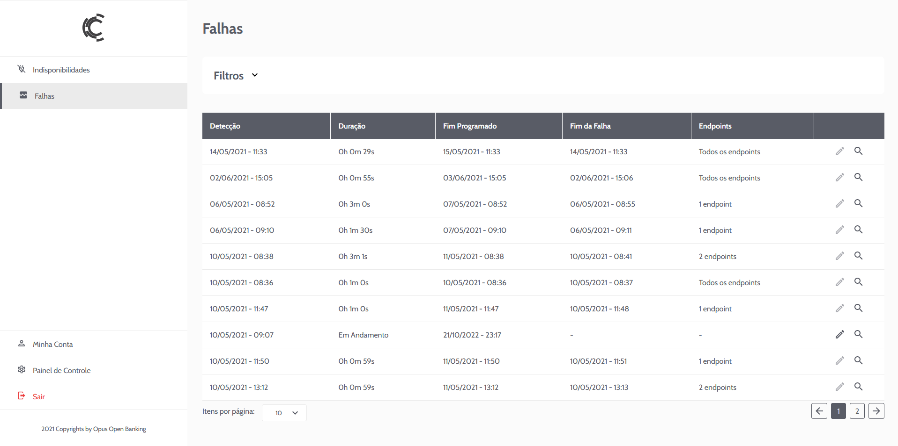
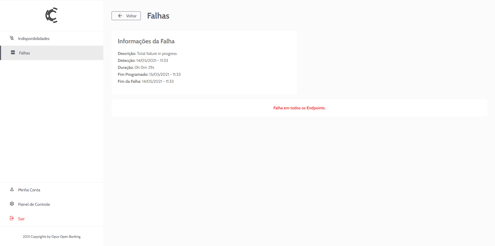
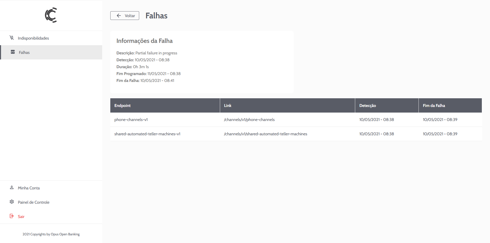
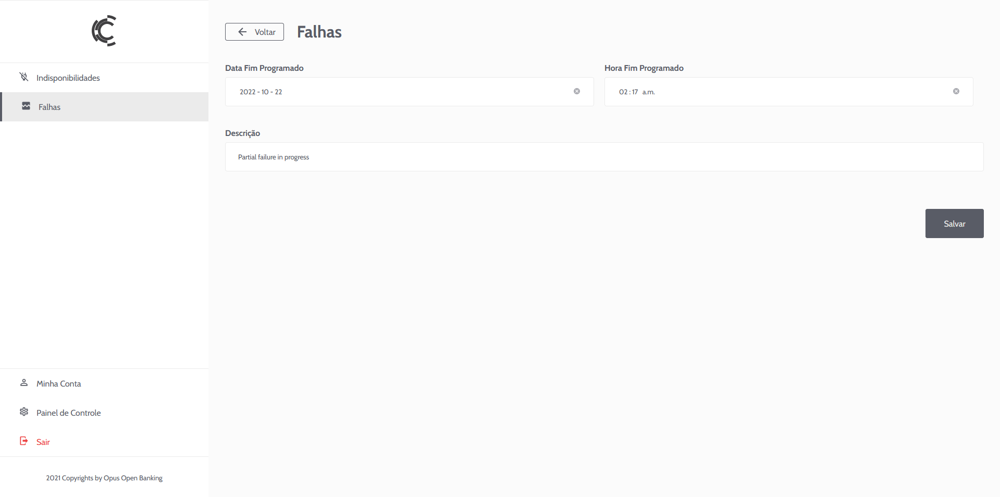
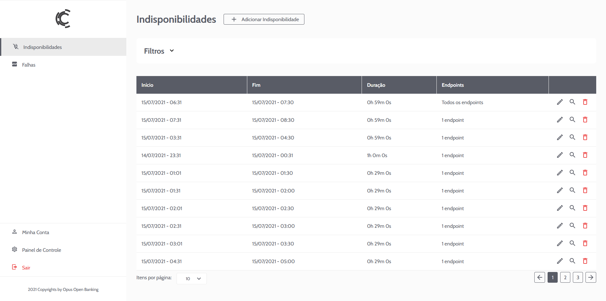
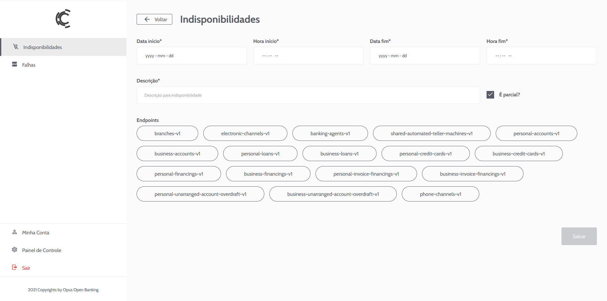
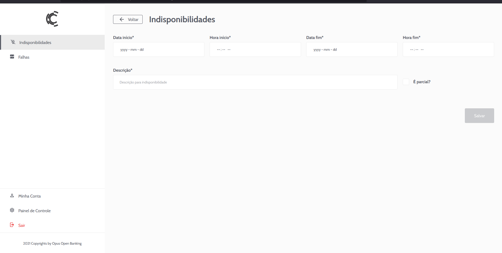

# Falhas e Indisponibilidades
Esta seção descreve a utilização das telas de Falhas e Indisponibilidades do Portal Backoffice do Opus Open Banking (OOB ou O2B). Estas telas trazem a visualização e cadastro das informações que são expostas nos endpoints de Open Banking para as APIs Comuns (Status e indisponibilidades) e de Admin (métricas).

## Falhas
O serviço de Status do O2B monitora a disponibilidade dos endpoints do Open Banking com base na coleta de status de request com erro no API Gateway e chamadas de healthcheck. Caso algum endpoint ou serviço apresente alta taxa de erro, ele automáticamente será classificado como em falha e passará a ser exibido na tela de Falhas. Uma Falha poderá ser **Total**, afetando todos os endpoints, ou **Parcial**, afetando um conjunto específico de endpoints.

### Listagem

Toda falha detectada será exibida, sendo ela ativa ou concluída, podendo ser filtrada por data de detecção e data de fim da Falha. Todas as Falhas podem ser visualizadas, mas apenas Falhas em andamento podem ser editadas.

### Visualização

Campos:
- **Descrição:** uma breve descrição da causa da falha. Este campo é gerado automaticamente com o texto "Failure in progress" mas pode ser editado enquanto a Falha estiver em andamento.
- **Detecção:** Data e Hora da detecção da Falha (Hora de início)
- **Duração:** Tempo percorrido desde a data e hora de detecção
- **Fim Programado:** Horário esperado para término da Falha. É gerado vazio e pode ser preenchido na edição
- **Fim da Falha:** Hora e Data da detecção do final da Falha. Este campo é preenchido automaticamente pelo Serviço de Status ao detectar que a Falha não está mais presente

No caso de todos os endpoints estarem em Falha, é informado Falha Total:

Caso apenas um conjunto de endpoints esteja em Falha, é apresentada a lista de endpoints em falha:

### Edição

Apenas Falhas em andamento podem ser editadas. Uma Falha continua em andamento enquanto o Serviço de Status continuar detectando erro, sendo automaticamente concluída caso contrário. Os campos que podem ser editados servem para informar os outros participantes do Open Banking Brasil e ao Regulador qual a data e hora em que se espera que o serviço seja restaurado e um descritivo da Falha.

Campos editáveis:
- **Data Fim Programado:**  Data em que se espera que a Falha deixe de ocorrer
- **Hora Fim Programado:** Data em que se espera que a Falha deixe de ocorrer
- **Descrição:** Descrição da Falha que está ocorrendo

## Indisponibilidades

Indisponibilidades são janelas de tempo em que o serviço está programado para estar fora do ar ou respondendo parcialmente. Elas servem como um mecanismo para informar os outros participantes do Open Banking Brasil e o Regulador que os endpoints estarão indisponíveis com data e hora marcada. Ele serve por exemplo para que seja possível marcar uma janela de manutençao no sistema.

### Listagem

Tela onde é possível visualizar todas as indisponibilidades cadastradas, sejam elas passadas ou futuras. É possível também adicionar, editar ou apagar indisponibilidades.

### Inclusão

Campos:
- **Data Início:** Data em que ser iniciará a janela de indisponibilidade
- **Hora Início:** Hora em que ser iniciará a janela de indisponibilidade
- **Data Fim:** Data em que se encerrará a janela de indisponibilidade
- **Hora Fim:** Hora em que se encerrará a janela de indisponibilidade
- **Descrição:** Uma breve descrição do motivo pelo qual haverá indisponibilidade. 

Adicionalmente, uma indisponibilidade poderá ser Total, afetando todos os endpoints, ou Parcial, afetando apenas um conjunto deles. O checkbox "É Parcial?" é utilizado para indicar Indisponibilidade Total ou Parcial

No caso de Indisponibilidade Parcial, é necessário selecionar a lista de endpoints que estarao indisponíveis:

No caso de Indisponibilidade Total, não é necessário selecionar endpoints:

