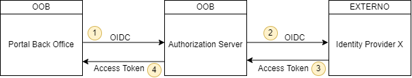

# Federation para usuários internos da instituição

Esta seção tem por objetivo descrever o funcionamento e configuração do
mecanismo de federation para autenticação dos usuários internos da instituição
para acesso ao Portal Back Office do OOB.

O mecanismo de federation foi implementado para que as instituições possam
utilizar seus próprios *Identity Providers* (IDP), integrando-os ao Authorization
Server do OOB. Dessa maneira, o Portal Back Office inicia o processo de
autenticação junto ao Authorization Server, e esse por sua vez realiza a
comunicação junto ao IDP externo para obtenção da autenticação do usuário
interno desejado. De posse da identificação desse usuário, o Authorization
Server gera um token de acesso válido que é devolvido para o Portal Back
Office, e a partir desse momento, o portal utiliza esse token para se comunicar
com as APIs necessárias durante o processo de navegação no sistema.



Sendo assim, para o correto funcionamento do federation é necessário realizar
algumas configurações e manter a atenção em relação a alguns pontos, sendo 
eles:

1. Configuração da comunicação entre o Portal Back Office do OOB e o
   Authorization Server do OOB.
2. Configuração da comunicação entre o Authorization Server do OOB e o IDP
   externo.
3. Configuração correta do IDP externo, para que ele gere tokens no formato
   esperado pelo Authorization Server do OOB.

## Configuração do Portal Back Office

É necessário configurar corretamente algumas variáveis de ambiente no Portal
Back Office para que a comunicação com o Authorization Server ocorra
corretamente. Essas variáveis são: `authDiscoveryDocumentUrl`, `authIssuer`,
`authClientId`, `authClientSecretName` e `authClientSecretKey`.

Detalhes e exemplo de configuração para essas variáveis pode ser conferido na
[página de configuração do deploy do Portal Back Office](../../deploy/oob-portal-backoffice/readme.md).

## Configuração do Authorization Server

Há dois conjuntos de variáveis que precisam de definição. O Authorization
Server precisa da configuração do *client* que receberá os pedidos de
autenticação do Portal Back Office, e precisa também da configuração do
*client* que fará as requisições de autenticação ao IDP externo.

### Configuração do *client* do Portal Back Office

Deve ser configurado como um *client* estático. A documentação detalhada desta
configuração pode ser conferida [aqui](../../deploy/oob-authorization-server/readme.md#clients).

Para algumas variáveis o valor de preenchimento fica à critério da instalação,
mas para outras alguns valores específicos devem ser definidos. No exemplo de
preenchimento abaixo quando o valor for `TBD` significa que ele depende da
instalação, caso contrário o valor da variável deverá ser preenchido igual ao
do template.

Template de configuração do cliente estático do Portal Back Office:

```yaml
  clients:
    - clientSecretName: "TBD"
      clientSecretKey: "TBD"
      clientId: "TBD"
      redirectUris: "https://instituicao-portal-backoffice.com.br/home"
      postLogoutRedirectUris: "https://instituicao-portal-backoffice.com.br/"
      responseTypes: "code"
      grantTypes: "authorization_code,refresh_token"
      tokenEndpointAuthMethod: "client_secret_post"
      allowedScopes: "openid,profile,oob_consents:read,oob_consents:write,
      oob_opendata:read,oob_opendata:write,oob_outages:read,oob_outages:write"
```

***Notas:*** 

- A variável `redirectUris` deve ser ajustada para a URL base do
Portal Back Office da instalação em questão, adicionando a rota `/home` no
final.
- A variável `postLogoutRedirectUris` deve ser ajusta para a URL base do Portal
Back Office da instalação em questão.

### Configuração do *client* do IDP externo

Para concluir a configuração do Authorization Server é necessário definir as
variáveis relativas ao cliente de acesso do IDP externo, bem como definir
também a variável que contém o endereço do Portal Back Office da instalação
para evitar problemas de CORS na comunicação. As variáveis que precisam de
definição são: `INTERNAL_USERS_FEDERATION_DISCOVERY_ENDPOINT`,
`INTERNAL_USERS_FEDERATION_ALLOWED_CLIENT_IDS`,
`INTERNAL_USERS_FEDERATION_CLIENT_ID`, `INTERNAL_USERS_FEDERATION_SECRET` e
`PORTAL_BACKOFFICE_URL`.

Detalhes e exemplo de configuração para essas variáveis pode ser conferido na
[página de configuração do deploy do Authorization Server](../../deploy/oob-authorization-server/readme.md#additionalvars).

## Configuração esperada para o IDP externo

Por último, é necessário que a configuração do IDP externo siga alguns padrões
para que a comunicação com o Authorization Server ocorra.

- O *endpoint* de *discovery* deve ser o mesmo endereço definido na variável
  `INTERNAL_USERS_FEDERATION_DISCOVERY_ENDPOINT` do Authorization Server.
- O *client ID* do cliente configurado no IDP externo deve ser o mesmo definido
  na variável `INTERNAL_USERS_FEDERATION_CLIENT_ID` do Authorization Server.
- O *client secret* do cliente configurado no IDP externo deve ser o mesmo
  definido na variável `INTERNAL_USERS_FEDERATION_SECRET` do Authorization
  Server.
- O *token endpoint auth method* deve ser `client_secret_post`.
- O *grant type* suportado deve ser `authorization_code`.
- O *response type* suportado deve ser `code`.
- A lista de URLs válidas de redirect para o cliente do IDP deve conter os
  seguintes endereços:
  - `https://oob-authorization-server.com.br/auth-nonfapi/interaction/callback`.
   Endereço do Authorization Server da instituição no caminho *nonfapi*, na
   rota `/interaction/callback`
  - `https://external-idp.com.br/*`. Endereço do próprio IDP externo,
   permitindo todas as rotas (`/*`). Essa configuração é necessária para os
   *redirects* que ocorrem durante o fluxo de *logout*.
  
Por fim, os usuários finais cadastrados no IDP externo devem ter os scopes
definidos de acordo com os acessos desejados.

**Cenário 1:**  Um usuário de back office **que pode criar e visualizar** outages
deveria gerar um token contendo os scopes `oob_outages:read` e
`oob_outages:write`. Um exemplo de token válido para tal usuário, gerado pelo
IDP externo poderia ser:

```json
{
  "exp": 1651105223,
  "iat": 1651104923,
  "jti": "452e540f-0f58-407f-864c-e9ee09cc897a",
  "iss": "https://external-idp.com.br/auth/example",
  "sub": "f2cec0ee-1d63-45b3-bc7c-03266250a2d5",
  "typ": "Bearer",
  "azp": "internal_users_federation",
  "session_state": "76dc5872-ce3d-42e8-ae88-2f779c486dce",
  "acr": "1",
  "scope": "openid oob_outages:write email oob_outages:read profile",
  "email_verified": false,
  "name": "Usuário1 Admin",
  "preferred_username": "user1",
  "given_name": "Usuário1",
  "family_name": "Admin",
  "email": "user1@example.com"
}
```

**Cenário 2:** Um usuário de back office que pode **apenas visualizar outages**
deveria gerar um token contendo o scope `oob_outages:read` (mas não o scope
de escrita). Um exemplo de token válido para tal usuário, gerado pelo IDP
externo poderia ser:

```json
{
  "exp": 1651105244,
  "iat": 1651104944,
  "jti": "f8fb977f-b02d-4c49-b1ee-e642e27b07bd",
  "iss": "https://external-idp.com.br/auth/example",
  "sub": "329c7438-a6ef-426d-8a8b-05b6b26ce69b",
  "typ": "Bearer",
  "azp": "internal_users_federation",
  "session_state": "0cb5e1fb-6c19-4d3b-89b3-acadc0902768",
  "acr": "1",
  "scope": "openid email oob_outages:read profile",
  "email_verified": false,
  "name": "Usuário2 Comum",
  "preferred_username": "user2",
  "given_name": "Usuário2",
  "family_name": "Comum",
  "email": "user2@example.com"
}
```
