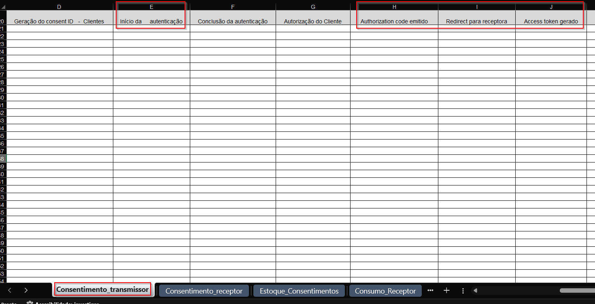
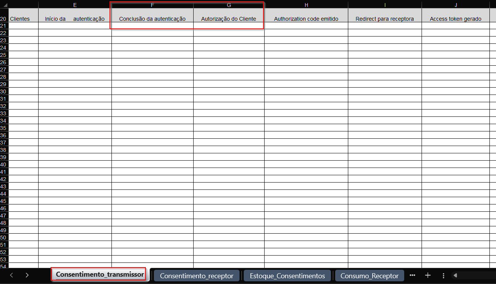

# Scripts SQL - informações dos consentimentos

- [Scripts SQL - informações dos consentimentos](#scripts-sql---informações-dos-consentimentos)
  - [Introdução](#introdução)
  - [Scripts - Consentimento Transmissor](#scripts---consentimento-transmissor)
    - [Consentimento transmissor - informações do consent](#consentimento-transmissor---informações-do-consent)
    - [Consentimento transmissor - informações do authorization server](#consentimento-transmissor---informações-do-authorization-server)
    - [Consentimento transmissor - Autorização do Cliente](#consentimento-transmissor---autorização-do-cliente)    
  - [Scripts - Estoque de consentimentos](#scripts---estoque-de-consentimentos)
    - [Estoque de consentimentos - informação consolidada](#estoque-de-consentimentos---informação-consolidada)
    - [Estoque de consentimentos - informação por receptor](#estoque-de-consentimentos---informação-por-receptor)

## Introdução

A Opus está fornecendo alguns scripts SQL que ajudarão os clientes na coleta
de dados relacionados aos consentimentos gerados e guardados no ecossistema Opus
Open Banking **OOB**.

As informações que poderão ser obtidas com eles são:

- Consentimento Transmissor
- Estoque de consentimentos

**OBS:** fica a cargo de nossos clientes
rodar os scripts e formatar as informações da forma e no período exigido pelo Open
Banking Brasil **OBB**.

O modelo de preenchimento pode ser encontrado [neste link](attachments/fase_2_interoperabilidade_modelo.xlsx)

## Scripts - Consentimento Transmissor

Os scripts SQL fornecidos nessa seção devem ser operados no
**banco de dados do OOB-Consent**

### Consentimento transmissor - informações do consent

Os scripts SQL fornecidos nessa seção devem ser operados no
**banco de dados do OOB-Consent**

Primeiramente, deve ser criada a function CONSENT_USAGE_REPORT executando o seguinte [script](attachments/consent_function_extract_usage_report.sql).

Para obter os dados, deve-se chamar a função usando o seguinte comando:

```sql
SELECT * FROM CONSENT_USAGE_REPORT('<data_inicio>','<data_fim>', <offset?>, <size?>);
```

Sendo que os parâmetros devem ser preenchidos no formato yyyy-MM-dd, por exemplo:

```sql
SELECT * FROM CONSENT_USAGE_REPORT('2022-10-02','2022-10-08');
```

Os parâmetros `<offset?>` e `<size?>` são opcionais, servem para paginação e indicam quantas linhas devem
ser puladas e capturadas, respectivamente.

Os dados obtidos devem ser preenchidos na aba "Consentimento_transmissor", colunas C ou D ("Geração do consent ID - Não Clientes" ou "Geração do consent ID   -  Clientes")


### Consentimento transmissor - informações do authorization server

Os scripts SQL fornecidos nessa seção devem ser operados no
**banco de dados do OOB-Authorization-Server**

Primeiramente é necessário criar a function decode_base64url executando o
seguinte [script](attachments/as_function_decode_base64url.sql).

Depois, deve ser criada a function extract_report_data executando o seguinte [script](attachments/as_function_extract_report_data.sql).

Para obter os dados, deve-se chamar a função usando o seguinte comando:

```sql
SELECT * FROM extract_report_data('<data_inicio>','<data_fim>');
```

Sendo que os parâmetros devem ser preenchidos no formato yyyy-MM-dd, por exemplo:

```sql
SELECT * FROM extract_report_data('2022-10-02','2022-10-08');
```

Os dados obtidos devem ser preenchidos na aba "Consentimento_transmissor", colunas E, H, I e J ("Início da autenticação", "Authorization code emitido", "Redirect para receptora" e "Access token gerado")



### Consentimento transmissor - Autorização do Cliente

Primeiramente é necessário criar a function consent_authorization_client
executando o seguinte [script](attachments/consent_function_authorization_client.sql).

Para obter os dados, deve-se chamar a função usando o seguinte comando:

```sql
SELECT * FROM consent_authorization_client('<data_inicio>','<data_fim>');
```

Sendo que os parâmetros devem ser preenchidos no formato yyyy-MM-dd, por exemplo:

```sql
SELECT * FROM consent_authorization_client('2022-01-02','2022-10-08');
```

Os dados obtidos devem ser preenchidos na aba "Consentimento_transmissor", colunas F e G ("Conclusão da autenticação" e "Autorização do Cliente")



## Scripts - Estoque de consentimentos

### Estoque de consentimentos - Consentimentos com access token gerado

Os scripts SQL fornecidos nessa seção devem ser operados no
**banco de dados do OOB-Authorization-Server**

Primeiramente é necessário criar a function as_function_access_token_generated
executando o seguinte [script](attachments/as_function_access_token_generated.sql).

Para obter os dados, deve-se chamar a função usando o seguinte comando:

```sql
SELECT * FROM as_function_access_token_generated('<data_fim>');
```

Sendo que os parâmetros devem ser preenchidos no formato yyyy-MM-dd, por exemplo:

```sql
SELECT * FROM as_function_access_token_generated('2022-10-08');
```

O retorno dessa consulta deverá ser usado nas funções a seguir.

### Estoque de consentimentos - informação consolidada

Os scripts SQL fornecidos nessa seção devem ser operados no
**banco de dados do OOB-Consent**

Primeiramente é necessário criar a function consent_consolidated_stock executando
o seguinte [script](attachments/consent_function_consolidated_stock.sql).

Para obter os dados, deve-se chamar a função usando o seguinte comando:

```sql
SELECT * FROM consent_consolidated_stock('<data_fim>', '<resultado_as_function>');
```

Sendo que o parâmetro *data_fim* ser preenchido no formato yyyy-MM-dd e o *resultado_as_function*
com o resultado da execução da function anterior. Por exemplo:

```sql
SELECT * FROM consent_consolidated_stock('2022-10-08', array ['f769dfb4-e537-4458-9408-42b24ef1edc8','c33da603-f7a6-42af-9eba-d10ca59c463b']);
```

Os dados obtidos devem ser preenchidos na aba "Estoque_Consentimentos", Visão Transmissora, colunas J e K ("Clientes únicos PF total" e "Clientes únicos PJ (CNPJ raíz)")


### Estoque de consentimentos - informação por receptor

Os scripts SQL fornecidos nessa seção devem ser operados no
**banco de dados do OOB-Consent**

Primeiramente é necessário criar a function consent_receptor_stock executando o
seguinte [script](attachments/consent_function_receptor_stock.sql).

Para obter os dados, deve-se chamar a função usando o seguinte comando:

```sql
SELECT * FROM consent_receptor_stock('<data_fim>', '<resultado_as_function>');
```

Sendo que o parâmetro *data_fim* ser preenchido no formato yyyy-MM-dd e o *resultado_as_function*
com o resultado da execução da function as_function_access_token_generated. Por exemplo:

```sql
SELECT * FROM consent_receptor_stock('2022-10-08',  array ['f769dfb4-e537-4458-9408-42b24ef1edc8','c33da603-f7a6-42af-9eba-d10ca59c463b']);
```

Os dados obtidos devem ser preenchidos na aba "Estoque_Consentimentos", Visão Transmissora, colunas K e L ("Estoque de consentimentos ativos" e "OrganisationId Receptor")


### ParentOrg Iniciador

Para obter o identificador da organização principal, deve-se executar o script [getParentOrganization](../parent-org-reference-script/getParentOrganization.js)
informando os IDs das organizações retornados pelas consultas
*consent_function_extract_usage_report* e *consent_function_receptor_stock*.

Será necessário instalar a versão do [Node.js](https://nodejs.org/en/download)
correspondente ao seu Sistema Operacional.

Com o Node.js instalado, execute o seguinte comando da raiz desse projeto:

```bash
node ferramentas-auxiliares/parent-org-reference-script/getParentOrganization.js [IDs das Orgs Iniciadoras]
```

Os IDs das organizações receptoras devem ser separados por espaço,
conforme exemplo abaixo:

```bash
$ node ferramentas-auxiliares/parent-org-reference-script/getParentOrganization.js f83bee4f-26df-53d7-8335-a8a6edd7e340 fd0ea3e7-aeca-55f9-a0a2-ec56980059fb fd0ea3e7-aeca-55f9-a0a2-ec56980059fc
----------------------------------------------
Org ID: f83bee4f-26df-53d7-8335-a8a6edd7e340
Parent Organization: 90400888000142
----------------------------------------------
Org ID: fd0ea3e7-aeca-55f9-a0a2-ec56980059fb
Parent Organization: N/A
----------------------------------------------
Org ID fd0ea3e7-aeca-55f9-a0a2-ec56980059fc Not found
----------------------------------------------
```

Caso a receptora não possua uma Parent Organization, o retorno do script para
ela será *N/A*. Caso ela não exista, o retorno será *Not found*.

Os dados obtidos devem ser preenchidos na aba "Estoque_Consentimentos", Visão Transmissora, coluna N ("ParentOrganisationReference
Transmissor")


## Execução de relatórios com consolidação de dados por organização

Caso a organização possua duas ou mais marcas, para as consultas que devem ser realizadas nas bases de dados dos serviços **OOB-Authorization-Server** e **OOB-Consent** é necessário utilizar os scrips com prefixo "organization_", nas quais além dos parâmetros originais (data de início e/ou data final), é preciso informar uma string de conexão para que a comunicação com as bases das outras marcas seja realizada.
Para tal, é necessário que o componente "dblink" seja instalado nas bases principais, por meio do comando:

```sql
CREATE EXTENSION IF NOT EXISTS "dblink";
```

a string de conexão deve ser formatada da seguinte maneira:

host={db_target_host} dbname={db_target_dbname} user={db_target_user} password={db_target_password}