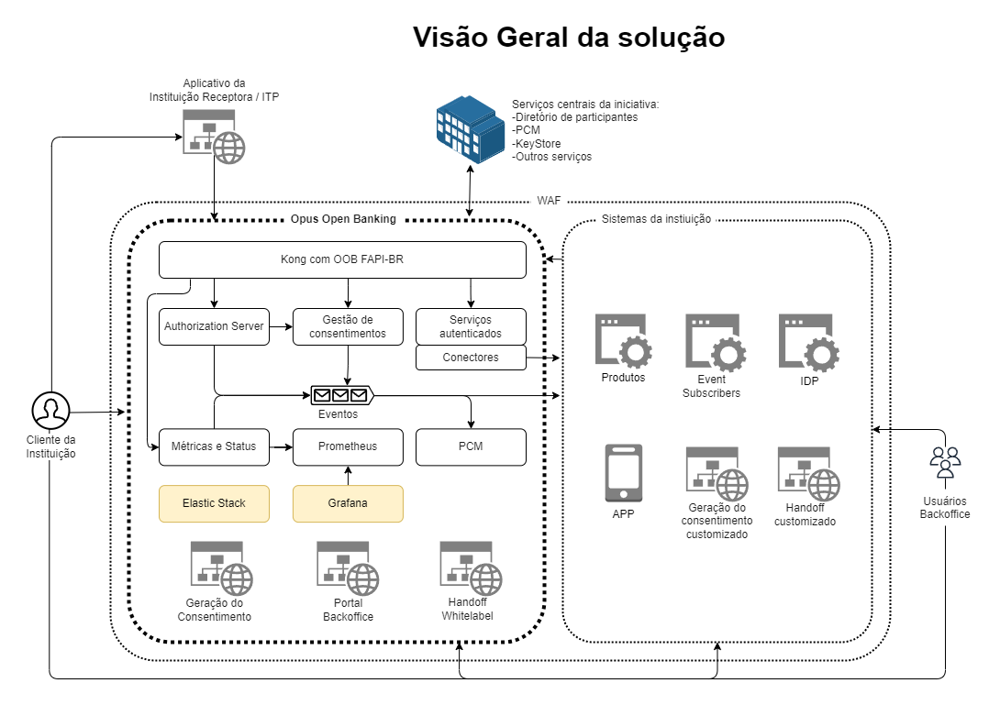
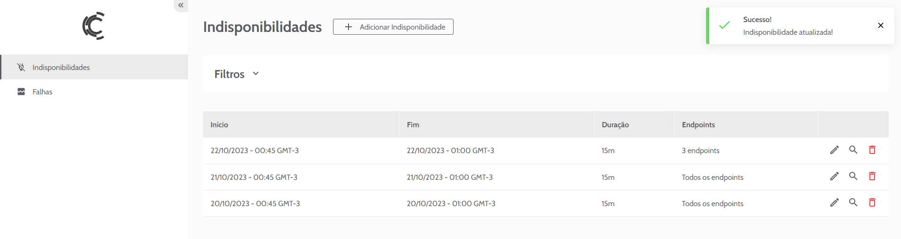
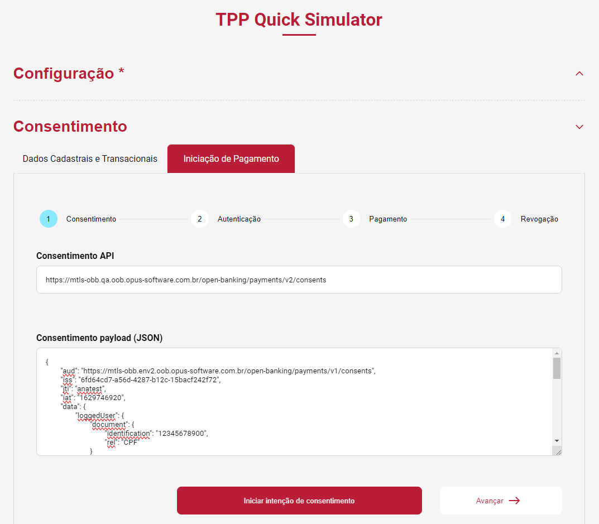

# Documentação Plataforma OPUS Open Finance

A seguir, apresentamos uma visão geral da plataforma OPUS Open Finance.

Ao final desta página, você também pode encontrar um índice detalhado
para especificações técnicas e detalhes de implantação, integração e utilização
dos diversos componentes da plataforma.

## Caracterização do produto

A Plataforma OPUS Open Finance oferece todos os recursos necessários para integrar
Instituições Financeiras ao ecossistema do Open Finance Brasil.

Como uma solução completa para atender a todos os requisitos das normas regulatórias
do Open Finance Brasil, a plataforma implementa as funcionalidades necessárias
para atuação das instituições financeiras em todos os perfis possíveis:

- Detentor de conta
- Transmissor de dados
- Receptora de Dados
- Iniciador de Transações de Pagamento (ITP)

Esquematicamente, a Plataforma OPUS Open Finance funciona como um proxy,
integrando-se aos sistemas de retaguarda da instituição financeira
e atendendo às requisições recebidas de outros participantes do ecossistema para
criação de consentimentos, realização de pagamentos, transmissão de dados, etc.,
conforme ilustra a figura a seguir:

Dentre as funcionalidades oferecidas pela Plataforma OPUS Open Finance destacamos:

1. Gestão de consentimentos obtidos e fornecidos;
1. Gestão multimarcas que permite a configuração do produto para atender a
diferentes marcas em uma mesma instalação do produto;
1. Cadastro de indisponibilidades e registro de falhas junto ao
diretório de participantes do Open Finance Brasil, conforme normas regulatórias;
1. Servidor de autorização que implementa perfil de segurança
FAPI-BR (Financial-grade API) exigido pelas normas regulatórias,
incluindo suporte a DCR (Dynamic Client Registration)
e DCM (Dynamic Client Management), devidamente certificado pela OpenID Foundation;
1. Plataforma de Coleta de Métricas, que envia informações referentes às operações
para o grupo de governança do Open Finance Brasil segundo as especificações regulatórias;
1. Gestão de logs utilizando um modelo de arquivos de log distribuídos baseado no
Elastic, mas que pode ser substituído por qualquer ferramenta de logs
já utilizada pela instituição financeira;
1. Integração com os sistemas de retaguarda da instituição financeira através de
conectores que isolam a complexidade da plataforma e garantem a padronização do produto;

Tela de Handoff White-label, código fonte das telas de consentimento para
integração ao aplicativo móvel da instituição financeira, simulador do ecossistema
para validação da instalação, e testador para validação dos conectores.

Para a realização de operações de Iniciação de Pagamento via Open Finance ou pedidos
de recepção de dados, a Plataforma OPUS Open Finance oferece módulos que implementam
os protocolos de segurança e autenticação. Tais módulos são acessíveis através de
interfaces REST, simplificando bastante a construção de aplicações.

Para fins de auditoria todas as transações são devidamente registradas em arquivos
de log. Todos os dados em repouso da solução (seja em logs ou bases de dados) são
encriptados para garantir sigilo em caso de acesso não autorizado.

## Módulos da Solução

### Módulo Detentor de Conta

Responsável pelo tratamento de pedidos pagamentos enviados por iniciadores de pagamentos.
Integra-se ao sistema de retaguarda responsável pela efetivação de pagamentos
(tipicamente Pix) através de um conector que isola a complexidade do ambiente
e garante padronização da plataforma entre diferentes ambientes de execução.

O tratamento de pedidos de iniciação de pagamento envolve a criação de um consentimento
após a autenticação e confirmação pelo cliente final, a validação de um consentimento
enviado pelo iniciador e o tratamento do pagamento até sua efetivação completa
(sinalizada pela chamada de um webhook).

Todos os detalhes da transação são salvos, de forma encriptada, na base de dados
e registrados em log, além de serem enviados ao Grupo de Governança do
Open Finance Brasil através da Plataforma de Coleta de Métricas, conforme a regulação.

### Módulo Transmissor de Dados

Responsável pelo tratamento de pedidos de compartilhamento de dados cadastrais e
transacionais de clientes da instituição.
Também integra-se aos sistemas de retaguarda através de conectores,
garantindo isolamento funcional e padronização da plataforma.

O tratamento de pedidos de compartilhamento de dados também envolve a criação de
consentimentos após autenticação e confirmação pelo cliente final,
porém sua validade é longa, sendo limitada a até 12 meses.
Durante sua vida útil, o consentimento pode ser utilizado para obtenção de dados,
de acordo com as permissões incluídas em seu momento de criação e
autorizadas pelo cliente final.

Para cada requisição recebida, o Módulo Transmissor de Dados efetua a validação
da instituição requisitante (incluindo assinaturas criptográficas),
da validade do consentimento, e verifica se as permissões incluem os dados requisitados.
Caso qualquer uma dessas validações tenha resultado negativo,
o módulo retorna automaticamente a mensagem de erro apropriada.
Desta forma, os conectores (e, por consequência, os sistemas de retaguarda)
são acionados única e exclusivamente em casos em que de fato o requisitante tem
autorização para acessar dados cadastrais e transacionais.

O Módulo também faz o envio de reportes obrigatórios para a
Plataforma de Coleta de Métricas.

### Módulo de Iniciação de Transações de Pagamento (OPUS TPP)

Um Iniciador de Transação de Pagamento (ITP), ou apenas Iniciador de Pagamentos,
é uma aplicação cliente que consome serviços de uma Detentora de Conta.
A Módulo ITP da plataforma OPUS Open Finance atua como um *middleware* que implementa
um facilitador para efetuação de iniciação de pagamentos via Open Finance,
abstraindo os fluxos operacionais.

Permite que consentimentos de iniciação de pagamentos sejam criados em uma única
requisição à API REST fornecida, e uma vez aprovado, esse consentimento seja
utilizado para efetuação da transação através de uma segunda requisição.

Adicionalmente, o módulo também é capaz de efetuar DCR (Dynamic Client Registration)
e DCM (Dynamic Client Management) em todas as
instituições Detentoras de Conta listadas no Diretório de Participantes do
Open Finance Brasil,
além de efetuar o envio automático de reportes obrigatórios para a Plataforma
de Coleta de Métricas.

Com isso, o módulo permite o desenvolvimento de aplicações que se beneficiem da
iniciação de pagamentos via Open Finance, porém sem a necessidade de implementação
dos diversos protocolos de segurança e outras obrigatoriedades.

### Módulo de Recepção de Dados (OPUS TPP)

O Módulo de Recepção de Dados é um *middleware* para consumo dos serviços de
Transmissoras de Dados, permitindo a criação de consentimentos de
compartilhamento de dados cadastrais e transacionais, e sua subsequente utilização.

Análogo ao Módulo ITP, este módulo também permite que consentimentos sejam criados
em uma única requisição HTTP. Após sua aprovação, podem ser utilizados os
endpoints de *proxy* de obtenção de dados,
que adicionam assinaturas criptográficas e outros requisitos de segurança,
e retornam os dados devolvidos pela instituição receptora.

Assim, ele permite a consulta atômica de dados cadastrais e transacionais de
clientes de instituições participantes do Open Finance Brasil.
Esses dados incluem, entre outras informações:
dados pessoais como nome, data de nascimento, endereço, e dados transacionais de
contas, cartão de crédito, e operações de crédito (empréstimos, financiamentos, etc.).

O módulo também efetua DCR e DCM e o envio automático de reportes obrigatórios
para a Plataforma de Coleta de Métricas.

### Módulo OPUS Open Data Receiver

Como extensão das funcionalidades do Módulo de Recepção de Dados,
a plataforma oferece também o módulo OPUS Open Data Receiver,
capaz de agregar dados de clientes e mantê-los atualizados durante toda a
vigência dos consentimentos obtidos.

Ele utiliza um *Scheduler*
e as capacidades do Módulo de Recepção de Dados (OPUS TPP)
para garantir que os dados sejam atualizados periodicamente,
respeitando os limites operacionais definidos pela regulação do Open Finance Brasil.

O módulo oferece uma API que consolida e unifica todos os dados referentes a
uma mesma pessoa.
Por exemplo,
caso um cliente final tenha contas em diferentes instituições, é possível criar diversos
consentimentos para obter os dados de todas elas.
Esses dados são consolidados e, através da Customer Data API,
é oferecida uma visão unificada, que retorna um extrato centralizado de todas
as transações do usuário nas diferentes insituições financeiras.

O sistema também alimenta uma fila de eventos,
que são disparados automaticamente quando ocorrem eventos técnicos,
como por exemplo quando um consentimento expira
ou é revogado pelo usuário,
e também permite a configuração de regras de negócio, como
detectar quando um usuário cria um novo contrato de empréstimo em outra instituição.
Dessa forma, é possível disparar ações para incentivar o usuário a renovar consentimentos
expirados (ex.: através do envio de notificações),
integrar com sistemas internos de CRM, etc.

Assim, o Módulo suporta a criação de outras aplicações que utilizem dados financeiros
dos usuários, sem a necessidade de se preocupar com atualização periódica
e consolidação de informações.

## Arquitetura da Solução

A arquitetura da solução é baseada em microsserviços,
para suportar escalabilidade horizontal automática,
e projetada para ser disponibilizada em contêineres (Docker)
rodando em ambiente de execução clusterizado Kubernetes.
A solução roda atualmente em produção tanto em ambientes Kubernetes gerenciados
(Google GKE, AWS AKS e Azure EKS) como clusters gerenciados manualmente.

### Visual geral da arquitetura

A figura abaixo mostra uma visão geral da arquitetura da solução

O componente <code>Elastic Stack</code> é uma sugestão para tratar os logs da
solução. A gestão dos logs pode ser feita em qualquer ferramenta que se integre
no cluster Kubernetes para fazer a ingestão dos logs gerados pelos PODs, tais
como a Elastic Stack, Datadog, Loki e outros.

O componente <code>Grafana</code> é uma sugestão opcional para complementar
a visibilidade da saúde solução. A saúde da solução já é monitorada de forma
automática pelo microsserviço "Métricas e Status" para todos os efeitos
regulatórios necessários (APIs regulatórias <code>Admin</code> e <code>Comuns</code>)

A plataforma foi concebida para rodar em uma estrutura de rede protegida por um
firewall e exige um API Gateway para sua correta configuração.
Caso a instituição financeira não possua um API Gateway corporativo (ou não queira
disponibilizá-lo para o ambiente Open Finance por questões de custo ou de governança)
o pacote de instalação possui uma opção pré-configurada para utilizar um
API Gateway Kong Community Edition sem custo adicional, garantindo que a solução
possa ser executada de maneira autônoma e sem dependências externas.

Todos os módulos do sistema suportam configuração de autoscaling, permitindo ao Kubernetes
criar (ou remover) instâncias baseando-se no uso de CPU e memória, por exemplo.

A distribuição dos módulos é realizada através de Helm charts, permitindo a definição,
instalação e upgrade da aplicação no Kubernetes, além da seleção de recursos
para execução no cluster.

A plataforma também faz uso de componentes de infraestrutura open source, como
Dapr, Grafana e Prometheus. Nesse caso, são disponibilizados scripts Terraform
para instalação e configuração.

Para a gestão de logs distribuídos a solução inclui o Elastic, mas pode ser configurado
outro produto (e incorporado ao pacote de distribuição da solução) caso exista um
padrão na instituição financeira.

## Componentes da solução

### Gestão de consentimentos

Responsável pelo ciclo de vida (criação, revogação e controle de expiração) dos consentimentos
criados na interação com Iniciadores de Pagamentos e Receptores de Dados.
Também controla os consentimentos obtidos pela instituição financeira.

Implementa uma API independente que permite, se desejável, a criação de aplicações
internas da instituição para consulta. Através dessa API atende aos pedidos de consultas
dos aplicativos Mobile e Web da instituição financeira para exibição dos consentimentos
válidos e revogados. Essa API também permite que a instituição implemente em seus
canais de atendimento a revogação de consentimentos – que é uma exigência das
normas regulatórias do Open Finance Brasil.

### Servidor de autorização

Implementa os perfis obrigatórios dos protocolos de segurança exigidos pelas
especificações do Open Finance Brasil, parte do FAPI-BR (Financial-grade API).

É o componente responsável pela execução dos protocolos de
DCR (Dynamic Client Registration) e DCM (Dynamic Client Management),
necessários para registro dos TPPs (Third-Party Providers)
que acessam as APIs do OPUS Open Finance,
registrando seus certificados criptográficos utilizados na validação de assinaturas
dos *payloads* de requisições subsequentes.

### Gestão multimarcas

Para instituições que devem disponibilizar APIs de Open Finance para diferentes marcas,
a plataforma oferece suporte nativo à convivência de múltiplas marcas em uma mesma
instalação do produto.

Com isso, marcas podem conviver no mesmo cluster Kubernetes,
beneficiando-se do compartilhamento de alguns microsserviços essenciais,
gerando economia de infraestrutura e menor complexidade operacional.

### Gestão de logs

Os logs gerados pela aplicação podem ser integrados com qualquer ferramenta de gestão
de logs utilizada pela instituição,
como Elastic, Data Dog, etc.
Além disso, as informações sensíveis de clientes finais, como
dados financeiros, dados cadastrais, etc.,
são anonimizados dinamicamente, seguindo os princípios da
Lei Geral de Proteção de Dados (LGPD).

### Plataforma de Coleta de Métricas

A Plataforma de Coleta de Métricas (PCM) é um requisito regulatório, obrigatório,
que exige que todas as instituições participantes reportem à estrutura de governança
métricas sobre todas as chamadas de API efetuadas e/ou recebidas.
Ambas as instituições envolvidas em qualquer operação devem enviar
reportes contendo informações como endpoint acessado, data e hora do evento,
resultado recebido e tempo de resposta.

O componente de PCM é parte integrante da plataforma OPUS Open Finance,
e executa de maneira transparente a coleta das informações necessárias e seu
envio à plataforma oficial da estrutura de governança.
Isso é possível graças à arquitetura da solução, na qual todas as chamadas
passam através de seu gateway.

Adicionalmente, o componente também agrupa os reportes para minimizar impactos
de desempenho,
mas ao mesmo tempo garantindo o envio dentro dos SLAs obrigatórios de tempestividade.
Adicionalmente, o módulo também lida com eventuais indisponibilidades da plataforma
central, armazenando os reportes não enviados até que a estrutura volte a fica disponível.

O componente de PCM da plataforma OPUS Open Finance integra-se com todos os
módulos oferecidos, isto é, os módulos de
Detentora de Conta, Transmissora de Dados, Iniciadora de Pagamentos e
Receptora de Dados.

Desta forma, não há necessidade nenhuma de desenvolvimento extra e de preocupações
com o envio de reportes. Uma vez configurado e inicializado, o módulo PCM enviará
automaticamente todos os dados necessários, minimizando impacto e garantindo conformidade
com as regulações.

### Conectores

Para garantir desacoplamento funcional e padronização do produto,
a plataforma OPUS Open Finance se integra com sistemas de retaguarda
através de **conectores**,
que são adaptados caso a caso e garantem que transações e dados
sejam acessados de acordo com a demanda.

Os conectores que devem ser implantados dependem dos Módulos adotados pela instituição.
Para o perfil de Detentora de Conta,
são necessários conectores de iniciação (imediata e agendada) de transações Pix,
consulta de status e cancelamento de agendamento.
Os conectores para Transmissora de dados abrangem
dados abertos sobre produtos e serviços oferecidos pela instituição,
dados cadastrais de clientes finais,
dados transacionais de contas, cartões de crédito, investimentos,
e dados de contratos de crédito
(empréstimos, financiamentos, direitos creditórios descontados, etc.).

### Status (health check)

As APIs obrigatórias de status dos serviços são implementadas pela solução,
e todas as chamadas recebidas são contabilizadas para efetuação dos
cálculos de disponibilidade que devem ser informados à estrutura de governança.

Elas informam sobre a disponibilidade momentânea dos diversos *endpoints* regulatórios,
que podem estar disponíveis, com falha parcial,
em manutenção programada, ou indisponíveis.

### Security e autenticação de serviços

Todos os protocolos de segurança são implementados e certificados pela OpenID Foundation.
A implementação inclui os protocolos FAPI-BR (Financial-Grade API) e também
a validação e geração de assinaturas JSON Web Token (JWT),
além dos protocolos de DCR (Dynamic Client Registration)
e DCM (Dynamic Client Management), necessários no processo de
registro de Third-Party Applications (TPP)
com Detentoras de Conta e Transmissoras de Dados.

### Fila de eventos

A plataforma suporta a geração de notificações sinalizando a ocorrência de diversos
eventos pertinentes aos diferentes componentes do sistema.
As notificações enviadas para uma fila de eventos são de diferentes naturezas,
podendo ser eventos técnicos como notificações de erros HTTP,
como também de negócio,
como a revogação de um consentimento ou a realização de um
registro DCR por um novo TPP.

As notificações são organizadas por tópicos,
que podem ser assinados independentemente por aplicações externas.
Assim, aplicações como CRM, Análise de Crédito, etc.,
receberão apenas as notificações pertinentes,
e poderão consumi-las em tempo real.

A plataforma suporta diferentes plataformas de filas de evento,
pois internamente é utilizado o [DAPR](https://dapr.io/),
que abstrai particularidades e facilita a integração
com qualquer plataforma já utilizada pela instituição financeira.

### Portal Backoffice

O portal de backoffice da plataforma OPUS Open Finance permite que funções
administrativas sejam executadas.
De acordo com as especificações regulatórias do Open Finance Brasil,
as instituições participantes devem cumprir níveis determinados de disponibilidade:

1. 95% do tempo a cada 24 horas
2. 99,5% do tempo a cada 3 meses

Com isso, faz-se necessário reportar indisponibilidades,
sejam elas ocasionadas por falhas no sistema ou por eventos de manutenção programada.

### Autenticação via Federation

O suporte à autenticação via Federation permite que as instituições utilizem
seus próprios Identity Providers (IDP) para controlar o acesso ao portal.
Em outras palavras,
usuários podem utilizar o mesmo login institucional que já utilizam em
outros sistemas da instituição.

#### Cadastro de indisponibilidade (regulatório)

O Portal Backoffice oferece uma interface gráfica para
cadastro de indisponibilidades programadas,
permitindo que o sistema sinalize apropriadamente para a estrutura de governança
tais eventos,
que são contabilizados separadamente de falhas sistêmicas.

#### Registro de falhas (regulatório)

Através de integração com o serviço de status,
o portal oferece um dashboard de visualização das insdisponibilidades
parciais e totais detectadas pelo componente de auto-diagnóstico da plataforma.

### Ferramentas auxiliares

#### Tela de handoff White-label

Em casos de Detentoras de Contas e/ou Transmissoras de Dados que oferecem apenas
canais digitais mobile (i.e., aplicativos) e **não** têm canais desktop
(ex.: Internet Banking),
é obrigatória a implementação do fluxo de ***handoff***,
no qual usuários utilizando dispositivos desktop devem visualizar
um QR Code que pode ser utilizado para autorizar a operação
através de um dispositivo móvel.

A plataforma oferece também um módulo opcional de *handoff* que pode ser
customizado com definições de imagens, paletas de cores,
textos informativos e links para lojas de download de aplicativos Android/iOS.

#### Aplicativo móvel com telas de autorização

Oferecemos também um aplicativo móvel com exemplos de design e código-fonte
de implementação das funcionalidades obrigatórias do Open Finance Brasil,
e integração completa com a plataforma OPUS Open Finance.

#### Connector Tester

A ferramenta Connector Tester executa simulações de chamadas vindas através do
ecossistema do Open Finance Brasil e permite que os conectores de integração
com os sistemas de retaguarda da instituição sejam exercitados e testados,
facilitando sua depuração durante as fases de desenvolvimento.

#### TPP Quick Simulator

A ferramenta TPP Quick Simulator implementa as funcionalidades uma aplicação
Iniciadora de Pagamentos ou Receptora de Dados e
executa as chamadas correspondentes de criação de consentimentos e sua
subsequente utilização, nos contextos apropriados.

Ela oferece grande flexibilidade de construção dos *payloads* enviados em cada requisição,
permitindo a construção de diversos cenários de uso e/ou exceção,
e servindo como ferramente de testes, diagnóstico e demonstração de funcionalidades
de Detentoras de Contas e Transmissoras de Dados.

#### Relatórios obrigatórios

O Banco Central (BACEN) exige a extração e envio de diversos relatórios
sobre a saúde e utilização dos serviços do Open Finance Brasil.
Tanto as Detentoras de Conta quanto as Transmissoras de Dados
devem enviar planilhas semanais e semestrais informando
à estrutura de governança diversos dados sobre
consentimentos, transações e disponibilidade de APIs.

A plataforma OPUS Open Finance oferece uma série de scripts
e roteiros de extração dos dados que devem ser reportados periodicamente
ao BACEN por todas as instituições.

## Índice

1. Como integrar seus sistemas com a platafora OPUS Open Finance?
    1. Detentoras de Conta e Transmissoras de Dados:
        1. [Integrando com o aplicativo mobile da instituição](consentimento/app2as/readme.md)
        1. [Integrando com interface web da instituição](consentimento/web2as/readme.md)
        1. [APIs de visualização e revogação de consentimentos](portal-backoffice/apis-backoffice/readme.md)
        1. Para instituições *app-only*:
            1. [Implementando fluxo handoff](consentimento/app2as-handoff/readme.md)
            1. [Configurações da página de handoff customizável](consentimento/app2as-handoff/custom-handoff-config/readme.md)
    1. Integração com a retaguarda: **Conectores**
        1. [Visão geral](integração-plugin/readme.md)
        1. Detentoras de Conta:
            1. [Discovery de recursos (contas, cartões, etc.)](integração-plugin/consent/readme.md#discovery-de-recursos-no-opus-open-banking)
            1. [Iniciação e consulta de pagamentos (Pix)](integração-plugin/payments/readme.md)
        1. Transmissoras de Dados:
            1. [Discovery de recursos (contas, cartões, etc.)](integração-plugin/consent/readme.md#discovery-de-recursos-no-opus-open-banking)
            1. [Dados abertos (produtos e serviços)](integração-plugin/open-data/readme.md)
            1. [Dados cadastrais e transacionais](integração-plugin/financial-data/readme.md)

1. Instalação do produto:
    1. Implantação do cluster Kubernetes:
        1. [Visão geral](deploy/readme.md)
        1. [Configurações via Terraform](deploy/terraform/readme.md)
        1. [Definições compartilhadas](deploy/shared-definitions.md)
        1. Detentora de Conta e Transmissora de Dados:
            1. [Authorization Server](deploy/oob-authorization-server/readme.md)
            1. [Consentimentos](deploy/oob-consent/readme.md)
            1. [Status](deploy/oob-status/readme.md)
            1. [Fila de eventos](deploy/oof-event-service/readme.md)
            1. [Plataforma de Coleta de Métricas (PCM)](deploy/oof-pcm-service/readme.md)
        1. Detentora de Conta:
            1. [Pagamentos](deploy/oob-payment/readme.md)
        1. Transmissora de Dados:
            1. [Dados abertos](deploy/oob-open-data/readme.md)
            1. [Dados cadastrais e transacionais](deploy/oob-financial-data/readme.md)
        1. Opcionais:
            1. [Portal Backoffice](deploy/oob-portal-backoffice/readme.md)
            1. [Handoff Web](deploy/oob-handoff-web/readme.md)
    1. Configuração de domínios e certificados criptográficos
        1. [Detentora de Conta e Transmissora de Dados](dominios-e-certificados/readme.md)
        1. [Iniciadora de Pagamentos e Receptora de Dados](dominios-e-certificados/tpp.md)
    1. [Configuração de controles de segurança por API](segurança/readme.md)

1. Roteiros de certificações obrigatórias
    1. [Envio da certificação de Segurança (OpenID Foundation)](certificacao/seguranca/enviando-certificacao.md)
    1. [Execução da certificação funcional (Governança Open Finance Brasil)](certificacao/funcional/dcr.md)

1. Ferramentas úteis
    1. Depuração de conectores: [Connector Tester](ferramentas-auxiliares/connector-tester/readme.md)
    1. Extração de relatórios obrigatórios enviados ao BACEN:
        1. [Relatório Semestral de Disponibilidade](ferramentas-auxiliares/relatorio-de-disponibilidade-por-grupo-de-apis/readme.md)
        1. [Relatório Semestral de Volume de Requisições](ferramentas-auxiliares/relatorio-semestral/readme.md)
        1. Detentora de Conta:
            1. [Relatório de Acompanhamento de Funcionamento](ferramentas-auxiliares/acompanhamento-do-funcionamento-inicial/fase-3/readme.md)
            1. [Relatório de Iteroperabilidade](ferramentas-auxiliares/relatorio-de-interoperabilidade/fase-3/readme.md)
            1. [Relatório de Requisitos não-funcionais](ferramentas-auxiliares/relatorio-de-requisitos-nao-funcionais/readme.md)
        1. Transmissora de Dados:
            1. [Relatório de Estoque de Consentimentos](ferramentas-auxiliares/retirada-de-informaçoes-sobre-os-consentimentos/readme.md)
    1. Portal Backoffice:
        1. [Instalação](deploy/oob-portal-backoffice/readme.md)
        1. [Customização de interface](portal-backoffice/customizacao/readme.md)
        1. [Integração com login institucional via *Federation*](portal-backoffice/federation-usuarios-internos/readme.md)
        1. [Utilização (guia de usuário)](portal-backoffice/falhas-e-indisponibilidades/readme.md)
